# DataStructure(C)-Beta版
**南京邮电大学数据结构C语言代码**

整理+补全代码：PureStream

如果有什么建议或者错误欢迎QQ私聊或者 `New Issue`

每个大章节中我会把文件程序具体是什么放在最前面，然后知识点放在程序后，所以可能顺序会有点不同，可以看下面目录选择你喜欢的进行查看（ **想看程序分别对应是什么的** 可以直接 **点大章节标题**，比如我直接点树就能看到对应程序的内容所指）（Github右边可以展开目录）

[TOC]

## 线性表

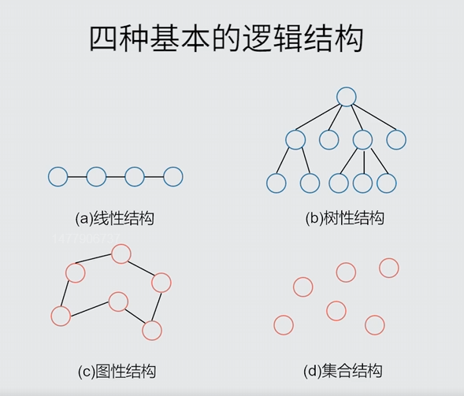

线性结构体现的是**数据之间一对一的关系**

### 线性表的定义

线性表是零个或多个数据元素构成的线性序列，记为 $$(a_0，a_1，…，a_{n-1})$$ 

线性表中的数据元素个数 $$n$$ 称为线性表的长度

当 $$n=0$$ 时，此线性表为空表

**线性表的运算**

`Init(L)`：初始化运算。构造一个空的线性表L，若初始化成功，则返回OK，否则返回ERRO

`Destroy(L)`：撤销运算。判断线性表L是否存在，若已存在，则撤销线性表L;否则返回ERROR

`IsEmpty(L)`：判空运算。判断线性表L是否为空，若为空，则返回OK;否则返回ERROR

`Length(L)`：求长度运算。若线性表L已存在，返回线性表L的元素个数;否则返回ERROR

`Find(L,i)`：查找运算。若线性表L已存在且0≤i≤n-1，则查找线性表L中元素a;的值，查找成功返回OK;否则，返回ERROR

`Insert(L,i,x)`：插入运算。若线性表L已存在且-1≤i<n-1，则在元素a;之后插入新元素x，插入成功后返回OK，否则返回ERROR

`Delete(L,i)`：删除运算。若线性表L非空且0≤i<n-1，则删除元素a;，删除成功后返回OK，否则返回ERROR

`Update(L,i,x)`：更新运算。若线性表L已存在且0≤i≤n-1，则将线性表L元素a;的值修改为x，否则返回ERROR

`Output(L)`：输出运算。若线性表L已存在，则输出线性表L中所有数据元素，否则返回ERROR

### 线性表的顺序存储

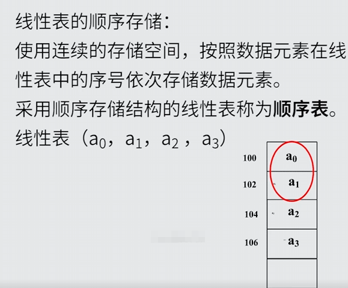

**这里线性表的一对一关系是通过物理位置上的相邻来体现的**

设线性表中第一个元素 $$a_0$$ 在内存中的存储地址是 $$loc(a_0)$$ 每个元素占用 $$k$$ 个存储单元，则线性表中任意元素 $$a_i$$ 在内存的存储地址为： $$loc(a_i)=loc(a_0)+i*k$$

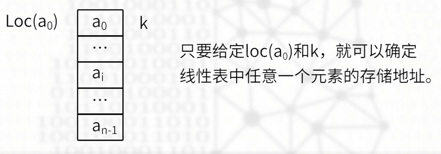

线性表的顺序表示定义如下：

```c
typedef struct seqlist{
	int n;
    int maxlength;
    ElemType *element;
} SeqList;

//ElemType 是自定义类型,在实际使用时，用户可以根据实际需要将ElemType具体定义为所需的数据类型，可以是int、float等基本数据类型
```

**顺序表的插入**


代码如下：

```c
Status Insert(SeqList *L, int i, ElemType x){
    int j;
    if(i < -1 || i > L -> n - 1)	// 判断下标是否越界
        return ERROR;
    if(L -> n == L -> maxlength)	// 判断顺序表是否已满
        return ERROR;
    for(j = L -> n - 1; i > i; j--)
        L -> element[j + 1] = L -> element[j];
    L -> element[i + 1] = x;
    L -> n = L -> n + 1;
    return OK;
}
```

**顺序表的删除**

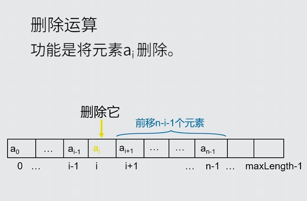

代码如下：

```c
Status Delete(SeqList *L, int i){
    if(i < 0 || i > L -> n - 1)
       	return ERROR;
    if(!L -> n)
        return ERROE;	//顺序表为空则删除失败
    for(j = i + 1; j < L -> n; j++)
        L -> element[j - 1] = L -> element[j];
    L -> n--;
    return OK;
}
```

### 线性表的链接存储

#### 单链表

**线性表的顺序存储结构的优缺点：**

(1)优点：

- 随机存取
- 存储空间利用率高

(2)缺点：

- 插入、删除效率低;
- 必须按事先估计的最大元素个数分配连续的存储空间，难以临时扩大

采用链式存储结构的线性表称为**链表**

链表有单链表、循环链表和双向链表等多种类型

链表中，不仅需要存储每个数据元素，还需存储其直接后继的存储地址，这两部分数据信息组合起来称为结点

结点包括两类域：存储数据元素信息的域称为**数据域**；存储直接后继存储地址的域称为**指针域**

每个结点只包含一个指针域的链表，称为**单链表**

下面是单链表的结点结构

| element（数据） | link（地址） |
| --------------- | ------------ |


最后一个结点的指针域为NULL，在图中记为 ^ 

first是头指针，指向链表中的第一个结点，链表中的第一个结点称为**头结点**

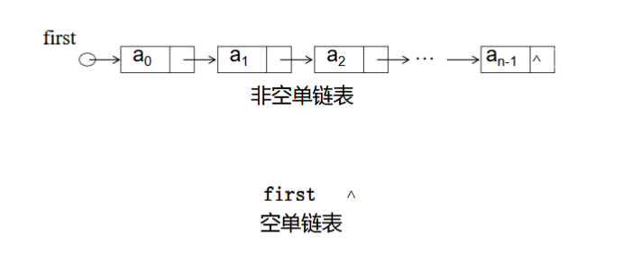

注意：不能出现“断链”现象

```c
typedef struct node{
    ElementType element;
    struct node *link;
}Node;

typedef struct singleList{
    struct node *first;
    int n;
}SingleList;
```

#### 单链表的插入

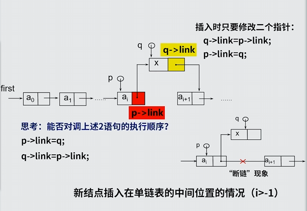

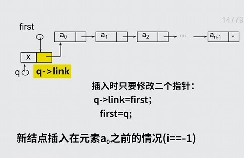

```c
bool Insert(SingleList *L, int i, ElementType x){
    Node *p, *q;
    itn j;
    if(i < -1 || i > L -> n - 1)
        return false;
    p = L -> first;
    for(j = 0; j < i; j++)
        p = p -> link;
    q = malloc(sizeof(Node));
    q -> element = x;
    if(i -> -1){                // 插在链表中间
        p -> link = q -> link;
        p -> link = q;    
    }else{                      // 插在链表头结点之前
        q -> link = L -> first;
        L -> first = q;
    }
    L -> n++;
    return true;
}
```

#### 单链表的删除

删除算法步骤为：

①从first开始查找 $$a_i$$ 所在结点， $$p$$ 指向该结点， $$q$$ 指向该结点之前驱结点

②从单链表中删除元素 $$a_i$$ 所在结点，若 $$i==0$$ ，则表示删除头结点；若 $$i>0$$ ,则表示删除的结点在单链表的中间位置:

③释放元素 $$a_i$$ 所在结点的空间

④表长减 $$1$$

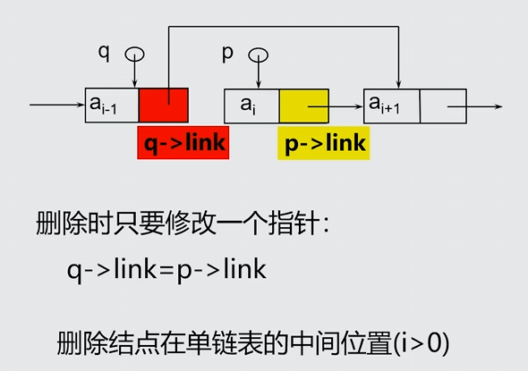

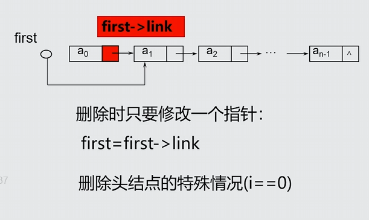

```c
bool Delete(SingleList *L, int ){
    Node *p, *q;
    if(!L -> n)
        return false;
    if(i < 0 || i > L -> n - 1)
        return false;
    q = L -> first;
    p = L -> first;
    for(int j = 0; j < i; j++)
        q = q -> link;
    if(i == 0)
        L -> first = L -> first -> link; // 删除头结点
    else{
        p = q -> link;			// p变成待删除结点
        q -> link = p -> link;
    }
    free(p);
    L->n--;
    return true;
}
```

#### 循环链表和双向链表

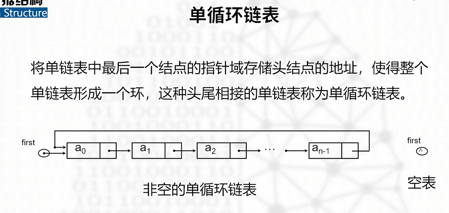

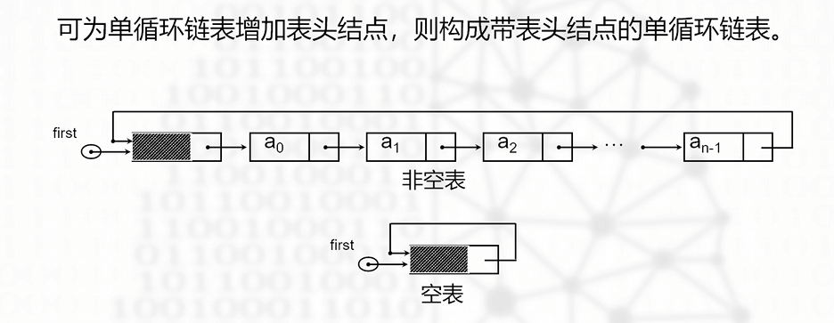

**双向链表**

| llink | element | rlink |
| ----- | ------- | ----- |


结构定义：

```
typedef struct duNode{
    ElementType element;
    struct duNode *llink;
    struct duNode *rlink;
}DuNode, DuList;
```

**插入运算**

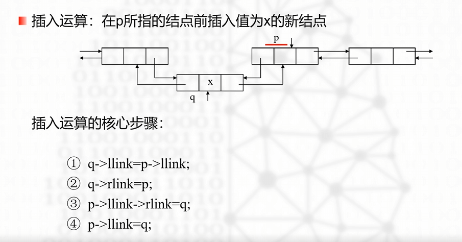

**删除运算**

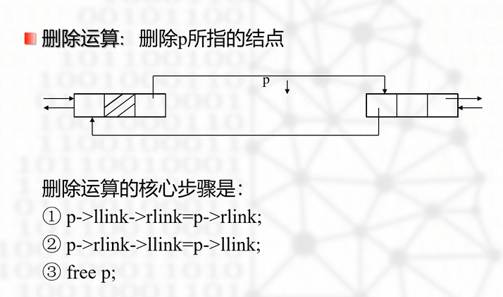

### 线性表的应用

线性表是一种最简单、最基本，最常用的数据结构，其用途十分广泛。作为线性表应用的一个例子，下面讨论一元整系数多项式的算术运算。从该例中，要学会如何分析元素间的关系、结构的描述、存储方式的选择，如何描述和实现算法

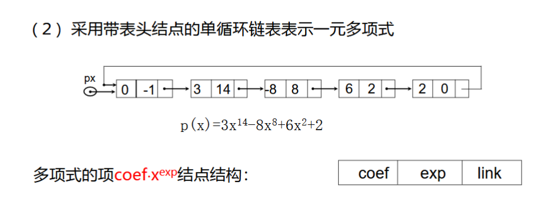

相应结构体定义如下：

```c
typedef struct pNode{
    int coef;
    int exp;
    struct pNode *link;
}PNode;

typedef struct polunominal{
    struct pNode *head;
}Ploynominal;
```

## 堆栈与队列

1

## 数组

1

## 树

binarytree.c（先序、中序、后序遍历）

binarytree2.c（层次遍历）

binarytree3.c（应用-计算结点数量）

treeclear.c（递归清空二叉树）

### 树转化成二叉树


### 二叉树转化成森林

（左孩子，右兄弟）


### 树和森林的存储表示


其中这里的 `sibling` 表示原示例中兄弟结点的下标，比如说B和C是兄弟结点，然后A是-1，B是1，C是2，那么BC（B在C的左边）这个兄弟结点的的 `sibling` 的表示则为： `B -> C(2) -> A(-1)`，也就是上面图示的箭头指向，兄弟结点的最后一个（最右边的）的 `sibling` 即为他的父结点的位置下标

### 森林的遍历


总结就是：

- 森林先序/中序遍历与二叉树的思想基本相同，遍历完相加即可
- 森林后序遍历的头结点是从右往左一次遍历的（D -> A），并不是简单相加
- 层次也差不多


------

## 堆与优先权队列

heap1.c（向下调整算法 && 建堆运算）

queue1.c（优先权队列的实现）

### 什么是堆？

定义:从逻辑结构上看，一个大小为n的堆是一棵包含n个结点的 **完全二叉树**，根结点称为堆顶，包含如下两类：

- 最小堆:树中每个结点的数据都 **小于或等于** 其孩子结点，因此，在最小堆中，堆顶存储的数据是整棵树中最小的;
- 最大堆:树中每个结点的数据 **大于或等于** 其孩子结点，因此，在最大堆中，堆顶存储的数据是整棵树中最大的


### 堆的存储表示

就拿上面那个最小堆来举例，堆的存储结构应该遵循的是层次遍历，也就是如下：

```
index:  0   1   2   3   4   5  ....
value: [18, 30, 24, 50, 46, 92]....
```

那么如何判断一个堆是最小堆还是最大堆？

你就从0开始按层次遍历排好，然后观察是不是 **每个结点** 都 **大于等于/小于等于** 其子结点就行

### 建堆运算

我们已知最后一个叶结点双亲的位置是 $$\lfloor\frac{(n-2)}{2}\rfloor$$ ($$\lfloor x\rfloor$$表示向下取整)，根结点位置为 0

**算法思想（最小堆）：** 从最后一个叶子的双亲($$K_{\lfloor(n-2)/2\rfloor}$$)**反方向** 直到根结点($$K_0$$)，依次对其中的每个结点($$K_i$$)执行向

下调整（AdjustDown）操作，步骤如下：

①若该结点小于或等于其最小的孩子，则本轮向下调整结束;否则执行步骤②;

②将该结点与最小孩子交换;交换完成后，继续以该结点为考查对象，再次执行步骤①；

关键算法：（完整代码可以见 heap1.c）

```c
void AdjustDown(ElemType heap[], int current, int border){
    int p = current;
    int minChild;
    ElemType temp;
    while(2 * p + 1 <= border){  // 若p不是叶结点，则执行
        if((2 * p + 2 <= border) && (heap[2 * p + 1] > heap[2 * p + 2]))
            minChild = 2 * p + 2;  // 右子树存在，且较小，则minChild指向p的右子树
        else
            minChild = 2 * p + 1;  // 右子树不存在或较大，则指向p的左子树
        if(heap[p] <= heap[minChild]){
            break;                 // 若当前结点不大于自己的最小的子树，则结束
        }
        else{                      // 否则就将p与最小的子树进行交换
            temp = heap[p];
            heap[p] = heap[minChild];
            heap[minChild] = temp;
            p = minChild;          
            // 设置下轮循环待考察元素的位置（当前下移元素位置）
        }
    }
}

void CreatHeap(ElemType heap[], int n){
    int i;
    for(i = (n-2)/2; i > -1; i--)      // 从最后一个叶结点的双亲方向到根结点
        AdjustDown(heap, i, n - 1);
}
```

### 优先权队列

**优先权队列** 是一种具有如下特性的数据结构：元素加入数据结构的次序无关紧要，但每次从该数据结构中取元素

时，都只取具有最高优先级的元素，这样的数据结构即为优先权队列

- 每个元素都应有一个优先权，且可以比较大小
- 元素按优先权的高低顺序依次出队，而不是按元素进入队列的先后顺序出队

**实现优先权队列的方法：**

- 进队：将新元素放在堆尾元素后面，并按照（最小堆）或最大堆进行适当调整 ($$O(log_2n)$$)
- 出队：直接取出堆顶元素($$O(1)$$)，取出后，按照（最小堆）或最大堆进行适当调整($$O(log_2n)$$)

**向上调整算法（最小堆）：**

- 设新元素插入在最小堆的元素序列的尾部
- 从新插入元素开始，自底向上，与父结点元素进行大小比较；若父结点大于子结点，则进行交换调整；直到父结点不再大于新元素子结点，或者新元素已经到达了堆顶

关键代码：（完整代码请见 queue1.c）

```c
// 向上调整
void AdjustUp(ElemType heap[], int current){
    int p = current;
    ElemType temp;
    while(p > 0){   // 如果p是根节点了则结束
        if(heap[p] < heap[(p - 1) / 2 ]){  //  // 如果p小于父结点，则进行交换
            temp = heap[p];
            heap[p] = heap[(p - 1) / 2 ];
            heap[(p - 1) / 2 ] = temp;
            p = (p - 1) / 2;   // 更新p的位置使其成为父结点  
        }else {
            break;
        }
    }
}
```

## 哈夫曼树与哈夫曼编码

huffmantree1.c（哈夫曼算法）

### 树的路径长度

**树的内路径长度**：除叶结点外，从根到树中其他所有结点的路径长度之和

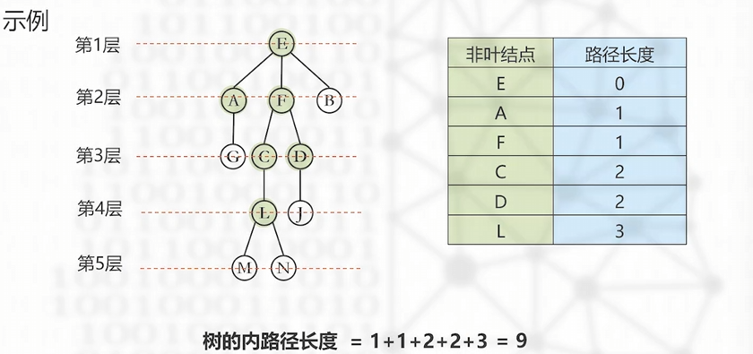

**树的外路径长度**：从根到所有叶结点的路径长度之和

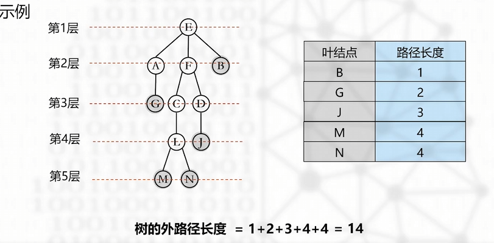

我们已知 **扩充二叉树（2-树）** 是一棵 **除了叶结点之外，每个结点都必须有两个子结点**，现在定义内路径长度和外路径长度分别为 `I` 和 `E`，叶结点数量为 `n`，那么有以下公式：

$$
E=I+2n
$$

**叶结点的加权路径长度**：设叶结点是带权的，则叶结点的加权路径长度是其长度与其权值的乘积

**树的加权路径长度**：所有叶结点的加权路径长度之和，记作 `WPL`，有如下公式：

$$
WPL=\sum_{k=1}^{m}w_k \times l_k
$$

其中， $$m$$ 是叶结点的数量， $$w_k$$ 是第 $$k$$ 个结点的权值(圆圈里的数值)， $$l_k$$ 是该叶结点的路径长度

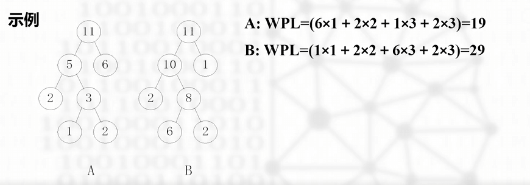

**加权路径长度WPL的内涵**(结合字符编码应用场景)

- 每一个叶结点表示一个字符
- 叶结点权值表示对应字符在文本中的出现频度
- 叶结点的路径长度表示对应字符的编码长度

**WPL 表示的是一个文本最终转换成编码之后的总编码长度**

### 哈夫曼树和哈夫曼算法

**哈夫曼算法**：求具有最小加权路径长度二叉树的算法

**哈夫曼树**:用哈夫曼算法构造生成的二又树

- 哈夫曼树是一棵扩充二叉树
- 哈夫曼树中任一 **非叶节点的权值** 等于其 **左右孩子的权值之和**
- 对于叶节点相同二叉树而言，哈夫曼树的 **加权路径长度是最小的**

由下面的例子来呈现哈夫曼算法的具体步骤：

现有集合 `W = {3, 5, 9, 11, 12，13}`，我们先选取最小的两个权值构成二叉树，即 3 和 5，构造如下：

`F = {8，9，11，12，13}`，其中 <8，3>，<8，5>

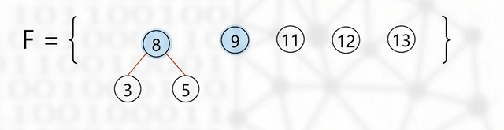

然后循环上述步骤，我们能得到 <17，8>，<17，9>

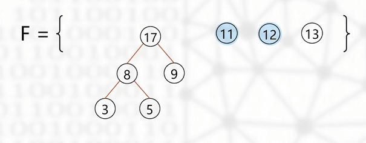

然后我们再选择 11 和 12 进行组合，以此类推，最终生成一个新的二叉树

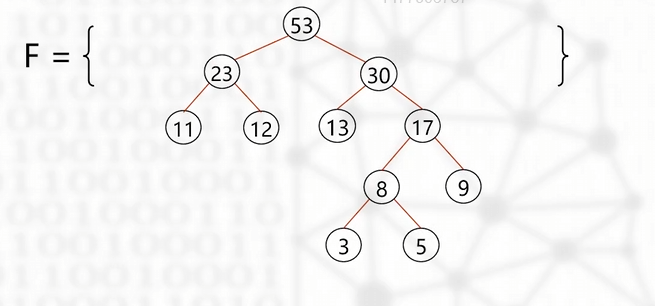

关键代码如下：（伪代码）（非伪代码可以看 huffmantree1.c）

```c
// 创建哈夫曼树
BinaryTree CreateHFMTree(int w[], int m){
    BinaryTree x, y, z;
    CreatPQ(PQ, m);                       // 初始化用于存储二叉树的优先权队列，权值存在根结点数据域
    for(int i = 0; i< m; i++){
        MakeTree(x, w[i], NULL, NULL);    // 创建只包含根结点的二叉树，并把权值存在根结点数据域
        Append(PQ, x);                    // 将二叉树存入优先权队列
    }
    while(PQ.n > 1){
        Serve(PQ, x);
        Serve(PQ, y);                        // 这两步对应哈夫曼算法中取出两个最小的结点进行结合
        if(x.root.element < y.root.element)  // 设置左子树的权值小于右子树
            MakeTree(z, x.root.element + y.root.element, x, y);
        else
            MakeTree(z, x.root.element + y.root.element, y, x);
        Append(PQ, z);                       // 将合并后的二叉树加入优先权队列
    }
    Serve(PQ, x);          // 获取优先权队列中唯一的二叉树（完整的哈夫曼树），并存入x
    return x;
}
```

### 哈夫曼编码

（为了调上面那个伪代码怒耗时3h，但是给自己定的ddl要到了，遂停摆）

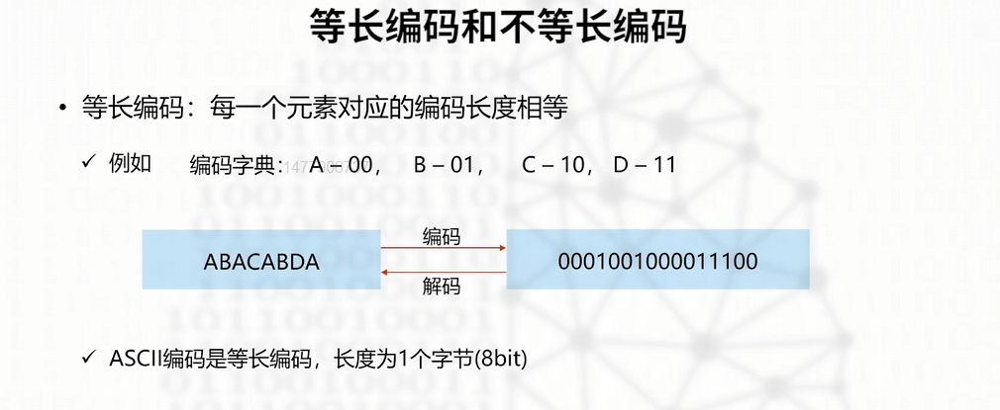

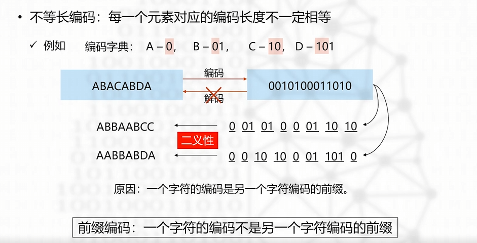

**哈夫曼编码**

利用哈夫曼树构造哈夫曼编码：

已知文本的字符集S，以及对应的权值集合W，权值表示对应字符的频度，执行如下步骤：

1. 根据W构造哈夫曼树，叶结点权值代表对应的字符;
2. 按照左孩子分支标记编码0，右孩子分支标记编码1的原则(左0右1)，为哈夫曼树中的分支标记0/1编码;
3. 叶子节点对应字符的编码，即为从根结点到该叶子节点的路径中，经过各孩子分支所形成的0/1编码序列。

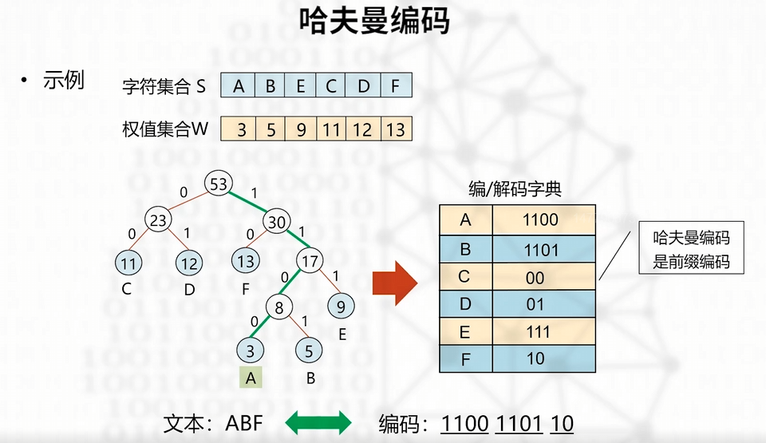


------

## 集合与搜索

jihe1.c（有序表顺序搜索，无序表顺序搜索，有哨兵的有序表顺序搜索）

jihe2.c（二分搜索）

### 集合的抽象数据类型

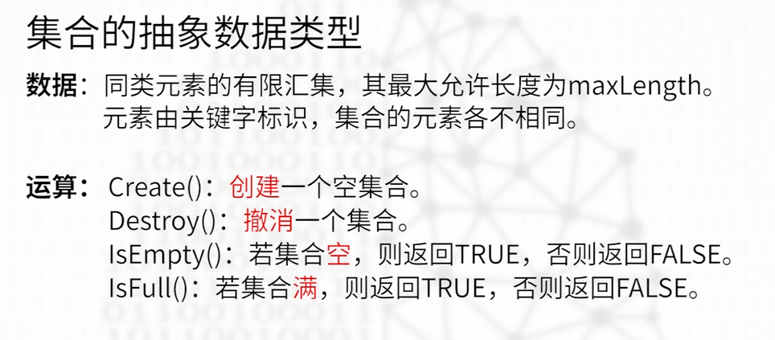

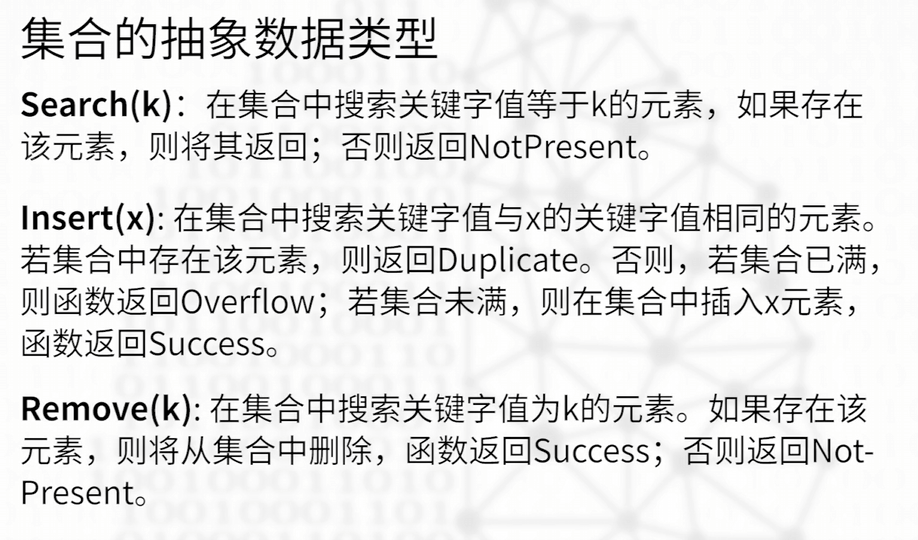

**常见的集合实现有三种：**

- 线性表（本章节采用线性表）
- 搜索树
- 散列表

**定义顺序表表示下的集合：**

```c
typedef struct {
    int n;
    int maxLength;
    ElemType *element;
}ListSet;
```

（ElementType表示可以比较的类型，要根据实际进行更改）

### 顺序搜索

**顺序表**：采用顺序存储表示来实现的线性表（申请连续的存储空间）

**顺序搜索**：在进行元素查找时，从线性表第一个元素开始，按照位置从前到后依次的进行元素的查找

**无序表的顺序搜索：**

从第一个元素开始，将指定待查找的元素x的关键字与表中元素的关键字一一比较

若相等，搜索成功；若搜索完整个表，不存在关键字值等于给定值的元素搜索失败，例如：

 (41，25，28，33，36，15)

33搜索成功! 35 搜索失败!（需要将每个元素都比较一遍）

顺序搜索无序表的代码实现：

```c
int SeqSearch(ListSet L, ElemType x){
    for(int i = 0; i < L.n; i++)
        if(L.element[i] == x)      // 一个一个搜索直到搜索到为止
            return i;
    return -1;
}
```

如果存在有序表（1， 25， 28， 33， 36， 45），我需要查找35，我可以对代码改动如下：

```c
int SeqSearchOrder(ListSet L, ElemType x){
    for(int i = 0; i < L.n; i++){
        if (L.element[i] == x)
            return i;
        else if(L.element[i] > x)    // 顺序表中是从小到大排列的
            return -1;
    }
    return -1;
}
```

也可以增加一个 **哨兵**（有序表最后添加一个无穷大的数）

```c
int SeqSearchSentry(ListSet L, ElemType x){
    L.element[L.n] = MaxNum;              // 将最后一个设置为无穷大
    for(int i = 0; L.element[i] < x; i++) 
    // 让L中的每个元素跟x比较，若匹配到了最后一个哨兵还没有x，就说明搜索失败
        if(L.element[i] == x)             // 一个一个搜索直到搜索到为止
            return i;
    return -1;
}
```

**对有序表进行顺序搜索比无序表上进行顺序搜索速度更快？**

错误。顺序搜索的时间复杂度在有序表和无序表上都是 O(n)，没有本质区别

### 二分搜索

此章节说明的二分搜索适用于有序表

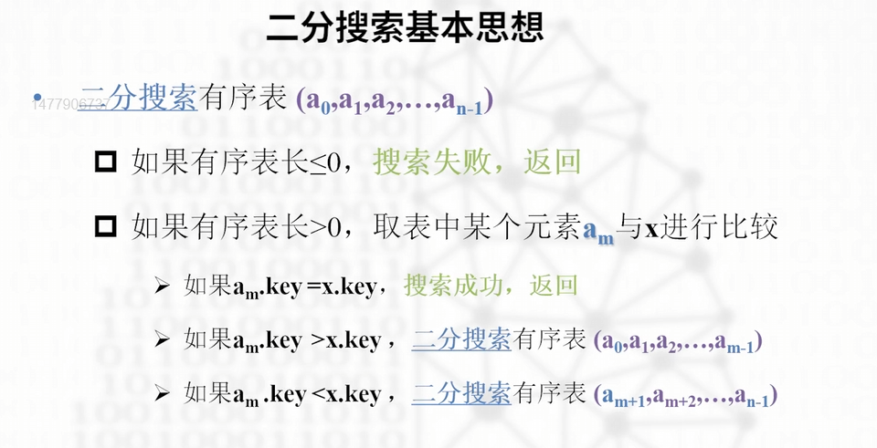

**对半搜索是二分搜索中的一种，分割点为表的中点元素**： 

$$
m=\frac{low+high}{2}
$$

过程如下：

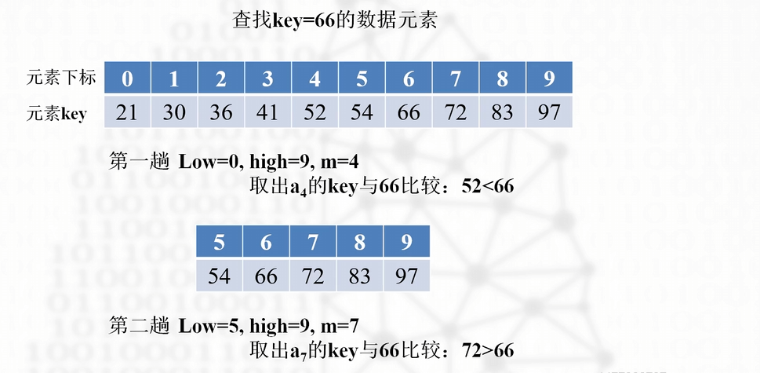

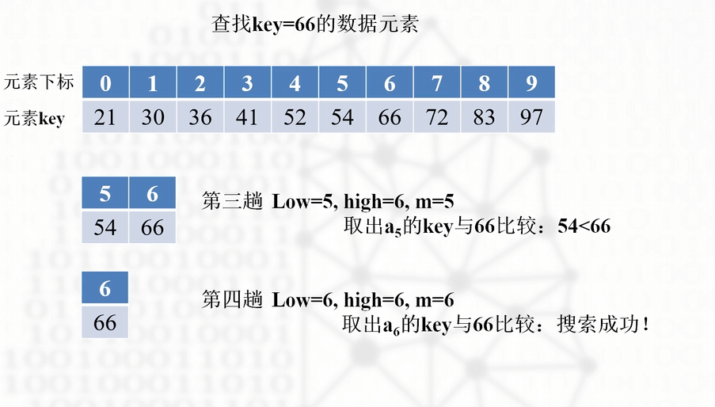

关键代码：

```c
int BinarySearch(ListSet L, ElemType x, int low, int high){
    if(low <= high){
        int m = (low + high) / 2;
        if(L.element[m] > x)
            return BinarySearch(L, x, low, m - 1); // 中点比x大，说明x在左半边
        else if(L.element[m] < x)
            return BinarySearch(L, x, m + 1, high);// 中点比x小，说明x在右半边
        else
            return m;
    }
    else
        return -1;
}
```

也可以使用while循环：

```c
int BinarySearch(ListSet L, ElemType x){
    int m, low = 0;
    int high = L.n - 1;
    while(low <= high){
     	m = (low + high) / 2;
        if(L.element[m] > x)
            return BinarySearch(L, x, low, m - 1); // 中点比x大，说明x在左半边
        else if(L.element[m] < x)
            return BinarySearch(L, x, m + 1, high);// 中点比x小，说明x在右半边
        else
            return m;  
    }    
    return -1;
}
```

### 平均搜索长度分析

分析一个搜索算法的时间复杂度通常分搜索成功以及搜索失败两种情况加以讨论

为了确定一个指定关键字值的记录在表中的位置，需要进行关键字值之间的比较，这些比较次数的期望值称为搜索

算法的 **平均搜索长度( average search length ASL)**

#### 无序表的顺序搜索

(1)成功搜索的平均搜索长度

设表中元素a,被搜索的概率p;，假定每个元素的搜索概率相等即 $$p_i=\frac{1}{n}$$ ，则搜索成功时的平均搜索长度为：

$$
ASL_s=\sum_{i=1}^{n}i \times p_i=\frac{1}{n}\sum_{i=1}^{n}=\frac{n+1}{2}
$$

(2)搜索失败的平均搜索长度

该函数在搜索失败的情况下，总要进行 **n次** 关键字值之间的比较 

#### 有序表的顺序搜索

(1)成功搜索的平均搜索长度

**与无序表相同**，其公式如下

$$
ASL_s=\sum_{i=1}^{n}i \times p_i=\frac{1}{n}\sum_{i=1}^{n}=\frac{n+1}{2}
$$

(2)搜索失败的平均搜索长度

在搜索失败的情况下，**平均搜索长度大约比无序时快一倍**，其公式如下：

$$
ASL_F=1+\sum_{i=1}^{n+1}i \times \frac{1}{n+1}=2+\frac{n}{2}
$$

其中，循坏内比较了 $$1+\frac{n}{2}$$ 次，判断跳出循环又比较了 $$1$$ 次

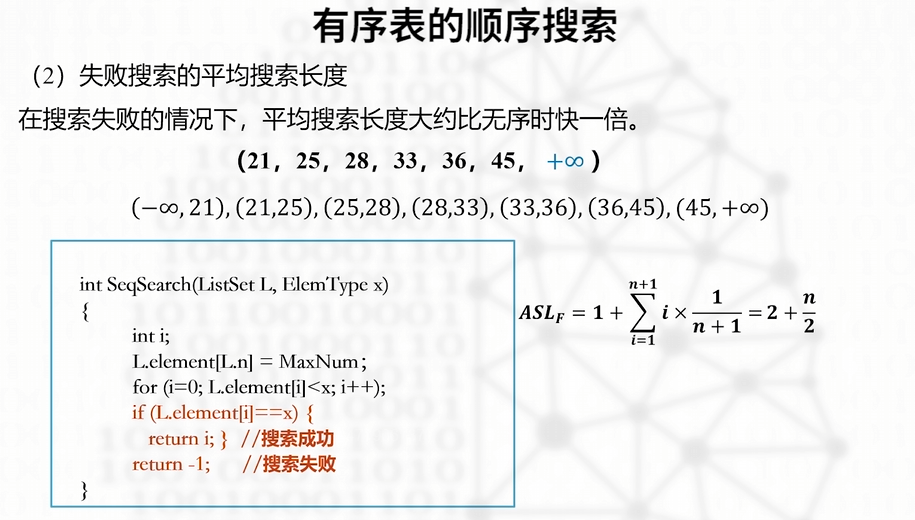

#### 二叉判定树构造

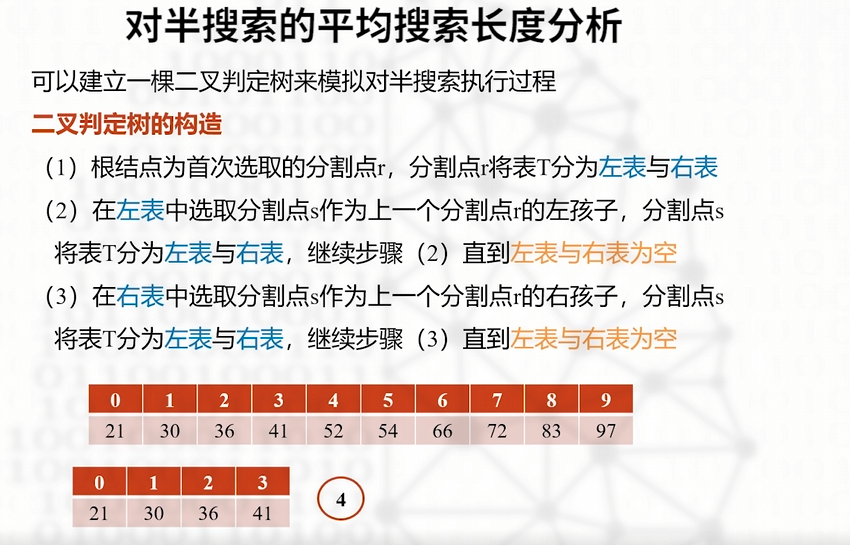

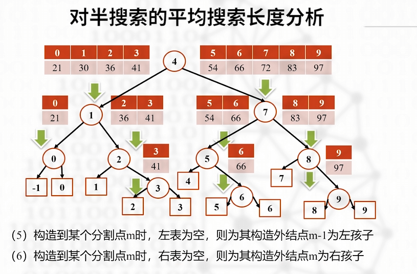

这样子构造可以保证每个内结点的左子树都是关键字更小的结点，而右子树都是关键字更大的结点

**搜索(二叉判定树T，k)**

(1)将 (l = 根结点的关键字) 与 (k) 进行比较

(2)如果 l=k，**成功搜索，返回**

(4)如果 I>k，如果T的左子树不为空，**搜索(T的左子树，k)**

**否则，搜索失败，返回**

(5)如果 l<k，如果T的右子树不为空，**搜索(T的右子树，k)**

**否则，搜索失败，返回**

**如果搜索成功，则算法在内结点处终止；否则算法在外结点处终止**

这样构造出来的二叉树有以下特征：(高度为 $$\lfloor log_2n \rfloor+1$$ 的二叉树 ) 

- 任意结点左右子树上结点个数差 = 1
- 左右子树高度差最多为 1

**定理**  对半搜索算法在成功搜索的情况下，关键字值之间的比较次数不超过 $$\lfloor log_2n \rfloor+1$$;对于不成功的搜索，算法需要作 $$\lfloor log_2n \rfloor$$ 或 $$\lfloor log_2n \rfloor+1$$ 次比较 

**定理** 对半搜索算法的成功/失败的平均时间复杂度为 $$O(log_2n)$$

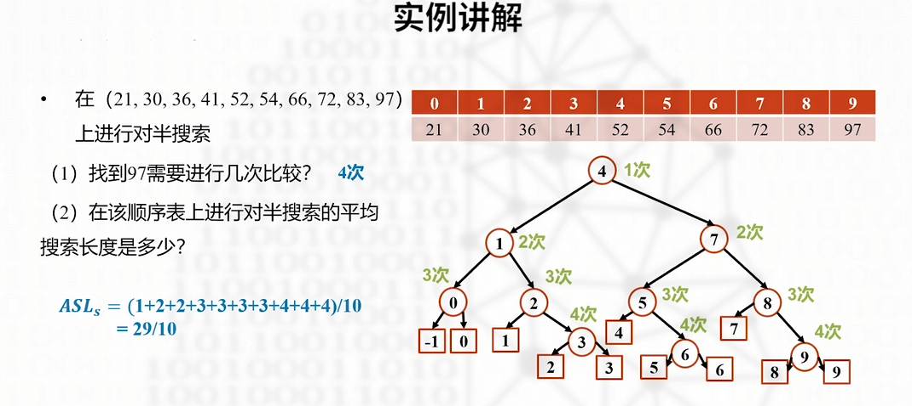


------

## 搜索树

searchtree1.c（二叉搜索树的搜索、插入、删除）

### 二叉搜索树

#### 二叉搜索树的定义

**定义** 设结点由关键字值表征，假定所有结点的 **关键字值各不相同**，二叉搜索树或者是一棵空二叉树或者是具有下

列性质的二叉树:

(1)若左子树不空，则左子树上所有结点的关键字值均小于根结点关键字值;

(2)若右子树不空，则右子树上所有结点的关键字值均大于根结点关键字值;

(3)左、右子树也分别是二叉搜索树


**性质** 若以中序遍历一棵二叉搜索树，将得到一个以关键字 **递增** 排列的有序序列

**中序遍历**：23 35 45 54 63 69 76 87

#### 二叉搜索树中序遍历的特征

任何一个结点：

- 左子树上的结点都在它的左侧排列;
- 右子树上的结点都在它的右侧排列，

再结合二叉搜索树左小右大的原则，任何一个结点：

- 左子树上的结点都在它的左侧排列且都比它小
- 右子树上的结点都在它的右侧排列且都比它大

#### 类型实现

定义值集合项类型 T 包含值与键

```c
typedef int KeyType;
struct entry{
    KeyType Key;
    DataType Data;
}Entry;
typedef struct Entry T;
```

定义搜索树：

```c
// 定义搜索树节点类型BTNode, 包含集合项、左右子树根结点指针
typedef struct btnode{
    T Element;
    struct btnode *lChild, *rChild;
}BTNode;

// 定义搜索树类型BTree，包含根结点
typedef struct btree{
    BTNode *root;
}BTree;
```

#### 二叉搜索树搜索操作

**二叉搜索树的搜索操作**

在一棵二叉搜索树上，查找关键字为k的元素

(1)若二叉树为空，则搜索失败

(2)否则，将k与根结点比较

- 若k小于该结点的关键字，则以同样的方法搜索左子树，而不必搜索右子树，
- 若k大于该结点的关键字，则以同样的方法搜索右子树，而不必搜索左子树，
- 若k等于该结点的关键字，则搜索成功终止

#### 二叉搜索树插入操作

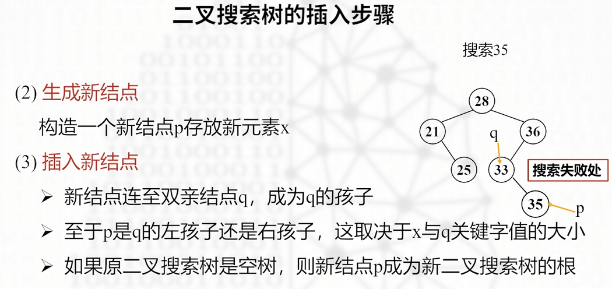

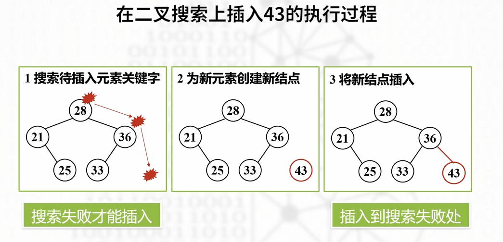

关键代码：

```c
// 搜索树插入操作
bool Insert(BTree *bt, T x){
    BTNode *p = bt -> root, *q, *r;    // p指针从根结点出发一直到搜索结束
    KeyType k = x.Key;
    while(p){
        q = p;                         // q指针记录搜索失败处的上一层结点
        if ( k < p -> Element.Key)
            p = p -> lChild;
        else if (k > p -> Element.Key)
            p = p -> rChild;
        else
            return false;
    }
    r = NewNode(x);                   // 生成新结点
    if(!bt -> root)
        root = r;                     // r作用是指向新结点
    else if (k < q -> Element.Key)
        q -> lChild = r;              // q指针作用是记录新结点的双亲
    else 
        q - > rChild = r;
    return true;
}
```

#### 二叉搜索树删除操作

##### 删除叶结点

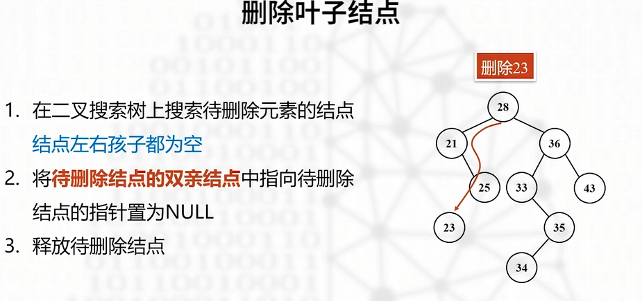

##### 删除带一个子树的结点

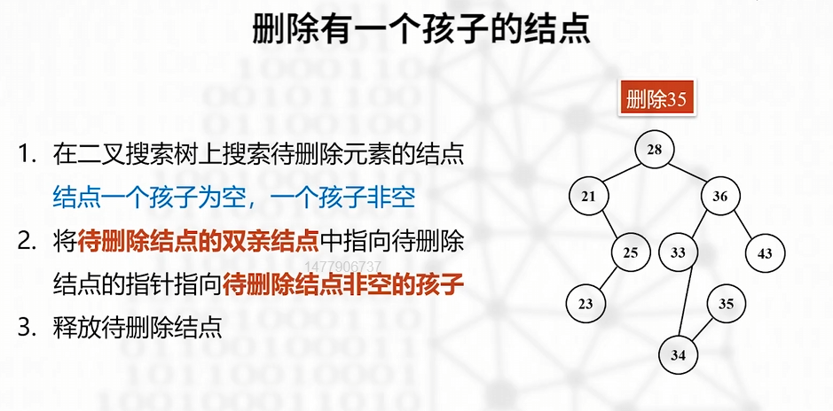

首先先断开33和35之间的连线，然后将33与34相连（33的右指针指向34），最后删除35

PS：不能直接删除，但是可以替代，比如上述就是让34替代了原本35的位置，而且 **不会影响有序性**

##### 删除两个子树的结点

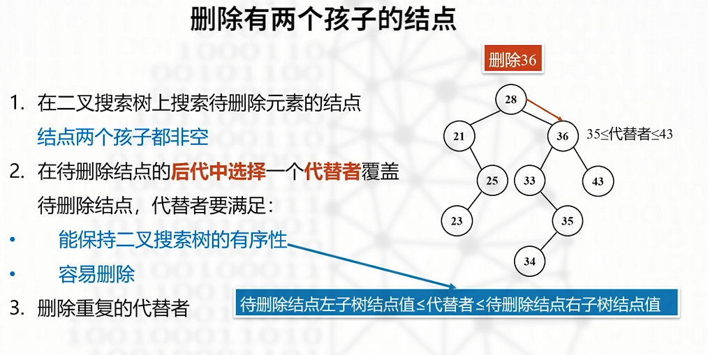

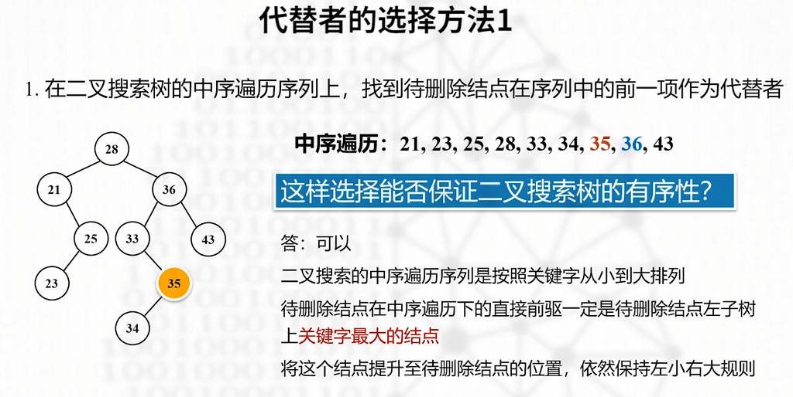

**↑ 所选的代替者肯定没有右子树**


**↑ 所选的代替者肯定没有左子树**

**删除有两个孩子的结点**

(1)在二叉搜索树上搜索待删除元素的结点 （**结点两个孩子都非空**）

(2)选择待删除结点在中席遍历序列下的直接 B 代替待删除节点

(3)删除重复的代替者

- 代替者没有孩子：直接删除
- 代替者有一个孩子：孩子直接代替后删除

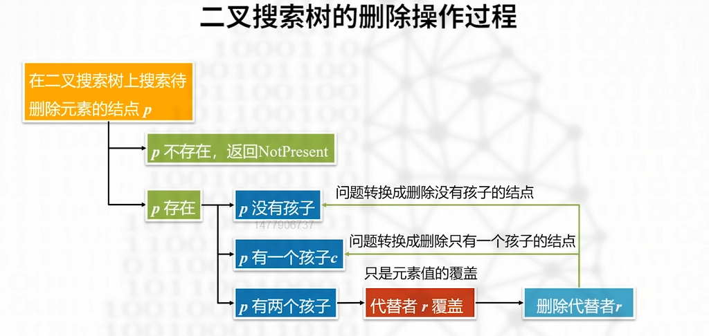

### 平衡树

#### 二叉平衡树的定义

二叉平衡树或者是一棵空二叉搜索树，或者是具有下列性质的二叉搜索树

(1)其根的左、右子树高度之差的绝对值不超过1;

(2)其根的左、右子树都是二叉平衡树

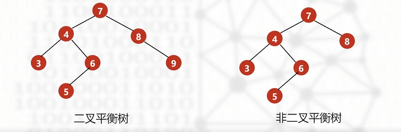

**定义** 结点的平衡因子

结点的平衡因子被定义为该结点的左子树高度减去右子树的高度

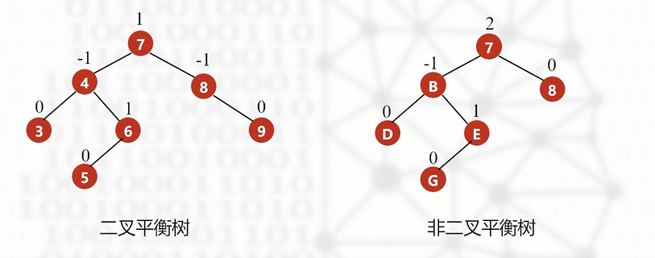


#### 二叉平衡树的插入运算

二又平衡树的插入运算可按如下两条基本原则进行：

- 原则1：先按普通二叉搜索树的插入方法插入结点以保持 **排序性** 
- 原则2：然后再判断二又平衡树的平衡性是否被破坏，从而决定是否需要调整 **平衡性**

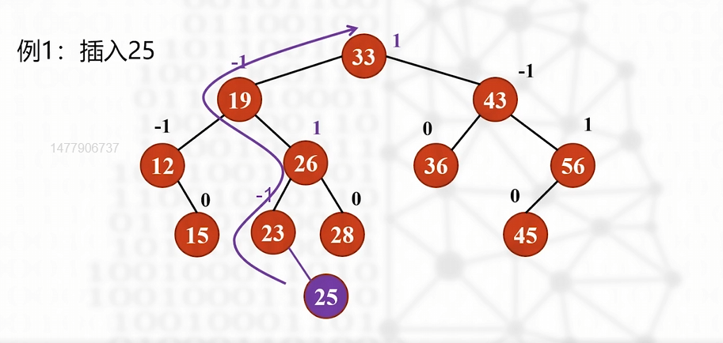

如图，插入25后，任何根结点的左右子树高度差绝对值不超过1，所以25被正常插入

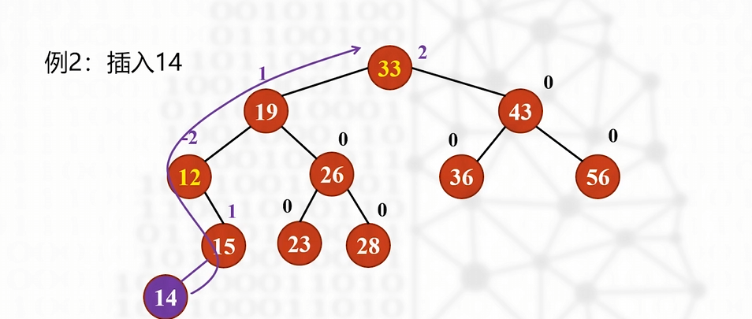

如图，插入14后，发现根结点的左右子树高度差绝对值大于1（12所在的根结点和33所在的根结点），所以插入失败，需要进行 **平衡性的调整**

**基本原则**：

- 找到需要调整的最小子树
- 调整最小子树的平衡性

**如何找到需要调整的最小子树？**

最小子树的根结点s 即为离新插入结点最近且平衡因子绝对值超过1的祖先结点，也就是插入后由新结点回溯至根结点的路径上第一个出现的非平衡结点

**如何调整最小子树的平衡性？**

根据 **新结点在最小子树s上的插入类型** 来选择不同的平衡

- 如果属于LL(RR)插入类型，即新结点插入s的左(右)子树的左(右)子树上，则采用 **单旋转方法**
- 如果属于LR(RL)插入类型，即新结点插入s的左(右)子树的右(左)子树上，则采用 **双旋转方法**

而且是怎么插入的，旋转也按照插入的LR顺序进行

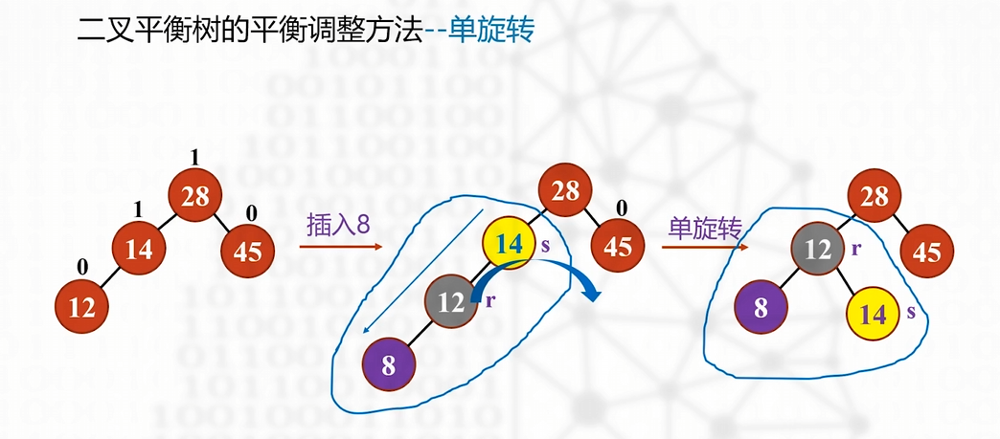

这里是LL的插入类型，也就是插入在14的左子树的左子树上，所以我们现在标记14为s，那么下一个12标记为r，然后就是将r和s沿顺时针方向转动，让s变成r的右子树


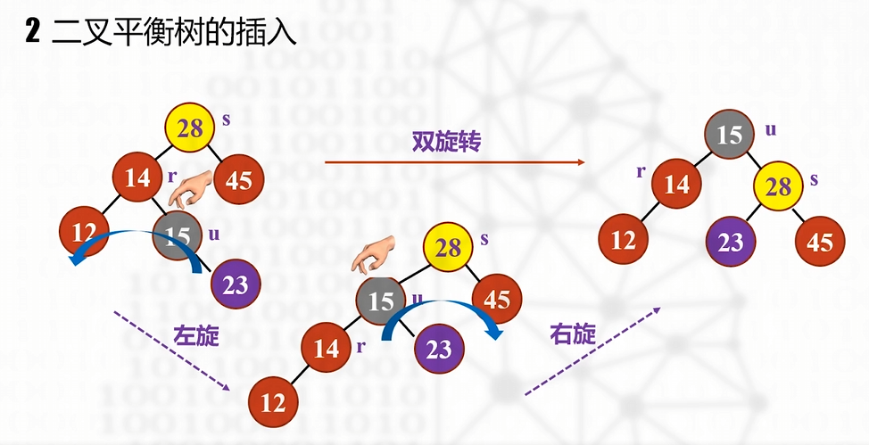

**二叉平衡树的插入算法**

在一棵二叉平衡树上，插入新元素的手工算法可描述如下：

1. 按照 **二叉搜索树的插入方式插入新元素**
2. 判断插入新元素后的二叉平衡树其平衡性是否被破坏，**如果平衡性没有破坏**，**则插入运算结束**
3. 否则，如果 **平衡性被破坏**，则标记s结点为插入后由新结点回湖至根结点路径上第一个出现的非平衡结点，然后判断插入类型：

- 如果插入类型为 **LL/RR**，采用 **单旋转方式** 调整最小子树的平衡性
- 如果插入类型为 **LR/RL**，则采用 **双旋转方式** 调整最小子树的平衡性

#### 例题

例题如下：

对空树的二叉平衡树，依次输入A，Z，B，T，C，P 所构造的二叉平衡树的根结点为 _______（字母根据在字母表的编号比较大小，A-Z的编号为1~26）

答案：C

解析：

**第1步：插入 A**

```
  A
```

**第2步：插入 Z**

```
  A
   \
    Z
```

**第3步：插入 B**

插入后失衡，进行 **RL旋转**（先右旋Z，再左旋A）

```
  插入后：        右旋Z：        左旋A：
    A               A             B
     \               \           / \
      Z       →       B    →    A   Z
     /                 \       /     \
    B                   Z     null    null
```

**结果**：

```
    B
   / \
  A   Z
```

**第4步：插入 T**

```
    B
   / \
  A   Z
     /
    T(20)
```

**第5步：插入 C**

插入后Z节点失衡，进行 **LL旋转**

```
    B                  B
   / \                / \
  A   Z     →        A   T
     /                  / \
    T                  C   Z
   /
  C
```

**结果**：

```
    B
   / \
  A   T
     / \
    C   Z
```

**第6步：插入 P**

插入后B节点失衡，进行 **RL旋转**

```
    B                  B                  C
   / \                / \                / \
  A   T     →        A   C     →        B   T
     / \                / \            / \   \
    C   Z              P   T          A   P   Z
     \                     /
      P                   Z
```

**最终结果**：

```
        C
       / \
      B   T
     /     \
    A       Z
     \     /
      P   null
```

**修正后的标准RL旋转**：

```
    B                  B                  C
   / \                / \                / \
  A   T     →        A   C     →        B   T
     / \                / \            / \   \
    C   Z              P   T          A   P   Z
     \                     / \
      P                   null Z
```

**最终平衡树**：

```
        C
       / \
      B   T
     / \   \
    A   P   Z
```

‍

### B-树

#### m叉搜索树的定义

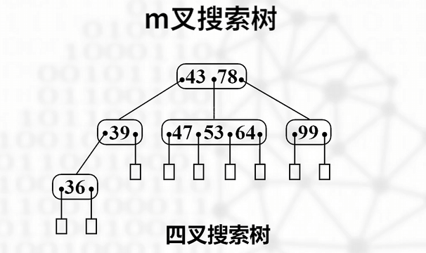

图中的方块代表空树

**空树** 也被称为 **失败结点**，因为这是当搜索某个关键字不在树中所到达的子树

失败结点中不包含元素，**失败结点不是叶结点**

**m叉搜索树的递归定义：**

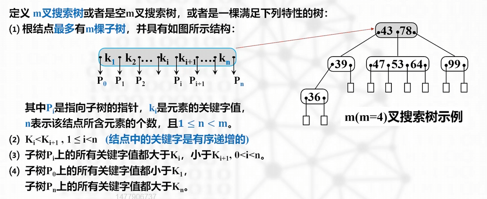

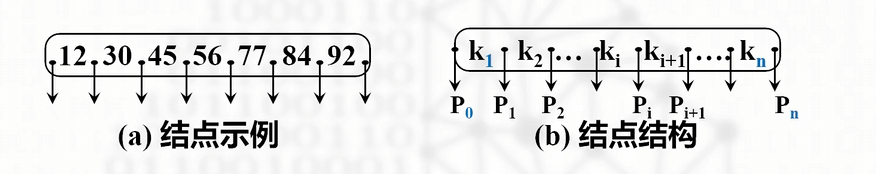

从定义中可以得到：

(1)一个m叉搜索树的结点中，**最多** 存放 **m-1个元素** 和 **m个指向子树的指针**

(2)每个结点中包含的元素个数比它包含的指针数少1

**内搜索和外搜索**

**内搜索：**当集合足够小，可以驻留在内存中时，相应的搜索方法称为内搜索

**外搜索：**如果文件很大，以至于计算机内存容不下时，它们必须存放在外存中。在外存中搜索给定关键字值的元素的方法称为外搜索

**内存中**，集合用 **二叉平衡树** 表示。**外存中**，集合可以用一种特殊的 **m叉搜索树--B-树** 来表示

由于读取外存的速度要比内存慢百倍，所以平时读取外存就可以将二叉树压成B-树：

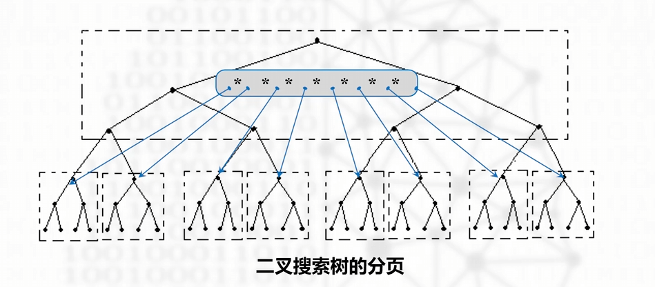

如上图，将一棵高度为6的二叉搜索树压缩成单结点存放7个元素、高度为2的8叉树，大大提高了搜索速度

#### m叉搜索树的性质

**性质1**：高度为 $$h$$ 的 $$m$$ 叉搜索树中最多有 $$m^h-1$$ 个元素

**性质2**：含有 $$N$$ 个元素的 $$m$$ 叉搜索树的高度在 $$log_m(N-1)$$ 到 $$N$$ 之间

#### B-树的定义

**定义** 一颗m阶B-树是一棵m叉搜索树，它或者是空树，或者是满足以下特性的树：

- 根结点 **至少有两个** 孩子 （根结点可以只有一个元素）
- 除根结点和失败结点外的所有结点 **至少** 有 $$\lceil \frac{m}{2} \rceil$$ 个孩子 （保证B-树不会退化成单分支树）
- 所有失败结点均在同一层上

**如何判断是不是B-树？如何判断是几阶B-树？**

- 首先看失败结点是否在同一层上
- 其次查看根结点是否最少有两个孩子
- 然后确定m的值，并计算 $$\lceil \frac{m}{2}\rceil$$ 是多少
- 最后查看每个结点(根结点和失败结点除外)的孩子数量有没有少于 $$\lceil \frac{m}{2}\rceil$$ ？

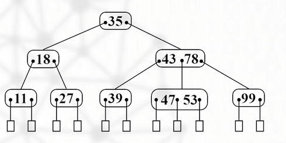

比如这个图，每个根结点下至少有2个孩子，所以此树既是3阶B-树，也是4阶B-树，但是绝对不可能是5阶B-树，因为 $$\lceil \frac{m}{2}\rceil$$ 至少为3，而图中存在有两个孩子的结点

#### B-树的性质

**性质1** 设B-树失败结点的总数是 $$s$$ ，那么，一棵B-树包含的元素总数 $$N$$ 是B-树的失败结点的总数 $$s-1$$ ，即 $$N=s-1$$

**性质2** 含有 $$N$$ 个元素的m阶B-树的高度 $$h$$ 有 $$h≤1+log_{\lceil \frac{m}{2}\rceil}\frac{N+1}{2}$$

#### B-树的搜索

在B-树上进行搜索的过程是一个 **顺时针查找结点**，和 **在结点的关键字中搜索** 交叉进行的过程

#### B-树的插入

B-树插入应遵循的基本原则：

- 首先执行 **搜索** 操作，判断元素是否存在;
- 如果元素不存在，则将元素依某种插入规则插入B-树;
- 如果插入后没有违反B-树的定义，则插入成功完成;否则需作相应调整

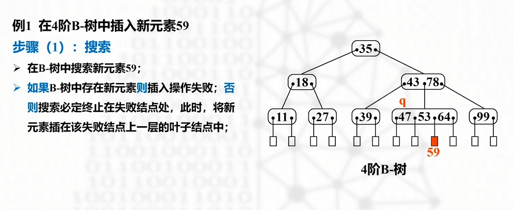

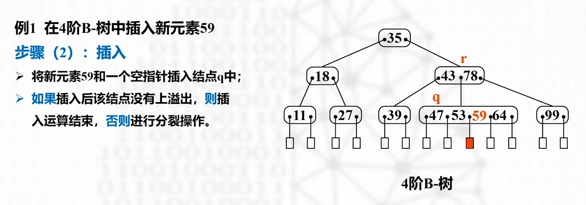

**上溢出**：关键字个数 > $$m-1$$

此时插入59后，结点个数突破上限3（上溢出），就要进行下一步调整操作：

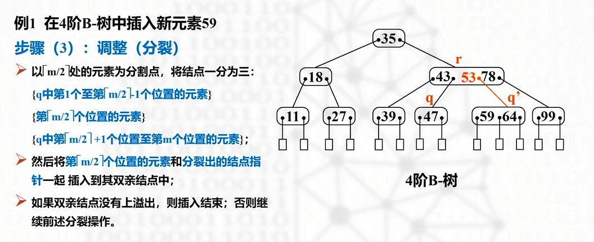

总结步骤如下：

- **Step 1**：搜索。在B-树中搜索给定关键字值的元素。如果搜索成功，表示有重复元素，则插入运算结束；**否则转Step 2将新元素插入搜索失败结点上一层处的叶子结点q中**
- **Step 2**：插入。将新元素和一个空指针插入结点q中。如果插入后，结点q未上溢出，即结点中包含的元素个数未超过 $$m-1$$ (指针数未超过m)，则插入运算结束。**否则转Step3进行结点的分裂操作**
- **Step 3**：分裂。以 $$\lceil \frac{m}{2}\rceil$$ 处的元素为分割点，将上溢出结点一分为三，然后将分割点元素和新结点插入双亲结点中。继续检查此双亲结点的上溢出问题。如果没有上溢出，则插入运算结束，**否则转Step 3继续该双亲结点的分裂操作，直至不再产生上溢出现**

**Tips**：如果按照Step3，**根结点产生分裂**，由于根结点没有双亲，那么分裂产生的两个结点的指针以及分割点元素将组成一个新的根结点，从而 **将导致B树长高一层**

#### B-树的删除

**B-树删除应遵循的基本原则**：

首先执行搜索操作，判断元素是否存在，如果被删除元素存在，则分情况执行删除操作：

- 情形1：被删除的元素 **在叶子结点上**。则直接从该叶子结点中删除该元素，并检查是否发生下溢出。如果没有下溢出，则删除运算结束，否则处理下溢出
- 情形2：被删除的元素 **不在叶子结点上**。则首先执行 **替代** 操作，用该元素 **右侧子树上的最小元素取代它** ，从而将问题转化为情形1

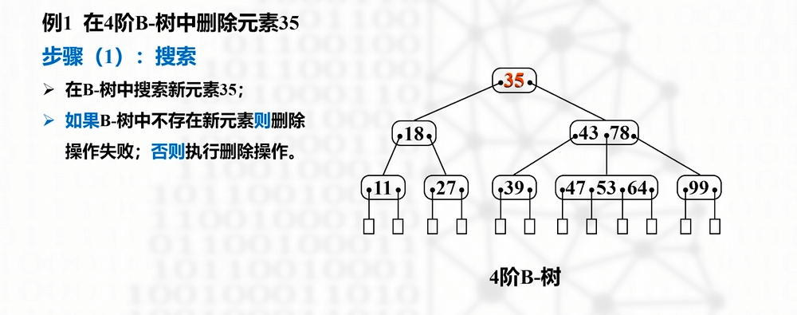

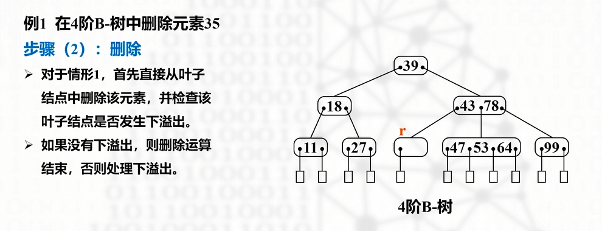

在B-树（B-tree）中，**下溢出（Underflow）** 是指删除操作后，某个非根节点的键数量低于最小允许值的情况

B-树中，根结点至少有1个键，非根结点至少要有 $$\lceil \frac{m}{2} \rceil -1$$ 个键

| 特性         | 上溢出（Overflow） | 下溢出（Underflow）                         |
| ------------ | ------------------ | ------------------------------------------- |
| **触发操作** | 插入键时           | 删除键时                                    |
| **条件**     | 节点键数 > $$m-1$$ | 节点键数 < $$\lceil \frac{m}{2} \rceil -1$$ |
| **解决方法** | 节点分裂（Split）  | 借键或合并（Borrow/Merge）                  |

就是说我4阶B-树有个叶结点只有一个键值，然后现在删除了，然后这个结点变成了0个键值，所以触发了下溢出

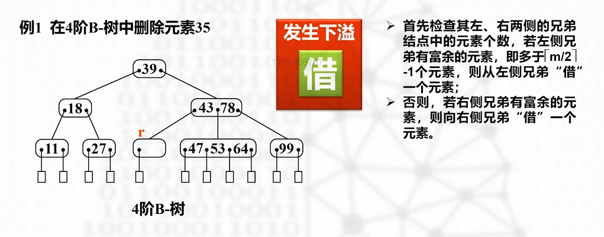

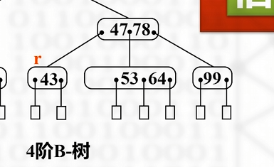

**旋转地借** 元素，而不是简单将47借过来

如果你说：如果我想要删除的元素发生了下溢出但是没有富裕的兄弟给我借怎么办？？

那好，看下面这个例子：

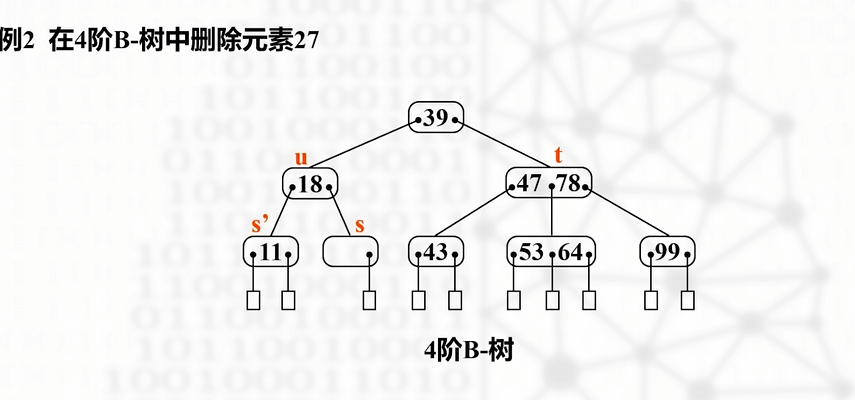

此时左边没有富裕，右边没有，那删除之后该怎么办呢？答案是 **并**

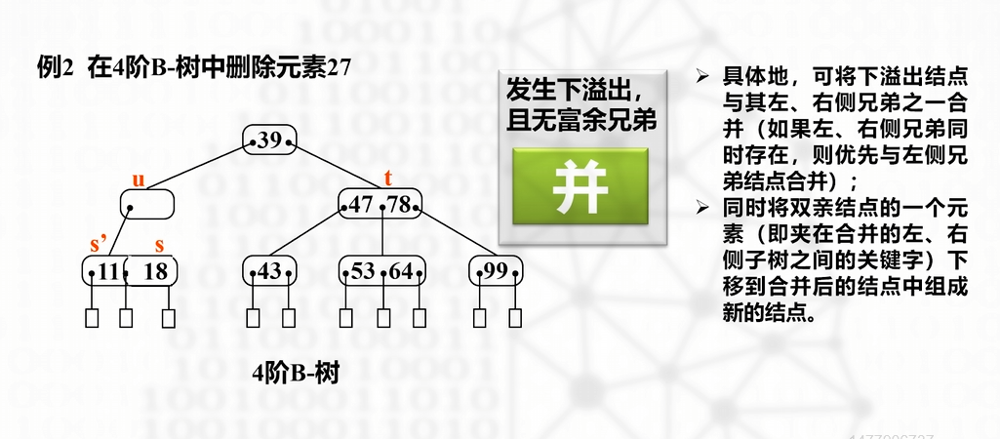

具体地，可将下溢出结点与其左、右侧兄弟之一合并(如果左、右侧兄弟同时存在，则**优先与左侧兄弟结点合并**);

同时将双亲结点的一个元素(即夹在合并的左、右侧子树之间的关键字)移到合并后的结点中组成新的结点

如果合并之后双亲结点发生了下溢出，则继续执行 **先借后并** 的操作：

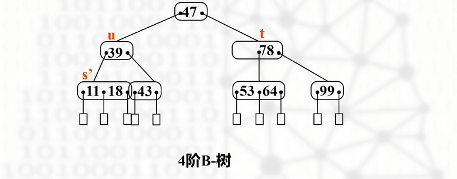

**为什么要把43移过来？**因为在B-树中，**子结点数 = 键数 + 1**

总结B-树删除运算的步骤：

Step 1：**搜索**。在B-树中搜索给定关键字值的元素。如果搜素不成功，则删除运算结束。否则转Step 2执行元素的删除操作

Step 2：**删除**。首先判断删除类型，根据删除类型选用相应的删除方法：

- 如果属于情形1，即被删除的元素在叶子结点中，则转Step 3执行从叶子结点中删 除该元素的操作;
- 如果属于情形2，即被删除的元素不在叶子结点中，则用该元素右侧子树上的最小元素取代它，从而将问题转化为情形1，然后转Step3执行从叶子结点中删除该元素的操作

Step 3：**从叶子结点中删除元素。**首先从叶子结点中直接删除该元素，如果删除元素后没有下溢，则删除运算结束。否则 **首先考虑采用“借”** 的方法处理下溢出，如果左右两侧兄弟结点都没有富余，则采用“并”的方法处理下溢出，然后继续检查其双亲结点的下溢出问题。如果没有下溢出，则删除运算结束，否则继续该双亲结点的**先“借”后“并”** 操作直至不再有下溢出现象产生

**Tips**：如果由于“并”操作，导致根结点中的一个元素被删除，并且该结点只包含一个元素，则根结点成为不包含任何元素的空结点，此时B-树将变矮一层


------

## 散列表

hashtable.c（线性探查）

### 基本概念

**散列表**：集合元素以一种 "分散" 的方式零散的存放在顺序表中

**散列的基本概念**：

- **散列函数 (h, hash)**：集合元素的关键字(key)与其存储位置(Loc)之间的关系函数，散列函数计算出的值也称为散列值
- **Loc(key)**： 表示关键字值为key的集合元素的存储地址
- **散列表 (hash table,哈希表)**：用散列函数建立起来的表，用于存储集合元素

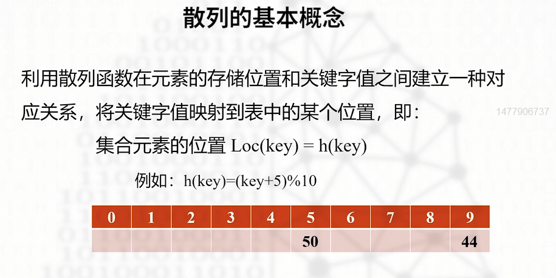

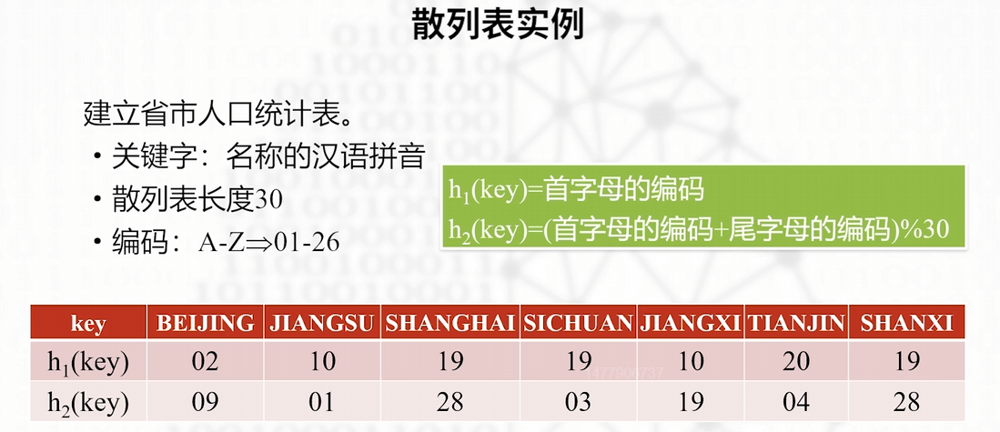

发现一：

对于 $$h_1$$ ：JIANGSHU 与 JIANGXI 等被映射到相同位置，产生冲突

对于 $$h_2$$ ：SHANGHAI 与 SHANXI 被映射到相同位置，产生冲突

**冲突**：$$key1 ≠ key2$$，但 $$h(key1)=h(key2)$$ 的现象

**同义词**：对给定 $$h$$，具有相同散列值的不同关键字

发现二：

散列函数 $$h_1(key)$$ 发生冲突的次数明显少于散列函数 $$h_2(key)$$

这说明 **散列函数的选择是有原则的**

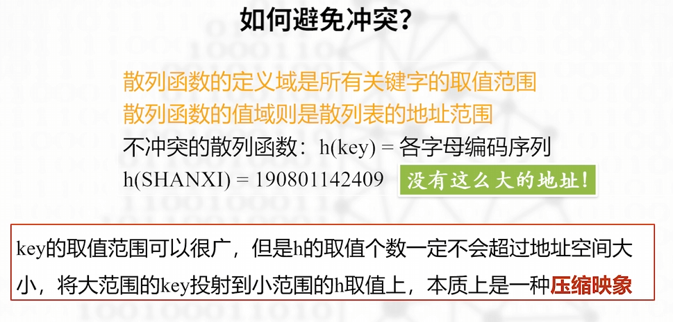

$$h_1(key)$$ 发生冲突的次数明显少于散列函数 $$h_2(key)$$，说明冲突与散列函数相关散列函数是一个 **压缩映象**，**冲突不可避免**！可以做到的是：

- 选择“好”的h，尽量减少冲突
- 如果发生冲突，如何处理? 用 **冲突处理技术**

### 常见散列函数

**什么是好的散列函数？**

- **确定性**：同一值总被映射到同一地址
- **快速**：最好是O(1)
- **满射**：尽可能充分覆盖整个散列表存储空间
- **均分布**：为了充分利用散列空间和降低冲突，要使映射到各个位置的概率接近，避免很多元素扎堆聚集的现象

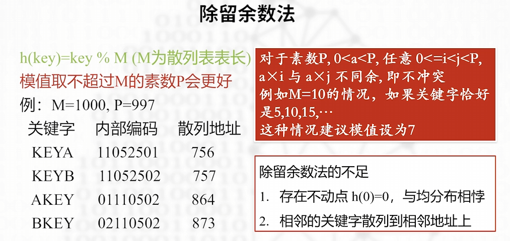

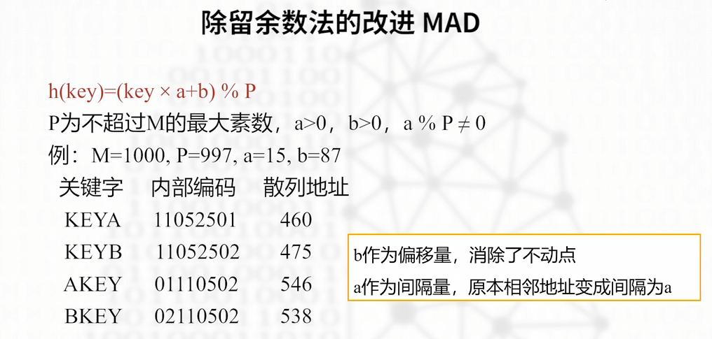

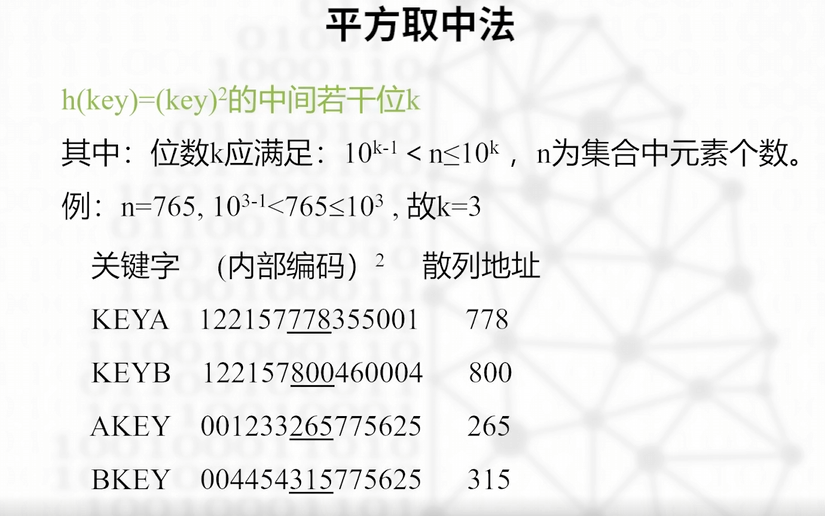

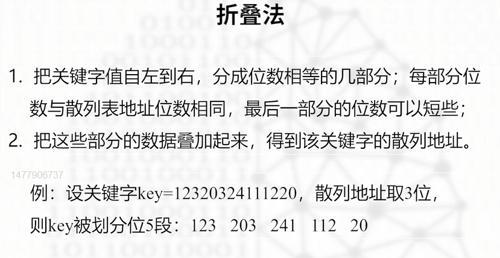

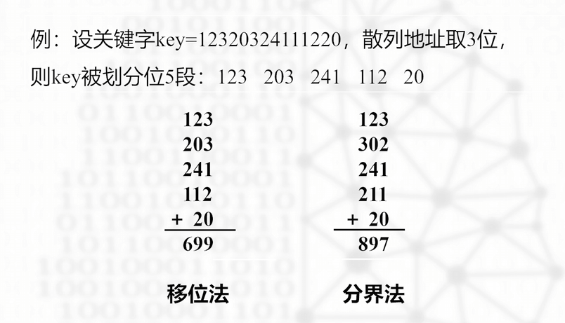

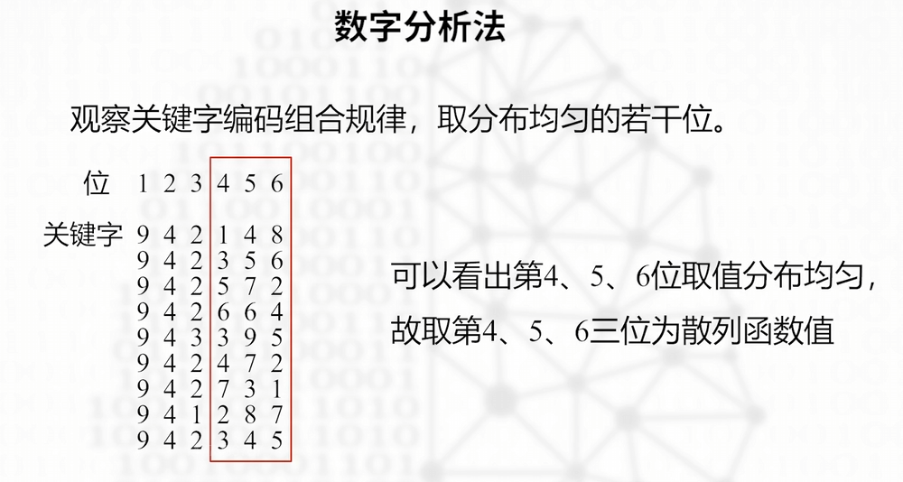


### 冲突处理技术

#### 拉链法

拉链法分为：

- 开散列法 Open Hashing
- 拉链法 Separate Chaining
- 闭散列法 Closed Hashing （开放地址法 Open Addressing）

**开散列法与闭散列法**

相同点：

- 都具有一个散列表和至少一个散列函数
- 对散列函数的要求一致：均分布、计算快速等不同点

不同点：

- **开散列法** 将集合元素存储在 **散列表主表之外** （Open Hashing）
- **闭散列法** 将集合元素存储在 **散列表主表之内** （Closed Hashing）

**拉链法**：

- 所有关键字互为同义词的集合元素存储在 **同一个单链表上**
- 所有单链表的头指针存入一个长度为 $$M$$ 的散列表中
- 单链表的头指针在散列表中的存储位置通过散列函数计算得到

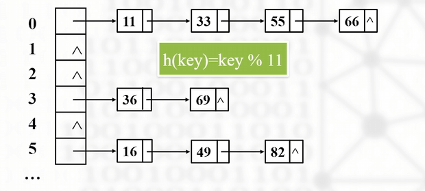


同一个头结点存放的都是同义词，比如图中的11，33，55，66，这些都是散列值为0的同义词

有 $$n$$ 个元素的散列表，其每个单链表的平均长度为 $$\frac{n}{M}$$

**集合元素的查找操作**：

- 计算散列值 $$h(key)$$
- 到散列表 $$h(key)$$ 位置处取出单链表头指针
- 遍历链表进行查找：比较key

拉链表发的插入、查找、删除的时间复杂度为：$$O(\frac{n}{M})$$

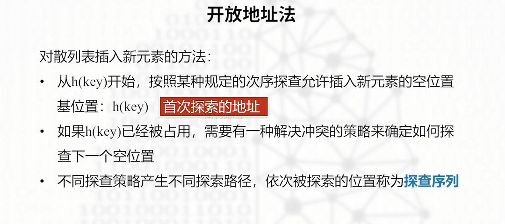

开放地址法包括：**线性探查法**、**二次探查法**、**双散列法**

#### 线性探查法

线性探查法使用的探查序列如下：

$$h(key),h(key)+1, h(key)+2 ...,M-1.0,1,...,h(key)-1$$ 插入元素时，从 $$h(key)$$ 开始，若被占用，检查 $$h(key)+1$$，若也占用，再检查探测序列中的下个位置，直到某个位置为空时，将关键字插入该位置

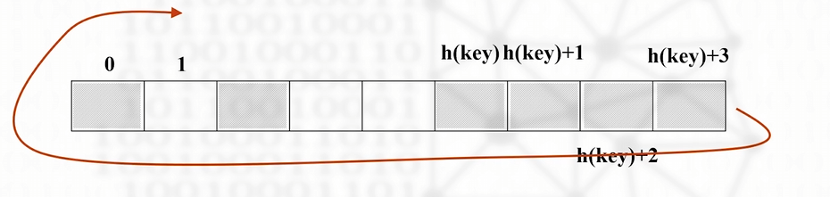

如图，假如说就连 $$h(key)+3$$ 也被占用了，但此时已经到了表的尽头了，就通过取模操作，回到原点继续向后寻找是否有空的位置，另一个例子如下：

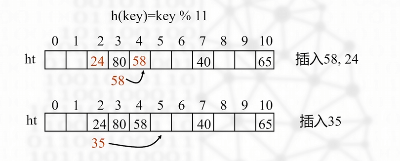

##### 搜索操作

基本思想：从基位置 $$h(key)$$ 开始，按照线性探查序列查找元素
搜索成功：找到关键字值为key的元素
搜索失败：

- 遇到一个空位置
- 探查到 $$h(key)$$ 前一个位置(表满)

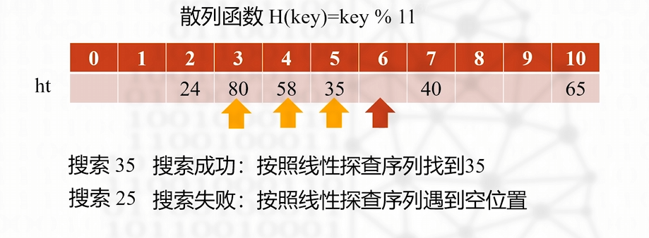

遇到空位置，搜索失败

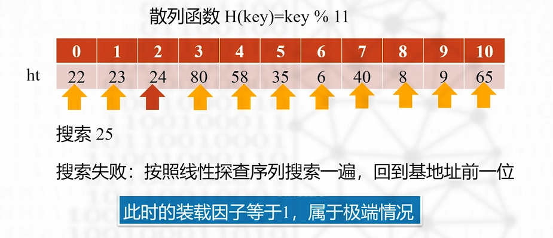

满表也找不到25，搜索失败（装载因子 $$\alpha = \frac{n}{M}$$）

##### 删除操作

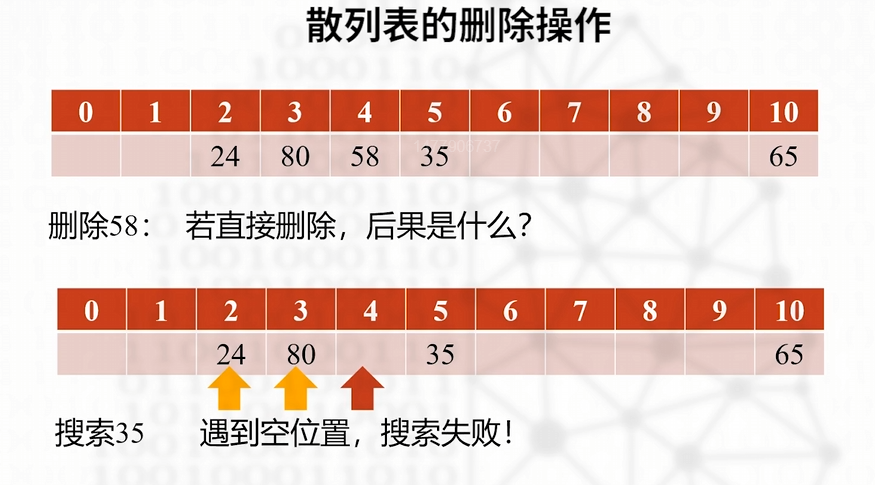

如果直接抹去58的话，那么4这个地方就空出来了，然后此时搜索35，由于规定遇到空的位置就算搜索失败，所以即使35存在于散列表中，也被当作搜索失败

**删除时需考虑两点**：

- 不能简单清除元素，否则会隔离探查序列后面的元素影响搜索
- 删除元素后，该位置能够重新使用

**解决的办法**：

- 为每个位置增加标志域empty，表示该位置是否使用过
- 删除元素时，不改变标志位，仍为False，元素值改为NeverUsed

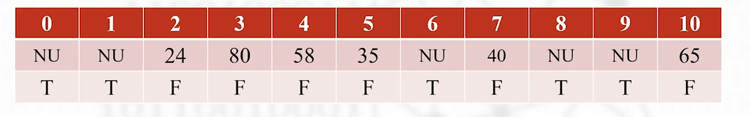

如果为True，就表示从未被使用过，如果是Flase但是标着NU，就说明使用过，但是被删除了


改进之后，遇到被删除的58的位置，由于还是False，所以不算查找失败，就向后继续查找

如果搜索25，跟上面搜索35一样，跳过NU但是False的位置，但是遇到后面6的NU但是True就返回失败

##### 插入操作

- 搜索，若搜索结果为存在重复元素则插入失败
- 如果搜索不到，但是表已满，则插入失败
- 如果搜索不到，线性探查第一个值为NeverUsed的位置，插入新元素，并将empty设为F

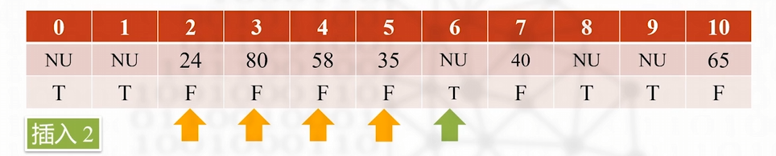

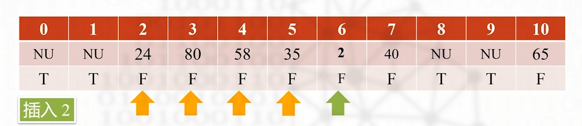

**线性探查法的缺点**：

- 很快表中所右位置的empty都变成F
- 易使元素在表中连成一片(线性聚集)探查次数增加，影响搜索效率

**改进方法**：

- 二次探查法
- 双散列法

##### 例题

散列查找中1个关键字具有同一散列值，若用线性探查法将这k个关键字对应的记录存入散列表中，至少要进行___次探查

答案： $$\frac{k(k+1)}{2}$$

#### 二次探查法

二次探查法的探查序列：

$$h(key),, h_1(key), h_2(key), ..., h_{2i-1}(key), h_{2i}(key),...$$

其中 $$h(key)$$ 表示初始计算得到的位置（基地址），如果 $$h(key)$$ 被占用，则进行一定的偏移计算

探查序列由下列函数得到：
$$
h_{2i-1}(key)=(h(key)+i^2)  \% M
$$

$$
h_{2i}(key)=(h(key)-i^2)\% M
$$

$$
其中：i=1,2,..,\frac{M-1}{2}
$$

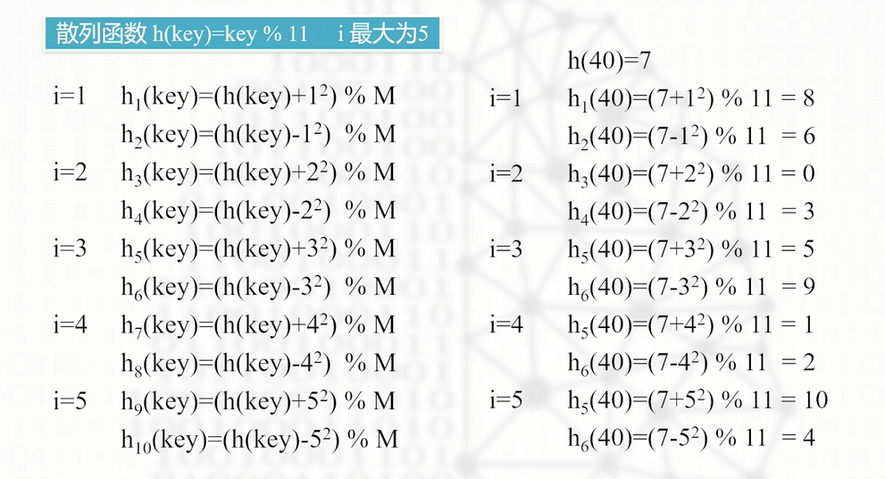

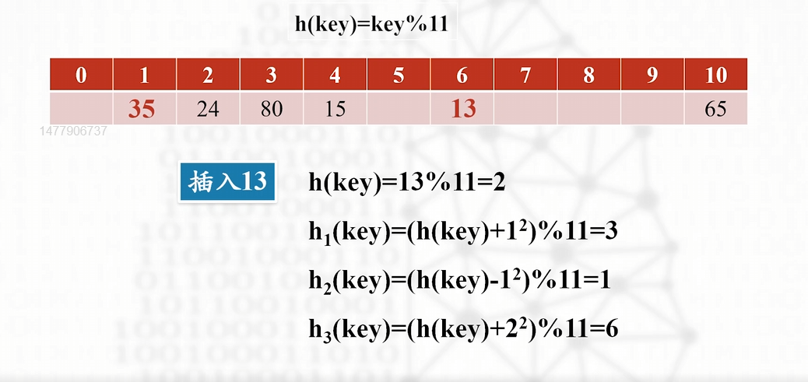

二次探查法能改善“线性聚集"

但是同义词会有相同的探查査序列，产生 **“二次聚集**” ，比如说前一个数进行多次探查后插入了一个位置，但是后一个数的基地址刚好在前一个数插入的位置，那么新的数想要插入，就可能要重走前面的探查路径

#### 双散列法

双散列法的探查序列：

具备两个散列函数 $$h_1$$ （用于计算基地址）和 $$h_2$$ （用于计算偏移量），探查序列为：
$$
h_1(key), (h_1(key)+ h_2(key))\%M, (h_1(key)+2h_2(key))\%M, ...
$$
总结就是：
$$
(h_1(key)+ i*h_2(key))\%M, ...
$$
其中：$$i=0,1,2,3....$$


------

## 图论

graph1.c（图的存储结构，邻接矩阵 ）

graph2.c（图的邻接表表示法）

graph3.c（图的遍历，图的深度优先遍历，图的宽度优先遍历）

graph4.c（拓扑排序）

graph5.c（关键路径）

graph6.c（最小代价生成树，普里姆算法）

graph7.c（克鲁斯卡尔算法）

graph8.c（单元最短路径）

### 基本概念

- **图(Graph)**：是数据结构 $$G=(V,E)$$ ，其中 $$V$$ 是 $$G$$ 中结点的 **有限非空** 集合，结点的偶对称为**边(Edge)**；  $$E$$ 是 $$G$$ 中边的有限集合，其中 **V不能为空，但是E可以为空**
- 图中的 **结点** 又称为 **顶点(Vertex)**
- 如果图中代表边的 **偶对是有序** 的，则该图称为 **有向图(Directed Graph)**，用 $$<u,v>$$ 表示一条 **有向边**： $$U ----> V $$，其中 $$U$$ 称为该边的 **始点(尾)**，$$V$$ 称为该边的 **终点(头)**
- 如果图中代表边的 **偶对是无序** 的，则该图称为 **无向图(Undirected Graph)**
- 在无向图中，边 $$(u, v)$$ 和边 $$(v, u)$$ 是同一条边

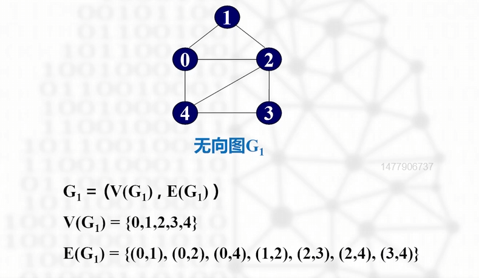

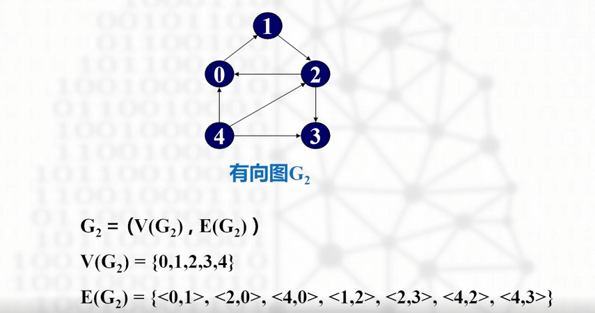

其中 `<>` 就代表是有序数对

**自回路**：如果图中存在无向边 $$(u,u)$$ 或有向边 $$<u,u>$$ ，则称这样的边为 **自回路**

**多重图**：指图中两个顶点间允许有多条相同的边

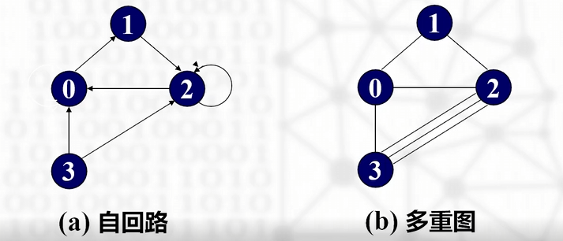

**完全图**：如果一个图有最多的边数，称为完全图

包含 **n个顶点** 的 **无向完全图** 有 $$\frac{n(n-1)}{2}$$ 条边

包含 **n个顶点** 的 **有向完全图** 有 $$n(n-1)$$ 条边

**邻接与关联**：如果 $$(u,v)$$ 是无向图中的一条边，则称顶点 $$u$$ 和 $$v$$ **相邻接**，并称边 $$(u,v)$$ 与顶点 $$u$$ 和 $$v$$ **相关联**

例如：下图是一个无向完全图

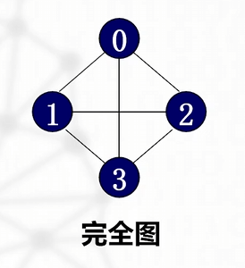

**子图**：图 $$G$$ 的一个子图是图 $$G’=(V'(G'),E'(G'))$$  ，其中 $$V'(G') \subseteq V(G)$$ ， $$E'(G') \subseteq E(G)$$

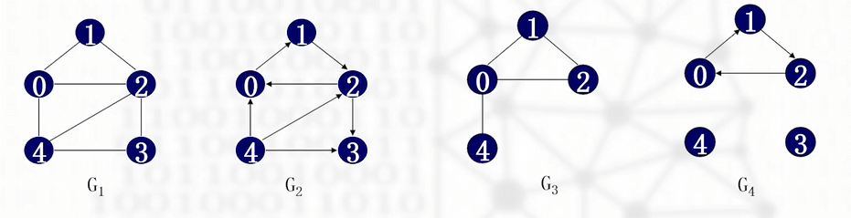

如图， $$G_3$$ 是 $$G_1$$ 的子图， $$G_4$$ 是 $$G_2$$ 的子图

**路径**：在无向图 $$G$$ 中，一条从 $$s$$ 到 $$t$$ 的路径是存在一个顶点序列 $$(s,v_1,v_2,v_3...v_k,t)$$ 使得 $$(s,v_1),(v_2,v_3)…… (v_k,t)$$ 都是图 $$G$$ 中的边

对于有向图顶点序列 $$(s,v_1,v_2,v_3...v_k,t)$$ ，应使 $$(s,v_1),(v_2,v_3)…… (v_k,t)$$ 都是图 $$G$$ 中的边

**路径长度**：指路径上边的数目

**简单路径**：除起点和终点可以相同外，路径上其余顶点各不相同

无向图中如果两个顶点 $$u$$ 和 $$v$$ **之间存在一条路径**，则称顶点 $$u$$ 和 $$v$$ 是 **连通的**，否则是不连通的

**连通图**：无向图中如果 **任意两个顶点之间是连通的**，则称该无向图为 **连通图**

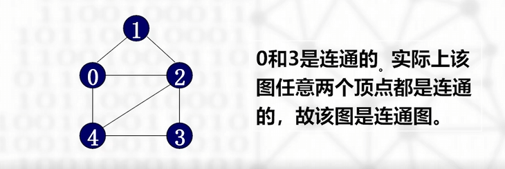

**连通分量**：无向图的极大连通子图

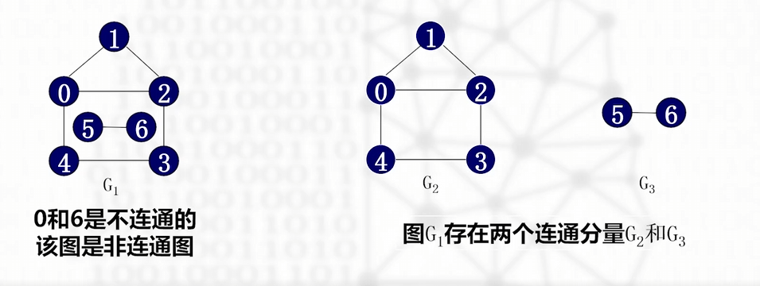

**求无向图的连通分量应该注意**：

- 图中连通分量可能有多个，不能只写顶点个数最多的那个连通分量
- 如果某个连通子图再加上一个顶点后，仍每个连通分量必须是极大的。是连通的，则它不是连通分量（**如果某个连通子图加上一个顶点后，仍是连通的，那这个子图就不是连通分量**）
- 每个连通分量必须包含其顶点之间的所有边

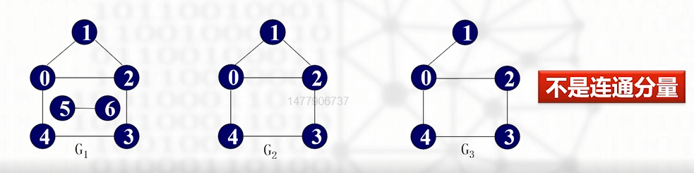

**强连通图**：**有向图** 中如果任意两个顶点 $$u$$ 和 $$v$$ 之间，存在一条从 $$u$$ 到 $$v$$ 的路径，同时存在一条从 $$v$$ 到 $$u$$ 的路径，则称该有向图为强连通图

**强连通分量**：有向图的极大强连通子图

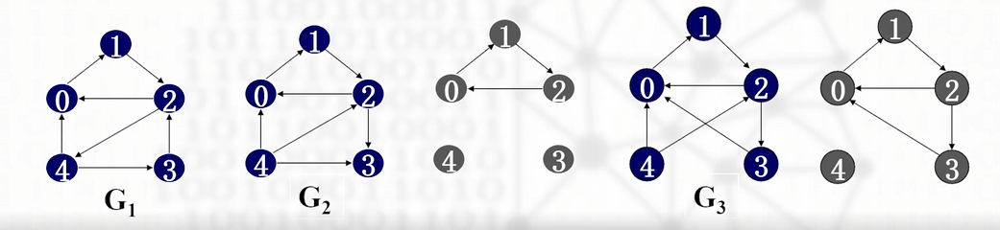

如图， $$G_1$$ 是强连通图， $$G_2$$ 不是强连通图，但是存在三个强连通分量（图中左三），同理 $$G_3$$ 也不是强连通分量，但是有两个强连通分量（图右一）

**顶点的度**：与该顶点相关联的边的数目

**入度**：有向图中顶点 $$v$$ 的 **入度** 指以 $$v$$ **为头**的边的数目

**出度**：有向图中顶点 $$v$$ 的 **出度** 指以 $$v$$ **为尾**的边的数目

**生成树**：**无向连通图** 的 **生成树** 是一个 **极小连通子图**，它 **包含图中所有顶点**，但只有足以构成一棵树的 $$(n-1)$$ 条边，再加上一条边将构成回路

**极小连通子图**：边数 **最少** 的连通子图。删除 **任意一条边**，图就会 **失去连通性**（断开）

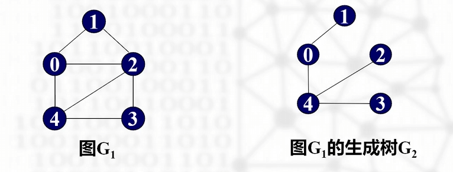

**网**：在图的每条边上加上一个数字作为边的权值(代价)，这种带权的图称为网

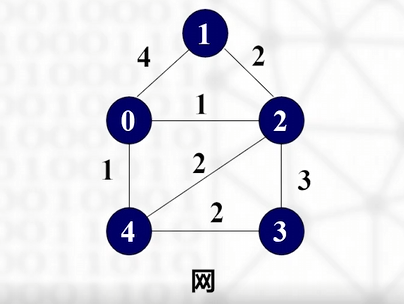

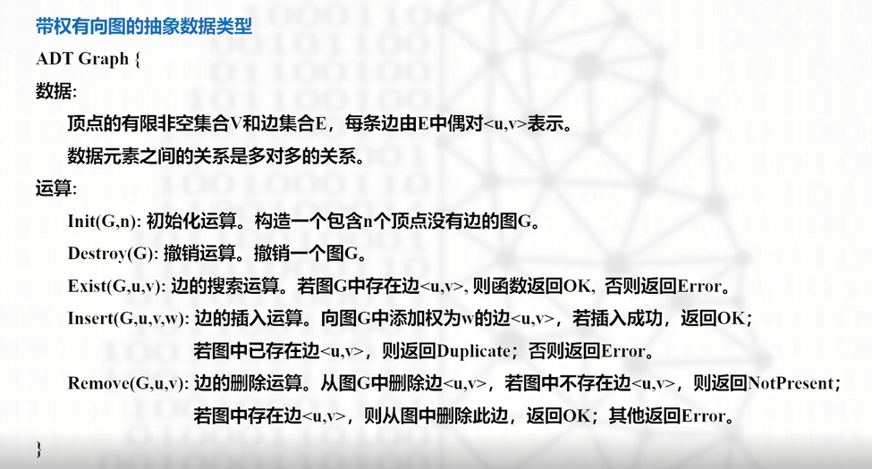

**例题**

22个顶点的**无向图**是**连通图**，则至少要有___条边

答案：21

15个顶点的**有向图**是**强连通图**，则至少有___条边

答案：15

### 图的存储结构

#### 邻接矩阵表示法

**邻接矩阵** (Adjacency Matrix)是表示顶点之间相邻关系的矩阵。设 $$G =(V,E)$$ 是一个有 $$n$$ 个顶点 $${0,1,2.……,n-1}$$ 的图，则G的 **邻接矩阵** 是具有如下性质的n阶方阵：
$$
A[u][v]=\begin{cases}
  1, & 若(u,v) 或<u,v> \in E \\
  0,  & 否则
\end{cases}
$$
如果 $$G$$ 是网，则邻接矩阵可以定义为：
$$
A[u][v]=\begin{cases}
  w, & 若(u,v) 或<u,v> \in E \\
  0,  & 若u=v \\
  \infty & 否则
\end{cases}
$$
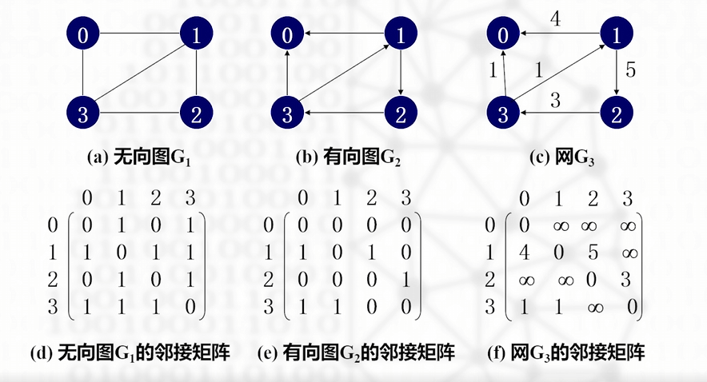

邻接矩阵的代码表示：

```c
typedef struct mgraph mGraph;

struct mgraph{
    ElemType **a;    // 动态二维数组
    int n;           // 顶点数
    int e;           // 边数
    ElemType noEdge; // 两顶点间无边时的值
};
```

**1、初始化带权有向图**
算法步骤：

- 初始化顶点数和边数
- 初始化两顶点间无边时的取值
- 初始化动态二维数组

```c
void Init(mGraph *mg, int size, intElemType noEdgeValue){
    mg -> n = size;             // 初始化顶点数
    mg -> e = 0;                // 初始化边数
    mg -> noEdge = noEdgeValue; // 初始化没有边时的值
    mg -> a = (ElemType*)malloc(sizeof(ElemType*)*size);
    for(int i = 0; i < mg -> n; i++){
        mg -> a[i] = (ElemType*)malloc(sizeof(ElemType)*size);
        for(int j = 0; j < mg -> n; j++){
            mg -> a[i][j] = mg -> noEdge;
        }
        mg -> a[i][i] = 0;
    }
}
```

**2、撤销带权有向图**

算法步骤：

- 依次释放n个一维数组的存储空间
- 释放一维指针数组的存储空间

```c
void Destory(mGraph *mg){
    for(int i = 0; i < mg -> n; i++)
        free(mg -> a[i]);           // 先依次释放n个一维数组的存储空间
    free(mg -> a);                  // 释放一维指针数组的存储空间
}
```

**3、边的搜索**
算法步骤：

- 判断输入参数是否有效。如果无效，返回False;
- 否则，继续判断边是否已经存在。如果存在，返回True;否则，返回False

```c
bool Exist(mGraph *mg, int u, int v){
    if(u < 0 || v < 0 || u > mg -> n - 1 || v > mg -> n - 1 || u == v)  
        // 如果u,v小于0或者是超界或者是uv相等，则失败
        return false;
    else if (mg -> a[u][v] != mg -> noEdge)
        return true;
    else
        return false;
}
```

**4、边的插入**

算法步骤：

- 判断输入参数是否有效。如果无效返回Error
- 否则，继续判断边是否已经存在。如果存在，返回Duplicate；否则，插入新边
- 当前边数+1，返回OK

```c
bool Insert(mGraph *mg, int u, int v, ElemType w){
    if(u < 0 || v < 0 || u > mg -> n - 1 || v > mg -> n - 1 || u == v)
        return false;
    else if(mg -> a[u][v] != mg -> noEdge) // 不等于无边时的值，证明有边
        return Duplicate;                  // 插入边已存在
    else
        mg -> a[u][v] = w;
    mg -> e++;
    return true;
}
```

**5、边的删除**

算法步骤：

- 判断输入参数是否有效。如果无效，返回Error
- 否则，继续判断边是否已经存在。如果不存在，返回NotPresent；否则，删除边
- 当前边数-1，返回OK

```c
bool Remove(mGraph *mg, int u, int v){
    if(u < 0 || v < 0 || u > mg -> n - 1 || v > mg -> n - 1 || u == v)
        return false;
    else if(mg -> a[u][v] == mg -> noEdge)
        return NoPresent;
    else
        mg -> a[u][v] = mg -> noEdge;   // 删除边
    mg -> e--;
    return true;
}
```

**邻接矩阵表示法的优缺点**

**优点**：

(1)便于判断两个顶点之间是否有边，即根据 $$A[u][v]$$ = 0 或 1 来判断

(2)便于计算各个顶点的度：

- 对于**无向图**，邻接矩阵第 $$i$$ 行**元素之和**就是**顶点** $$i$$ 的**度**;
- 对于**有向图**，第 $$i$$ **行元素之和**就是顶点 $$i$$ 的**出度**；第 $$i$$ **列元素之和**就是顶点 $$i$$ 的**入度**

**缺点**：

- 不便于统计边的数目。需要扫描邻接矩阵所有元素才能统计，时间复杂度为 $$O(n^2)$$
- 空间复杂度高。无论是有向图还是无向图，其空间复杂度均为 $$O(n^2)$$

#### 邻接表表示法

邻接表是图的一种链式存储结构，在邻接表中：

- 用n个单链表代替邻接矩阵中的n行
- 图中每个顶点对应邻接表中的一个单链表

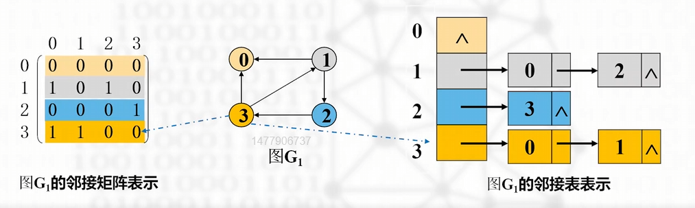

与邻接矩阵法不同的是，**邻接表表示法的主链表表示的是顶点元素，然后副链表表示的是他指向谁**

在邻接表中：

- 对图中每个顶点建立一个单链表，把与该顶点相邻接的顶点放在这个链表中
- 每个单链表的第一个结点存放有关顶点的信息称为单链表的**头结点**；其余结点存放有关边的信息，称为**边结点**
- 因此，邻接表便由两部分组成：**头结点表** 和 **边链表**

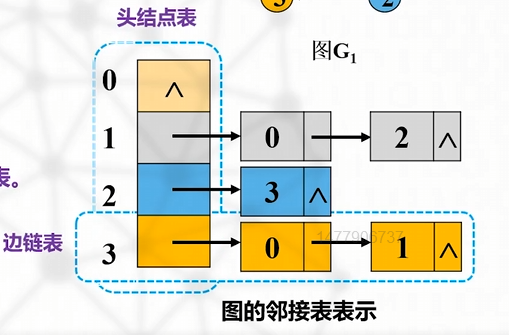

图中每个顶点对应一条边链表，边链表由该顶点对应的头结点及其相邻的所有边结点链接而成

**边结点**包括邻接点域（AdjVex）、数据域（Element）和链域（NextArc）：

| AdjVex | Element | NextArc |
| ------ | ------- | ------- |

其中邻接点域（AdjVex）指示 **与其所在边链表的头结点相邻接的点** 在图中的编号，链域NextArc用于指向该 **边结点的下一个邻接点**

如果是网的邻接表则使用带权的边结点，增加一个权值域（Weight）即可：

| Adjvex | Element | Weight | NextArc |
| ------ | ------- | ------ | ------- |

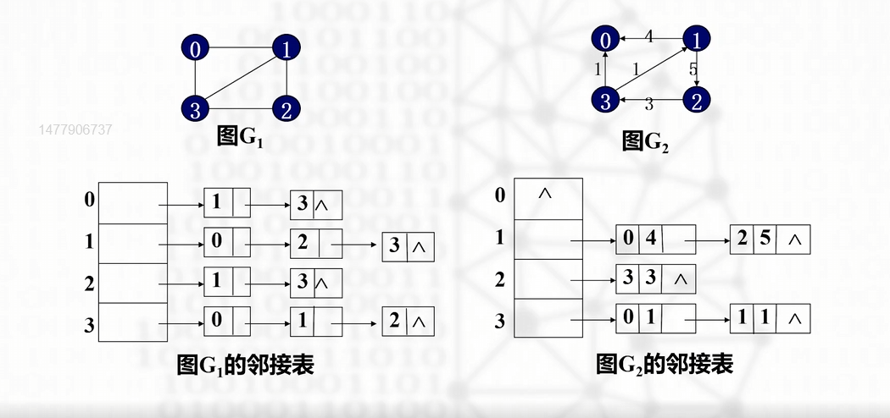

- 基于上述讨论，要定义一个**邻接表**，需要先定义其存放顶点的 **头结点** 和表示边的 **边结点**
- 然而，在具体实现时，为简便起见，我们并不需要定义头结点，而仅需定义边结点即可
- 具体地，我们可以将 **头结点表** 简单地视为一个 **一维指针数组**，该数组中存储的数据类型为指向边结点地址的指针

**邻接表构造**：

```c
typedef struct eNode ENode;
typedef struct lGraph LGraph;

struct eNode{
    int AdjVex;
    ElemType w;
    struct eNode* NextArc;
};

struct lGraph{
    ENode **a;  // 指向一维指针数组
    int n;      // 图中顶点数
    int e;      // 图中边数
};
```

**1、邻接表的初始化**

算法步骤：

- 初始化顶点数和边数
- 动态分配一维指针数组
- 初始化一维指针数组

```c
bool Init(LGraph *lg, int size){
    lg -> n = size;
    lg -> a = (ENode**)malloc(sizeof(ENode*)*size);
    if(!lg -> a)
        return false;
    else{
        for(int i = 0; i < lg -> n; i++)
            lg -> a[i] = NULL;           // 将指针数组a置空
        return true;
    }

```

**2、边的插入**

算法步骤：

(1)判断输入参数是否有效，若无效，则返回Error

(2)根据输入参数判断所需插入的边是否存在如果存在，返回Duplicate

(3)否则在相应的边链表中第一个边结点前插入新结点;

(4)当前边数+1，返回OK

```c
bool Insert(LGraph *lg, int u, int v, ElemType w){
    ENode* p;
    if(u < 0 || v < 0 || u > lg -> n - 1 || v > lg -> n - 1 || u == v) // 判断界限
        return false;
    if(Exist(lg, u, v))
        return Duplicate;
    else{
        p = (ENode*)malloc(sizeof(ENode));
        if(!p)
            return false;
        p -> AdjVex = v;            // 邻接点
        p -> w = w;                 // 权值
        p -> NextArc = lg -> a[u];  // 指向当前链表头
        lg -> a[u] = p;             // 插入链表头部
    }
    lg -> e++;
    return true;
}
```

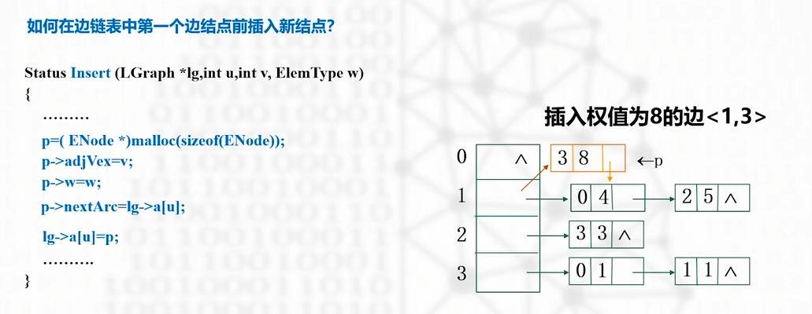

**3、边的删除**

算法步骤：

(1)判断输入参数是否有效，若无效，则返回Error

(2)根据输入参数判断所需删除的边是否存在。如果不存在，返回NotPresent

(3)否则在相应的边链表中删除该边结点

(4)当前边数-1，返回OK

```c
bool Remove(LGraph *lg, int u, int v){
    ENode *p, *q;
    if(u < 0 || v < 0 || u > lg -> n - 1 || v > lg -> n - 1 || u == v) // 判断界限
        return false;
    p = lg -> a[u], q = NULL;
    while(p && p -> AdjVex != v){
        q = p;                  // q是p的前驱节点
        p = p -> NextArc;
    }
    if(!p)
        return NoPresent;
    if(q)
        q -> NextArc = p -> NextArc;  // 将q的下一节点跳过p，指向p的下一个，从而达成删除效果
    else
        lg -> a[u] = p -> NextArc;
    free(p);                          // 只有动态数组才需要被free
    lg -> e--;
    return true;
}
```

**邻接表表示法的优缺点**

优点：

- **便于统计边的数目**。按头结点表顺序扫描所有边链表即可得到边的数目时间复杂度为 $$ O(n+e)$$
- **空间效率高**。无论是有向图还是无向图，其空间复杂度均为 $$ O(n+e)$$ ，适合于表示稀疏图。对于稠密图，考虑到邻接表中需附加存储链域，通常还是采用邻接矩阵表示法

缺点：

- **不便于判断顶点之间是否有边**。要判断和 $$v$$ 之间是否有边，需扫描第 $$u$$ 个边链表，最坏情况下要耗费 $$O(n)$$ 时间
- **不便于计算有向图各个顶点的度**。在有向图的邻接表中，顶点 $$u$$ 的出度是第 $$u$$ 个边链表中的边结点个数，顶点 $$u$$ 的入度则需遍历所有顶点的边链表

### 图的遍历

**图的遍历**：给定一个图和其中任意一个顶点 $$v$$，从 $$v$$ 出发对图中所有顶点访问且仅访问一次，这样的过程叫做图的遍历

图遍历的两种方法：

- **深度优先搜索**(Depth First Search,DFS)遍历(类似于树的先序遍历)
- **宽度优先搜索**(Breadth First Search,BFS)遍历(类似于树的层次遍历)

图遍历与树遍历的差异：

- 从图中任意一个顶点出发 **未必能到达其它所有顶点**
- 图中存在回路时，**有可能多次经过同一个顶点**

为了避免发生上述两种情况，可设置一个标记顶点是否被访问过的 **辅助数组** `visited[]`，它的初始状态为 `false`，在图的遍历过程中，一旦某一个顶点 $$i$$ 被访问，就立即让 `visited[i]` 置为 `true`，防止它被多次访问。搜索结束，如果还有未标记过的顶点，遍历算法应当从图中另选一个未标记的顶点出发，再次执行图的搜索

#### DFS深度优先遍历算法

深度优先搜索遍历(简称DFS遍历)的算法步骤：

- Step 1：初始化标记数组
- Step 2：逐个检查图中每一个顶点，如果该 **顶点未被访问**，则 **调用深度优先搜索(DFS)算法** 以该顶点为起始点

遍历该图，直至图中所有顶点都被访问过其中，该算法中调用的深度优先搜索是一种**递归**的搜索过程，其具体步骤为：

- Step 1：从起始顶点v出发，访问顶点 $$v$$ 并打上标记
- Step 2:：依序从 $$v$$ 的未被访问过的邻接点出发，深度优先搜索该图

从上述DFS遍历的算法描述中容易看到，**深度优先搜索是DFS遍历的核心操作** 

深度优先搜索(DFS)算法主要涉及两个操作：**前进vs回退**

前进：

- 从顶点 $$v$$ 出发，访问它的**任一未被访问邻接顶点** $$w_1$$
- 再从 $$w_1$$ 出发， 访问 $$w_1$$ 的**任一未被访问邻接顶点** $$w_2$$
- 然后再从 $$w_2$$ 出发，进行类似访问，如此进行下去，直至到达某一顶点 $$w_t$$ ，它的所有邻接顶点都被访问过。那么接下来开始**转回退操作**

回退：

- 从前进终止的顶点 $$w_t$$ 开始回退一步到 $$w_{t-1}$$ ，若 $$w_{t-1}$$ 存在未被访问邻接顶点 $$u$$ ，则转为执行从顶点 $$u$$ 起始的**前进操作**;
- 否则继续回退一步，重复上述过程，直到 $$v$$ 所属强连通分量中所有顶点都被访问过为止

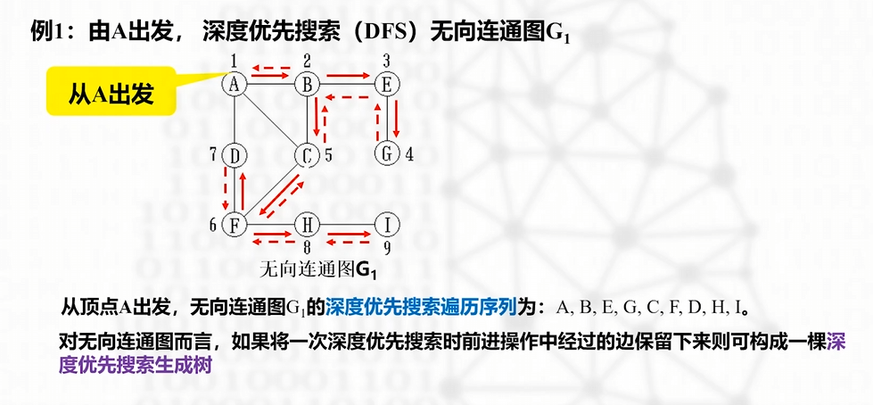

其中实线表示前进操作，虚线表示回退操作

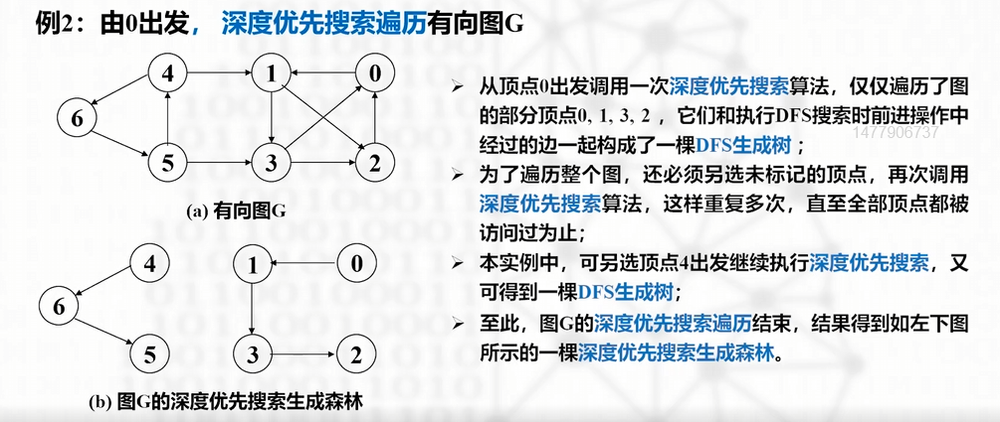

**DFS算法步骤**：

Step 1：从任给的起始顶点 $$v$$ 出发，访问顶点 $$v$$ 并打上标记;

Step 2：依序（**顶点v所对应的边链表中边结点的顺序**）从 $$v$$ 的未被访问过的邻接点出发，深度优先搜索该图

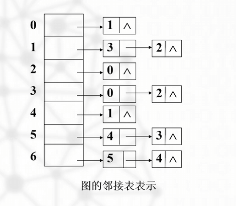

其算法表示为：

```c
void DFS(int v, int visited[], LGraph g){
    ENode *w;
    printf("%d ", v); // 访问顶点v
    visited[v] = 1;    // 为顶点v打上标记，证明访问过了v
    for(w = g.a[v]; w; w = w -> NextArc){
        if(!visited[w -> AdjVex])
            DFS(w -> AdjVex, visited, g);
    }
}
```

**深度优先搜索算法步骤**：

Step 1：初始化标记数组

Step 2：依序（**顶点编号**）检查图中每一个顶点，如果该顶点未被访问，则调用**深度优先搜索(DFS)算法**以该顶点为起始点遍历该图，直至图中所有顶点都被访问过

```c
void DFSTraverse(LGraph g){
    int *visited = (int*)malloc(sizeof(int)*g.n); // 生成动态标记数组
    for(int i = 0; i < g.n; i++)
        visited[i] = 0;
    for(int i = 0; i < g.n; i++)
        if(!visited[i])
            DFS(i, visited, g);  // 逐一检查每个顶点，如果没被访问过，怎调用DFS算法
    free(visited);
}
```

**算法时间复杂度分析**：

- 深度优先搜索算法每嵌套调用一次，实际上是对一个顶点 $$v$$ 察看其所有的邻接点，并对其中未标记的邻接点嵌套调用DFS函数
- 深度优先搜索遍历算法对 **有向图的每条边只查看1次**，而对于 **无向图，查看2次**
- 含 $$n$$ 个顶点、 $$e$$ 条边的图采用邻接表存储，DFS遍历算法的时间复杂度为 $$ O(n+e)$$ ，而采用邻接矩阵存储时，时间复杂度则为 $$O(n^2)$$

#### BFS宽度优先遍历算法

宽度优先搜索遍历(简称BFS遍历)的算法步骤：

Step1：初始化访问标记数组:

Step 2：逐个检查图中每一个顶点，如果该**顶点未被访问**，则 **调用宽度优先搜索(BFS)算法** 以该顶点为起始点遍历该图，直至图中所有顶点都被访问过

其中，该算法中调用的宽度优先搜索是一种**分层的搜索**过程，每向前走一步可能访问一批顶点，不像深度优先搜索那样有回退的情况。**宽度优先搜索不是一个递归的过程，其算法也不是递归的**

从上述BFS遍历的算法描述中容易看出，**宽度优先搜索是BFS遍历的核心操作**

**宽度优先搜索算法的实施过程**：

- 首先从图中某个顶点 $$v$$ 出发，访问 $$v$$
- 依次访问 $$v$$ 的各个未访问过的邻接点
- 接着再分别从这些邻接点出发依次访问它们的未访问过的邻接点，重复该步骤，直至图中所有已被访问的顶点的邻接点都被访问到

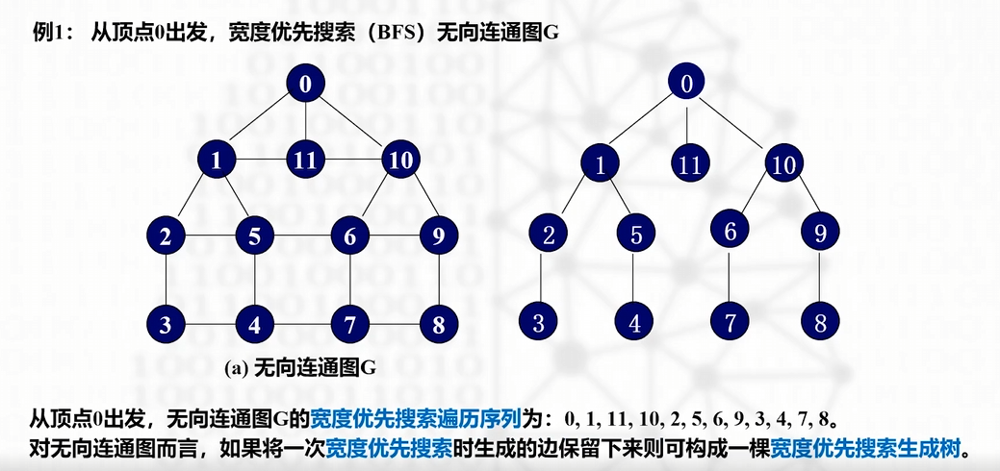

就是先访问一个顶点的所有节点，然后再依次从每个结点访问他的未访问过结点，比如说上图我先从0出发，然后访问得到了1，11，10三个结点，然后再从1出发，访问得到未访问过的结点2，5，此时停下再从11出发，以此类推

**宽度优先搜索算法**要实现按层次访问，可引入**队列**来保存已访问过但其邻接点尚未考察的顶点

**宽度优先搜索(BFS)的算法步骤**：

Step 1：初始化队列

Step 2：从顶点 $$v$$ 出发，访问 $$v$$ 并打上标记，然后将 $$v$$ 入队

Step 3：只要队列不空，则重复下列操作：

- 队首顶点 $$u$$ 出队;
- 依序（顶点 $$u$$ 所对应的边链表中边结点的序）搜索 $$u$$ 的未被访问过的邻接点，访问并将其入队

```c
void BFS(int v, int visited[], LGraph g){
    ENode *w;
    Queue q;
    CreateQueue(&q, g.n);
    visited[v] = 1;   // 标记顶点v
    printf("%d ", v);
    EnQueue(&q, v);   // 将顶点v放入队列
    while(!IsEmpty(&q)){
        Front(&q, &v);
        DeQueue(&q);    // 队首顶点v出列
        for(w = g.a[v]; w; w = w -> NextArc) 
            // 一次搜索v的未被访问过的邻接点，访问并将其入队
            if(!visited[w -> AdjVex]){
                visited[w -> AdjVex] = 1;
                printf("%d ", w -> AdjVex);
                EnQueue(&q, w -> AdjVex);
            }
    }
}
```

**图的宽度优先搜索遍历算法步骤**：

Step 1：初始化标记数组

Step 2：依序（**顶点编号**）检查图中每一个顶点，如果该顶点未被访问，则调用宽度优先搜索算法以该顶点为起始点遍历该图，直至图中所有顶点都被访问过

```c
void BFSTraverse(LGraph g){
    int *visited = (int*)malloc(g.n*sizeof(int));
    for(int i = 0; i < g.n; i++)
        visited[i] = 0;
    for(int i = 0; i < g.n; i++)
        if(!visited[i])
            BFS(i, visited, g);  // 依次检查每个顶点，如果未被访问，则调用宽度优先算法
    free(visited);
}
```

**算法时间复杂度分析**：

- BFS遍历过程中每个顶点进出队列各一次
- 对于每个出队的顶点，都要检查其所有的邻接点，对于无向图每条边被检查2次
- 含 $$n$$ 个顶点、 $$e$$ 条边的图采用邻接表存储，BFS遍历算法的时间复杂度为 $$ O(n+e)$$，而采用邻接矩阵表示，时间复杂度为 $$O(n)$$

### 拓扑排序

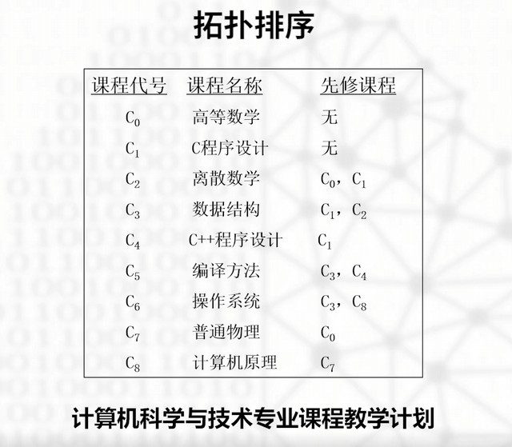

有些课程之间有先后关系

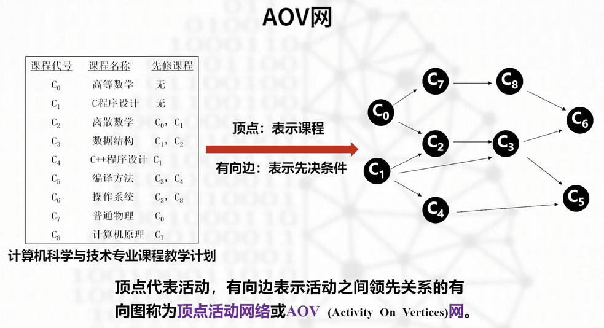

**对于AOV网**：

AOV网不应该有环，因为存在环意味着某项活动应以自己为先决条件，这是不符合逻辑的;

例如，工程中若设计出这样的流程图，工程便无法进行；因此，**AOV网应该是一个有向无环图** (DAG图)

**那么，如何对给定的AOV网判定是否有环呢**？

判断的方法是对有向图的顶点进行**拓扑排序**，若网中所有顶点都在它的拓扑序列中，则该AOV网必定不存在环

#### 概念

**拓扑排序** 就是将AOV网中所有顶点排成一个 **线性序列**，该序列满足：若在AOV网中顶点 $$v_i$$ 到顶点 $$v_j$$ ，有一条路径，则在该线性序列中的顶点 $$v_i$$ 必定在 $$v_j$$ 之前

**拓扑序列** 是AOV网中顶点的 **线性序列**，使得对图中任意二个顶点 $$v_i$$ 和 $$v_j$$ ，若在网中 $$v_i$$ 领先于 $$v_j$$ ，则在线性序列中 $$v_i$$ 是 $$v_j$$ 的前驱结点

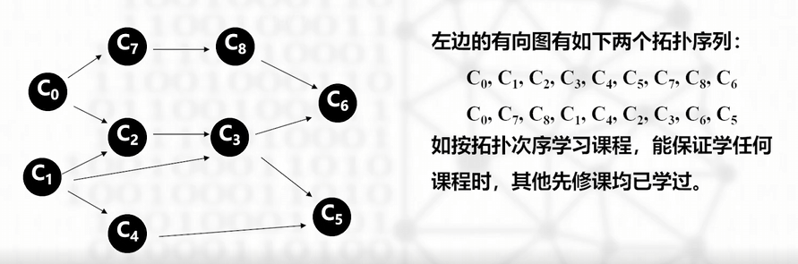

**PS** **AOV的拓扑序列不是唯一的**

#### 拓扑排序算法实现

**拓扑排序**可以做以下两件事情：

(1)测试AOV网的可行性，也就是判断AOV网是否有环

(2)对可行的AOV网求出其拓扑序列

**拓扑排序的过程**：

(1)在图中找 **一个入度为零的顶点将其输出**

(2)从图中 **删除该顶点及其所有出边**

(3)重复(1)、(2)，直到所有顶点都输出(此时得到的序列即为拓扑序列)，或图中剩下的顶点再也没有入度为零的顶点(此时存在有向回路)为止

在拓扑排序过程中，需**注意以下两点**：

(1)从图中删除一个顶点及其所有出边时，会产生新的入度为0的顶点

(2)入度为0的顶点的输出次序无关紧要,因此算法实现时，可以用 **堆栈或队列** 保存新产生的入度为0的顶点

下面来看拓扑排序的演示过程：

首先先找一个入度为0的顶点将其输出，然后从图中删除该顶点

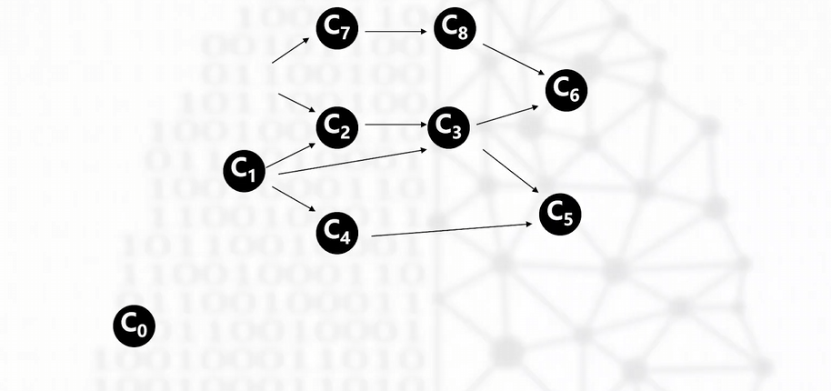

接下来再找一个入度为0的顶点将其输出，然后从图中删除

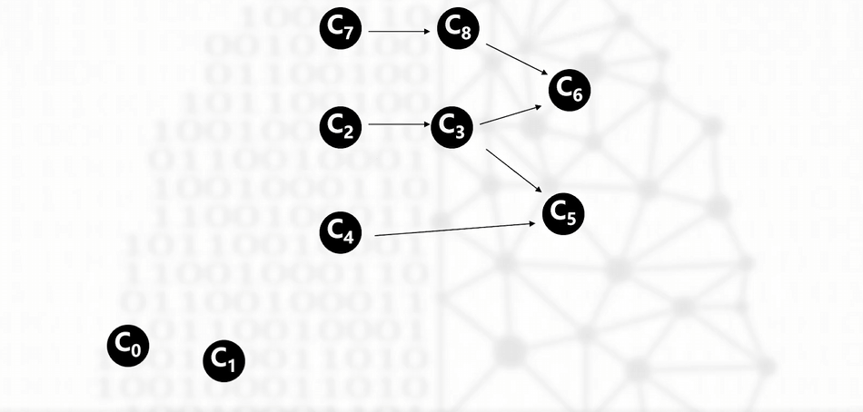

接下来重复1，2的过程，依次输出2，3

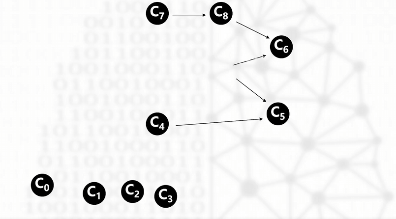

最终结果如下：


拓扑排序算法包含以下两个基本操作：

(1)计算每个顶点的入度
**可以计算每个顶点的直接前驱的个数**

(2)删除顶点的所有出边
**将该顶点的邻接点的入度减一**

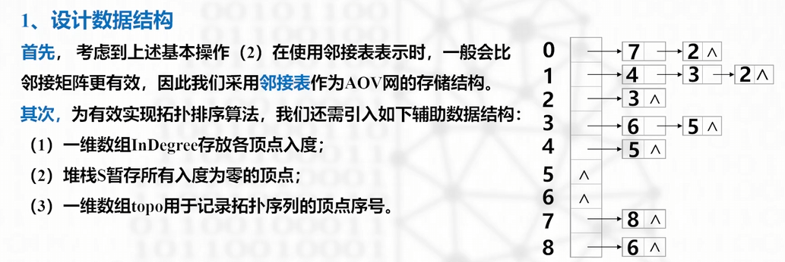

**实现拓扑排序算法步骤**：

(1)求出各顶点的 **入度存于InDegree** 数组中，并将 **入度为零的顶点进栈**

(2)若栈不空，则重复以下操作：

​	(2.1)将栈顶顶点 $$v_i$$ 出栈并保存在拓扑序列数组topo中

​	(2.2)将顶点 $$v_i$$ 的所有邻接点的入度减1，若此时某个邻接点的入度为0，便将该邻接点进栈

(3)**如果图中还有顶点未输出，则表明图中有环，无法进行拓扑排序，否则拓扑排序成功，输出序列即为拓扑序列**

算法步骤：

- 初始化InDegree数组
- 依序（顶点编号）检查顶点  $$v_i$$ 所对应边链表中的每一个边结点（即顶点 $$v_i$$ 的邻接点），并将这些边结点的入度加1

```c
void Degree(int *inDegree, LGraph g){
    ENode *p;
    for(int i = 0; i < g.n; i++)
        inDegree[i] = 0;
    for(int i = 0; i < g.n; i++)
        for(p = g.a[i]; p; p = p -> NextArc)   // 检查顶点v的所有邻接点
            inDegree[p -> AdjVex]++;           // 将顶点v的邻接点的入度+1
}
```

**拓扑排序**：

```c
bool TopoSort(int *topo, LGraph g){
    ENode *p;
    Stack S;
    int j = 0;
    int k = 0;
    int *inDegree = (int*)malloc(sizeof(int)*g.n);
    Degree(inDegree, g);   // 计算顶点的入度
    CreateStack(&S, g.n);       // 初始化堆栈
    for(int i = 0; i < g.n; i++)
        if(!inDegree[i])
            Push(&S, i); // 入度为0的进栈
    for(int i = 0; i < g.n; i++)
    {   
        if(IsEmpty(&S))
            return false;
        else{
            Top(&S, &j);
            Pop(&S);  // 顶点v出栈
            topo[i] = j;
            printf("%d ", j);                           // 将顶点j输出到拓扑序列中
            for( p = g.a[j]; p; p = p -> NextArc){      // 检查以顶点j为尾的所有邻接点
                k = p -> AdjVex;
                inDegree[k]--;
                if(!inDegree[k])                        // 若顶点k入度为0，则进栈
                    Push(&S, k);
        }
        }
    }
    return true;
}
```

### 关键路径

**AOE网**

与AOV网对应的还有一种活动网络，称为 **AOE(Activity On Edge)**网，AOE网是一个**带权的有向无环图**，其中顶点表示事件，有向边表示活动边权表示一项活动持续的时间

通常，AOE网可以用来估算一项工程的完成时间

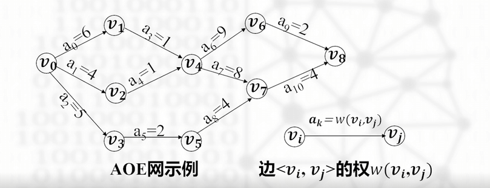

通常，AOE网在正常(无环)情况下：

- 只有一个 **入度为零** 的点，称作 **源点**，表示整个工程开始
- 也只有一个 **出度为零** 的点，称作 **汇点**，表示整个工程结束

AOE网在工程计划中有着广泛的应用，如：

(1)研究完成整项工程至少需要多少时间？

(2)为缩短工期，应该加快哪些活动的速度?

想要解决上面这些问题，就可以用到 **关键路径法**

#### 概念

**关键路径和关键活动**

完成工程所需的 **最短时间** 是从开始顶点到完成顶点的 **最长路径** 的长度，这条最长路径称为 **关键路径**

关键路径上的**边**代表的活动称为**关键活动**

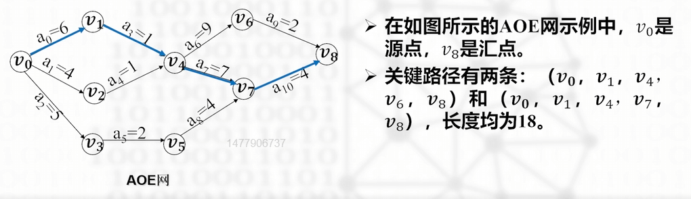

关键活动即为： $$a_0,a_3,a_6,a_7,a_9,a_{10}$$

**事件相关的两个基本概念**：

- 事件 $$v_i$$ 可能的**最早发生时间** $$E_{early}(v_i)$$ ：表示从开始顶点 $$v_0$$ 到顶点 $$v_i$$ 的**最长路径的长度**；这里的E是事件Event的简写
- 事件 $$v_i$$ 允许的最迟发生时间 $$E_{late}(v_i)$$  ：表示在不影响工期的条件下，事件 $$v_i$$ 允许的最晚发生时间

**活动相关的两个基本概念**：

假设活动 $$a_k$$ 关联的边为 $$<v_i,v_j>$$，持续时间记为 $$w(v_i,v_j)$$ 这里的A代表活动Activity，w代表边的权

- 活动 $$a_κ$$ 可能的最早开始时间 $$A_{early}(a_k)=E_{early}(v_i)$$
- 活动 $$a_k$$ 允许的最迟开始时间 $$A_{late}(a_k)=E_{late}(v_j)-w(v_i,v_j)$$

#### 关键路径算法

**关键路径求解过程**：

(1)对图中顶点进行拓扑排序

(2)按拓扑序列求出每个事件可能的最早发生时间 $$E_{early}(v_i)$$

(3)按逆拓扑序列求出每个事件允许的最迟发生时间 $$E_{late}(v_i)$$

(4)求出每个活动可能的最早开始时间 $$A_{early}(a_k)$$

(5)求出每个活动允许的最迟开始时间 $$A_{late}(a_k)$$

(6)找出 $$A_{early}(a_k)= A_{late}(a_k)$$ 的活动 $$a_k$$ 即为关键活动

**关键路径求解过程**：

(1)对有图AOE网中顶点进行拓扑排序可得到如下拓扑序列： $$v_0，v_1，v_2，v_3，v_4，v_6，v_5，v_7，v_8$$

(2)按拓扑序列求出每个事件可能的最早发生时间 $$E_{early}(v_i)$$ ：

$$
\begin{cases}
E_{early}(v_0)=0 \\
E_{early}(v_j)=max\underset{v_i \in P(v_i)}{\{ E_{early}(v_0)+w(v_i,v_j)\}}
\end{cases}
$$

其中 $$P(v_j)$$ 是所有以 $$v_j$$ 为头的边

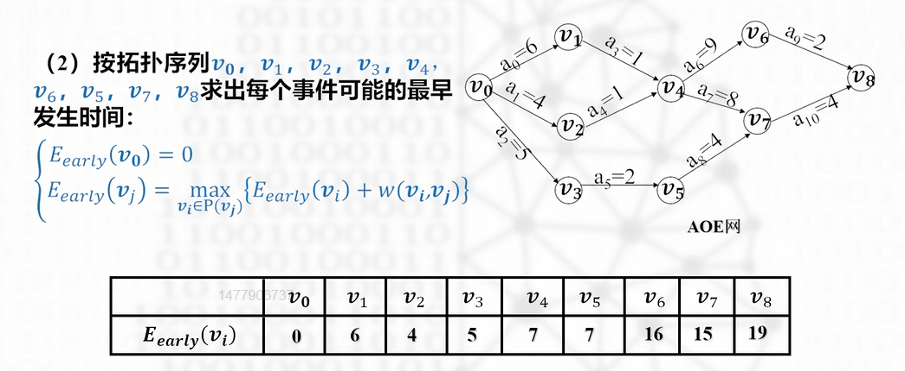

(3)按 **逆拓扑序列** 求出每个事件允许的最迟发生时间 $$E_{late}(v_i)$$ ：

$$
\begin{cases}
E_{late}(v_{n-1})=E_{early}(v_{n-1}) \\
E_{late}(v_i)=min\underset{v_j \in S(v_j)}{\{ E_{late}(v_j)-w(v_i,v_j)\}}~0=<i<n-1
\end{cases}
$$

其中 $$S(v_j)$$ 是所有以 $$v_j$$ 为尾的边 $$<v_i,v_j>$$ 的头结点 $$v_j$$ 的集合

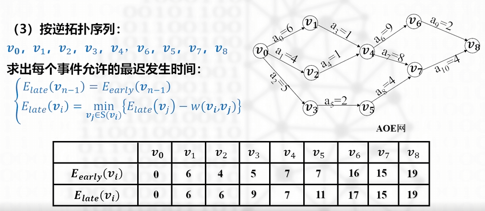

(4)求出每个活动可能的最早开始时间 $$A_{early}(a_k)$$

(5)求出每个活动允许的最迟开始时间 $$A_{late}(a_k)$$

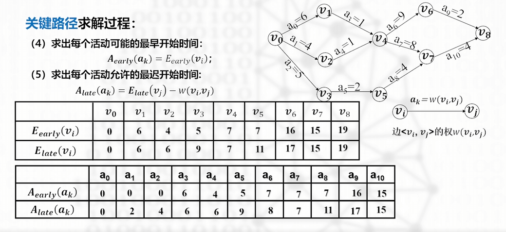

(6)找出 $$A_{early}(a_k)= A_{late}(a_k)$$ 的活动 $$a_k$$ 即为关键活动

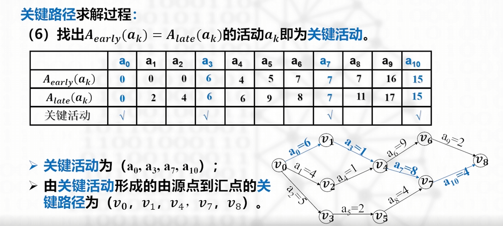

**选择图的存储结构**：

由于关键路径算法的实现要基于拓扑排序算法，因此我们仍选用**邻接表**做有向图的存储结构

**关键路径算法步骤**：

(1)调用拓扑排序算法，使拓扑序列保存在topo数组中

(2)从源点 $$v_0$$ 出发，令 $$E_{early}(v_0)=0$$ ，按拓扑序列求各顶点的 $$E_{early}(v_i)$$

(3)从汇点 $$v_{n-1}$$ 出发，令 $$E_{late}(v_{n-1})= E_{early}(v_{n-1})$$ ，按 **逆拓扑序列** 求其余各顶点的  $$E_{late}(v_i)$$

(4)如果每个活动 $$a_k$$ 关联的边为 $$<v_i,v_j>$$ ，根据各顶点的 $$E_{early}$$ 和 $$E_{late}$$ 值，计算每个活动的  $$A_{early}(a_κ)= E_{early}(v_i)$$ 和 $$A_{late}(a_k)= E_{late}(v_j)-w(v_i,v_j)$$ ，找出 $$A_{early}(a_k)= A_{late}(a_k)$$ 的活动 $$a_k$$ 即为关键活动

(5) 由关键活动形成的由源点到汇点的每一条路径就是关键路径

```c
void Early(int *eearly, int *topo, LGraph g){
    int k;
    ENode *p;
    for(int i = 0; i < g.n; i++)
        eearly[i] = 0;
    for(int i = 0; i < g.n; i++){
        k = topo[i];                            // 取得拓扑序列顶点序号k
        for(p = g.a[k]; p; p = p -> NextArc)
            if(eearly[p -> AdjVex] < eearly[k] + p -> w)
                eearly[p -> AdjVex] = eearly[k] + p -> w;
    }
}

void Elate(int *elate, int *topo, int longest, LGraph g){
    int j;
    ENode *p;
    for(int i = 0; i < g.n; i++)
        elate[i] = longest;
    for(int i = g.n - 2; i > -1; i--){
        j = topo[i];                            
        for(p = g.a[j]; p; p = p -> NextArc)
            if(elate[j] > elate[p -> AdjVex] - p -> w)
                elate[j] = elate[p -> AdjVex] - p -> w;
    }
}
```

#### 例题

减少任意一个关键活动的持续时间，可以缩短工期

参考答案：

B:错误

解析：

**当项目存在多条并行且长度相等的关键路径时，仅仅缩短其中一条路径上的某个关键活动的持续时间，并不能缩短项目的总工期**

假设项目有两条关键路径，长度都是30天（路径A和路径B）

- 如果只缩短路径A上某个关键活动2天，路径A变成28天
- 但路径B仍然是30天，此时项目的总工期由最长的路径决定，仍为30天
- 工期并未缩短，除非**同时**缩短所有关键路径

因此，"减少**任意**一个关键活动的持续时间"就能缩短工期的说法过于绝对。只有满足以下条件之一，才能缩短工期：

1. 项目**只有一条**关键路径
2. 或者缩短后使得该路径成为**唯一**最短的关键路径
3. 或者**同时**缩短所有关键路径上的活动

### 最小代价生成树

#### 概念

一个无向连通图的**生成树**是一个极小连通子图，它包括图中全部顶点并且有尽可能少的边

遍历一个连通图得到图的一棵生成树

**图的生成树不是唯一的**，采用不同的遍历方法，从不同的顶点出发可能得到不同的生成树

对于带权的连通图(网)，如何寻找一棵生成树使得**各条边上的权值之和最小**，是一个很有实际意义的问题

最小代价生成树的一个典型的应用是**通信网设计**


一棵生成树的代价是**各条边上的代价之和**

一个带权图的各生成树中，具有**最小代价**的生成树称为该网络的**最小代价生成树**


构造最小代价生成树的两种算法：

- 普里姆算法(Prim)
- 克鲁斯卡尔算法(Kruskal)

#### 普里姆算法

**普里姆算法构造最小代价生成树的过程**：

假设 $$G=(V,E)$$ 是含有 $$n$$ 个顶点的带权连通网，$$T=(V’,E')$$ 是正在构造中的生成树

初始状态下， $$T$$ 只有一个任意选定的起始顶点，没有边

从初始状态开始，重复执行下列运算：

(1)从 $$T$$ 的所有入边中找一条代价最小的边 $$e$$

(2)将边 $$e$$ 及其不属于 $$T$$ 的那个顶点加入 $$T$$

(3)重复(1)和(2)直到所有的顶点均加入 $$T$$ 为止

至此，得到 $$G$$ 的一棵包含 $$n-1$$ 条边的最小代价生成树 $$T$$

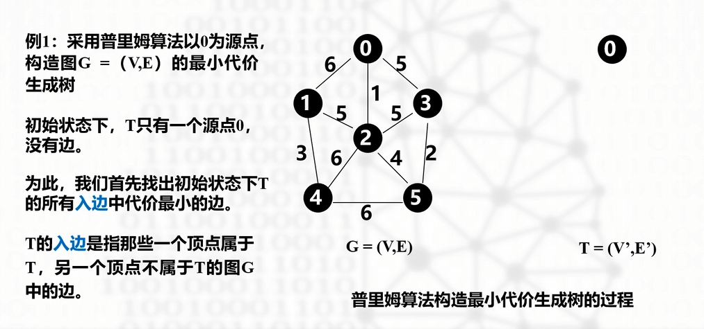

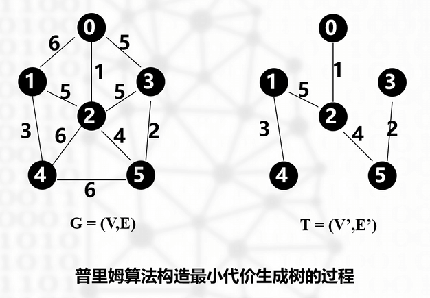

注意：**当选择代价最小的入边时，如果存在多条同样权值的边可选，此时任选其一即可**

**1、设计数据结构**

图采用**邻接表**存储

一维数组 $$nearest[]$$ ，其中 $$nearest[i]$$ 存放与顶点  $$i$$ 距离最近且在生成树上的顶点

一维数组 $$lowcost[]$$ ，其中 $$lowcost[i]$$ 存放边 $$(i,nearest[i])$$ 的权值

一维数组 $$mark[]$$ ，其中 $$mark[i]$$ 标记顶点 $$i$$ 是否已经在生成树上

对于当前尚未入选生成树的顶点 $$v$$ ，若边 $$(u,v)$$ 是 $$v$$ 与生成树 $$T$$ 中若干顶点构成的边中权值最小的，则设置$$nearest[v]=u$$ ， $$lowcost[v]= w(u,v)$$ ，其中 $$w(u,v)$$ 为顶点 $$u$$ 和 $$v$$ 之间的权值

此时，代表该边的三元组 $$(u,v,w(u,v))=(nearest[v],v,lowcost[v])$$

如果 $$mark[v]=false$$ ，表示 $$v$$ 未加入生成树，反之， $$v$$ 已选入

**2、实现普里姆算法**

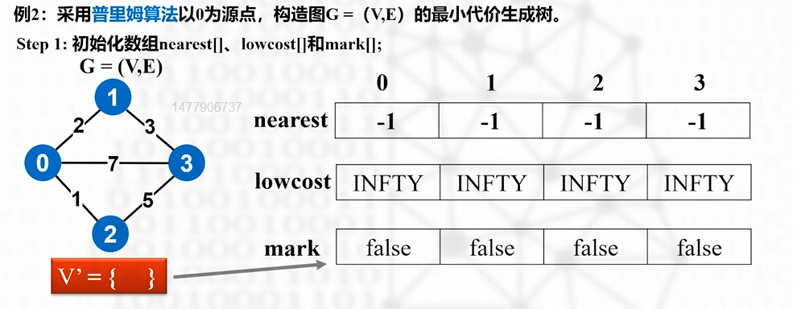


**从当前尚未入选生成树T的顶点1,2,3中，选出lowcost最小的顶点2**

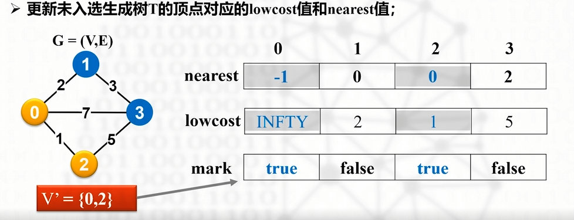

此时，只有3处数据进行了更新

**从当前尚未入选生成树T的顶点1,3中，选出lowcost最小的顶点1**

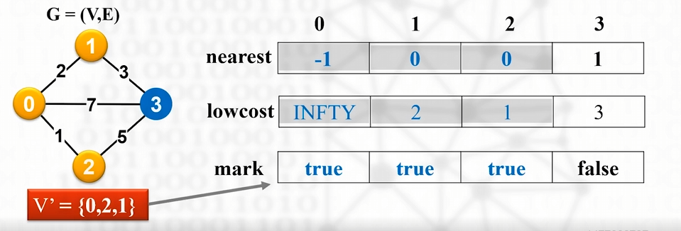

选择了1之后，又对3处的数据进行了一次更新，然后图中只剩下3一个顶点，直接加入进生成树即可，不过如果1处到3的权值大于2到3的权值，则不需要进行更新

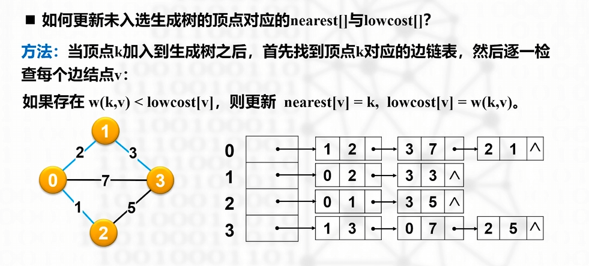

算法步骤：

(1)初始化数组 $$nearest[]$$ 、 $$lowcost[]$$ 和 $$mark[]$$

(2)将初始顶点 $$u$$ 加入生成树 $$T$$

(3)循环 $$n-1$$ 次，重复执行以下操作：

- 更新未入选生成树 $$T$$ 的顶点对应的 $$lowvcost$$ 值和 $$nearest$$ 值
- 从当前尚未入选生成树 $$T$$ 的顶点中，选出 $$lowcost$$ 最小的顶点 $$k$$
- 将 $$k$$ 加入生成树 $$T$$ 中

**3、算法时间复杂度**

对有 $$n$$ 个顶点、 $$e$$ 条边的图而言，其算法时间复杂度为 $$O(n^2)$$

```c
bool Prim(int k, int *closeVex, ElemType *lowWeight, LGraph g){
    ENode *p;
    ElemType min;
    int j;
    int *isMask = (int*)malloc(sizeof(int)*g.n);
    if(k < 0 || k > g.n)
        return false;
    for(int i = 0; i < g.n; i++) // 初始化三个数组
    {
        closeVex[i] = -1;       // 对应nearest[]， 存放与顶点i距离最近且在生成树上的顶点
        lowWeight[i] = INFTY;   // 存放边 (i,nearest[i]) 的权值
        isMask[i] = 0;          // 标记顶点 i 是否已经在生成树上
    }
    lowWeight[k] = 0;
    closeVex[k] = k;
    isMask[k] = 1;     // 以上三条说明源点加入生成树
    for(int i = 1; i < g.n; i++){
        for(p = g.a[k]; p; p = p -> NextArc){
            j = p -> AdjVex;
            if((!isMask[j]) && ((lowWeight[j] > p -> w)){ // 更新树外顶点的lowWeight值
                lowWeight[j] = p -> w;                    // 初始都是0，第一遍约等于初始化
                closeVex[j] = k;
            }
        }
        min = INFTY;
        for(j = 0; j < g.n; j++)    // 找生成树外顶点中，具有最小lowWeight值的顶点k
        {
            if((!isMask[j]) && (lowWeight[j] < min)){
                min = lowWeight[j];
                k = j;
            }
        }
        isMask[k] = 1;    // 将顶点加到生成树上
    }
    for(int i = 0; i < g.n; i++){
        printf("%d ", closeVex[i]);
        printf("%d ", i);
        printf("%d ", lowWeight[i]);
        printf("\n");
    }
    return true;
}
```

#### 克鲁斯卡尔算法

**克鲁斯卡尔算法的过程**：

初始状态下， $$T$$ 只包含 $$G$$ 中的所有顶点，没有边

从初始状态开始，重复执行下列运算：

(1)在 $$E$$ 中选择一条代价最小的边 $$(u,v)$$ ，并将其从 $$E$$ 中删除

(2)若在生成树的边集合 $$E’$$ 中加入边 $$(u,v)$$ 以后未形成回路，则将其加进 $$E’$$ 中否则继续从 $$E$$ 中选择下一条边

(3)重复执行步骤(2)，直至 $$E’$$ 中包含 $$n-1$$ 条边时为止

至此，得到 $$G$$ 的一棵包含 $$n-1$$ 条边的最小代价生成树 $$T$$

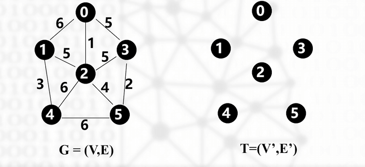

首先找出代价最小的一条边，然后将其从 $$G$$ 中删除，并添加进 $$T$$ ， 图中 $$<0,2>$$ 为代价最小的边

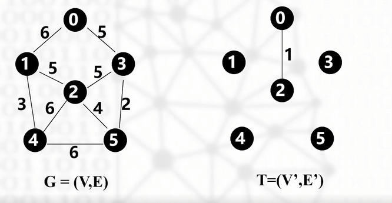

然后 $$T$$ 中未形成回路，则重复进行操作，如图中 $$<3,5>$$ 最小，则进行删除：

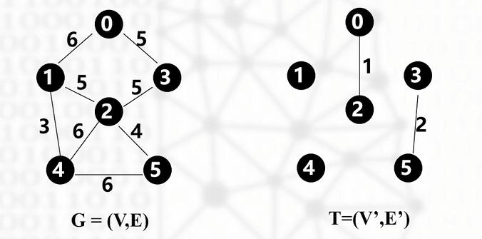

以此类推，得到：


欸，此时发现有存在多条代价最小的边怎么办，**任选其一即可**，比如说我们随便选了一条 $$<0,3>$$ 将其删除，发现此时形成了回路，但是**过程不能出现回路**，则不加入 $$T$$ 中，直接删除，然后再选其他边

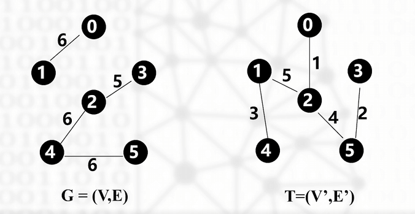

**1、设计数据结构**

- 图采用**邻接矩阵**存储
- 一维数组 $$edgeSet[]$$ 用于存储图中所有边的信息，包括边的两个顶点信息和权值，其中每一个 $$edgeSet[i]$$ 存放图中的一条边
- 一维数组 $$vexSet[]$$ ，用于标识各顶点所属的连通分量，其中 $$vexSet[i]$$ 表示顶点 $$i$$ 所属连通分量，初始时 $$vexSet[i]=i$$ ，表示各顶点自身构成一个连通分量

**2、实现克鲁斯卡尔算法**

克鲁斯卡尔算法包含如下两个关键操作：

**关键操作一：如何在E中选择一条代价最小的边?**

方法：单独建立一个数组 $$edgeSet$$ 存入所有边，然后选择一种排序算法进行排序

**关键操作二：如何判断所选取的边是否使生成树形成回路?**

方法：建立一个数组 $$vexSet$$ 用于标识各顶点所属的连通分量，若两个顶点属于不同的连通分量，则加入这两个顶点关联的边到生成树中时不会形成回路

算法步骤：

(1)从邻接矩阵中获取所有边存储于 $$edgeSet$$

(2)调用排序函数对数组 $$edgeSet$$ 中的边按**权值从小到大排序**

(3)依次查看数组 $$edgeSet$$ 中的边，循环执行以下操作：

从排序好的 $$edgeSet$$ 中取出一条边 $$(u,v)$$

在 $$vexSet[]$$ 数组中查找 $$u$$ 和 $$v$$ 所在连通分量的值 $$vexSet[u]$$ 和 $$vexSet[v]$$，进行判断：

- 若 $$vexSet[u]$$ 和 $$vexSet[v]$$ **不相等**，表示两顶点**属于不同连通分量**，输出此边，**合并** $$vexSet[u]$$ 和 $$vexSet[v]$$ 两个连通分量
- 若 $$vexSet[u]$$ 和 $$vexSet[v]$$ **相等**，表示两顶点**属于同一连通分量**，舍去此边，而选择下一条权值最小的边

**算法代码如下**：

```c
void SelectSort(Edge *eg, int n){
    int small;
    Edge t;
    for(int i = 0; i < n -1; i++){
        small = i;
        for(int j = i + 1; j < n; j++)
            if(eg[j].w < eg[small].w)
                small = j;
        t = eg[i];
        eg[i] = eg[small];
        eg[small] = t;
    }
}

void Kruskal(mGraph g){
    int k, u1, v1, vs1, vs2;
    int j;
    itn *vexSet = (int*)malloc(sizeof(int)*g.n);
    Edge *edgeSet = (Edge*)malloc(sizeof(Edge)*g.e);
    k = 0;
    for(int i = 0; i < g.n; i++)
        for(j = 0; j < i; j++){
            if(g.a[i][j] != 0 && g.a[i][j] != g.noEdge){
                edgeSet[k].u = i;
                edgeSet[k].v = j;
                edgeSet[k].w = g.a[i][j];
            }
        }
    SelectSort(edgeSet, g.e/2);
    for(int i = 0; i < g.n; i++)
        vexSet[i] = i;
    k = 0;
    j = 0;
    while(k < g.n - 1){
        u1 = edgeSet[j].u;
        v1 = edgeSet[j].v;
        vs1 = vexSet[u1];
        vs2 = vexSet[v1];
        if(vs1 != vs2){
            printf("%d , %d, %d, \n", edgeSet[j].u, edgeSet[j].v, edgeSet[j].w); // 输出边
            k++;
            for(int i = 0; i < g.n; i++)
                if(vexSet[i] == vs2)
                    vexSet[i] = vs1;
        }
        j++;
    }
}
```

### 单源最短路径

#### 概念

**单源最短路径问题**：给定**带权的有向图** $$G=(V,E)$$ 和源点 $$v_0 \in V$$ ，求从 $$v_0$$ 到 $$V$$ 中其余各顶点的最短路径

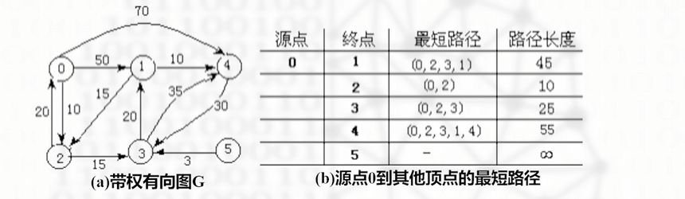

**迪杰斯特拉**提出了求解单源最短路径的基本思想：按路径长度的**非递减次序**逐一产生最短路径

即：首先求长度最短的一条最短路径，再求长度次短的一条最短路径，依此类推，直到从源点到其它所有顶点之间的最短路径都已求得为止

迪杰斯特拉算法的求解过程：

假设 $$G=(V,E)$$ 是含有 $$n$$ 个顶点的带权有向图，给定源点 $$v_0 \in V$$ ，求从 $$v_0$$ 到 $$V$$ 中其余各顶点的最短路径

**首先**将V中的顶点分成两组：

- 第一组 $$S$$ ：已求得最短路径的顶点集合(初始时只包含源点)
- 第二组 $$T=V-S$$ ：尚未确定最短路径的顶点集合(初始时为 $$T=V-{v_0}$$ )

**然后**将 $$T$$ 中顶点按最短路径非递减的次序加入到 $$S$$ 中，即循环执行以下操作：

- 计算 $$v_0$$ 到 $$T$$ 中各顶点 $$v_i$$ 的**当前最短路径**，选取长度最短的路径作为下一条最短路径，并将该路径的终点加入 $$S$$
- 重复步骤1，直到 $$S==V$$ 时算法结束

从源点 $$v_0$$ 到 $$v_i$$ 的**当前最短路径**，即为从 $$v_0$$ 直接到达 $$v_i$$ 或者间接经过 $$S$$ 中的顶点到达 $$v_i$$ 的最短路径。也就是说，该路径上除顶点 $$v_i$$ 自身外，其余顶点都属于 $$S$$ ，并且这是所有这些路径中的最短者。

#### 迪杰斯特拉算法

**1、设计数据结构**

图采用邻接矩阵存储

- 一维数组 $$s[]$$ ： 其中 $$s[i]$$ 表示顶点 $$v_i$$ 是否在集合 $$S$$ 中
- 一维数组 $$d[]$$ ：其中 $$d[]$$ 存放从源点 $$v_0$$ 到 $$v_i$$ 的当前最短路径长度
- 一维数组 $$path[]$$ ：其中 $$path[i]$$ 给出从 $$v_0$$ 到顶点 $$v_i$$ 的最短路径上，存放位于顶点 $$v_i$$ 前的那个前驱顶点

例如，若从源点 $$0$$ 到顶点 $$3$$ 的最短路径为 $$(0,2,3)$$ ，则有 $$path[3]=2$$ ， $$path[2]=0$$


此时从 $$0$$ 出发，没有可以直达到 $$3$$ 和 $$5$$ 的地方，所以 $$path[i] = -1$$

第一条最短路径是 $$T=V-\{0\}=\{1,2,3,4,5\}$$ 中所有顶点的当前最短路径中最短者

仔细观察不难发现，此时顶点 $$2$$ 的当前最短路径长度 $$d[2]=10$$ 即为最小值，因此选择顶点 $$2$$ 加入集合 $$S$$

在求得一条最短路径的终点 $$k$$ 并将其加入集合 $$S$$ 之后， $$V-S$$ 中顶点的当前最短路径长度将发生变化

为此，我们需要对所有 $$i \in V-S$$ 按照下列修正规则修正 $$d_i$$ 的值：
$$
d[i]=min\{d[i], d[k]+w(k,i) \}
$$
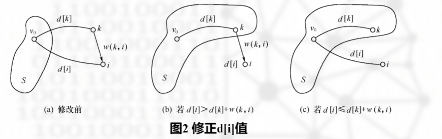

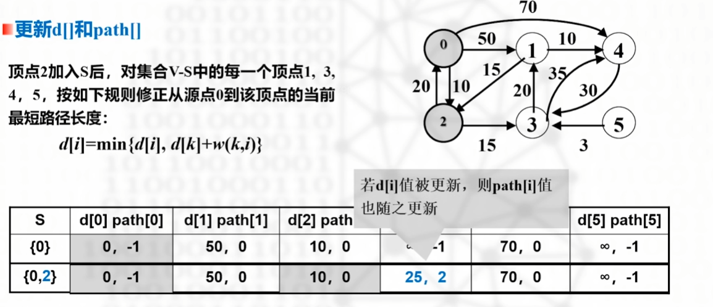

**重复下列步骤**：

(1)按照非递减次序选择下一条最短路径的终点(即 $$T=V-S$$ 中具有最短的当前最短路径长度的顶点 $$v$$ )，满足：

$$
d[k]= min\{d_i \in V-S \}
$$

(2) $$v_k$$ 加入 $$S$$ 集合后，修正 $$T$$ 中剩余顶点 $$v$$ 的当前最短路径长度

$$
d[i]=min\{d[i], d[k]+w(k,i) \}
$$

若 $$d[i]$$ 更新，则 $$path[i]$$ 也相应的更新为 $$k$$ 

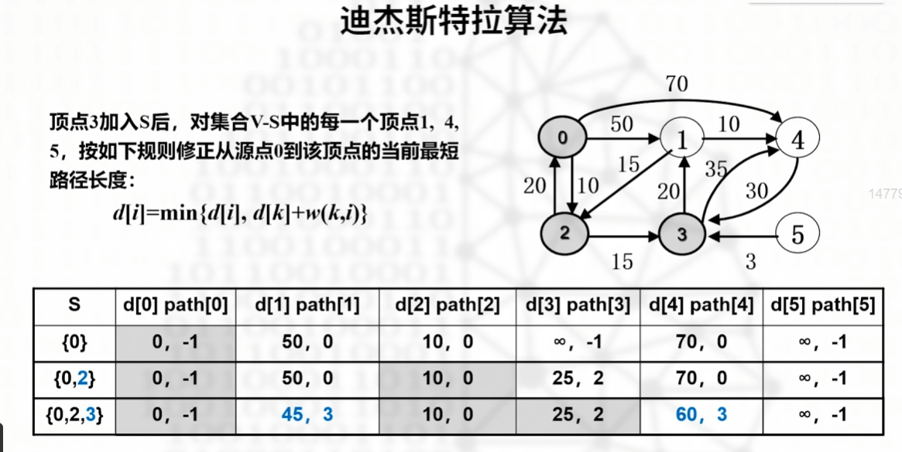

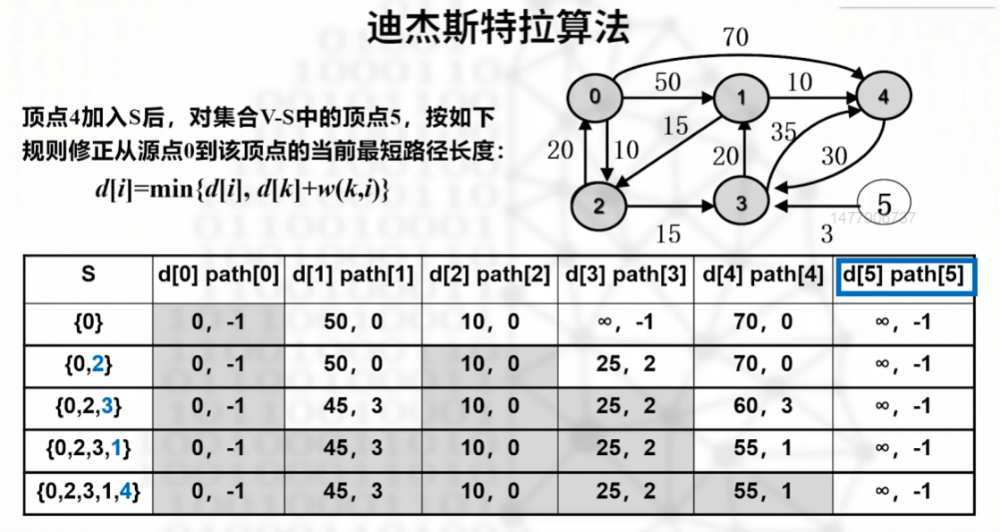

**2、实现迪杰斯特拉算法**

算法步骤：

(1)初始化 $$s[]$$ ：将其中每一个元素置为 $$false$$

(2)将源点 $$v_0$$ 加入集合 $$S$$ ，即令 $$s[v_0]=true$$

(3)初始化 $$d[]$$ ：如果 $$v_i$$ 属于集合 $$V-S$$ ，则 $$d[v_i]=w[v_0][v_i]$$ ；否则， $$d[v_i]=0$$

(4)初始化 $$path[]$$ ：如果 $$v_0$$ 和 $$v_i$$ 之间有弧，则 $$path[v_i]=v_0$$ ，否则 $$path[v_i]= -1$$

(5)循环 $$n-1$$ 次，执行以下操作：

- 从集合 $$V-S$$ 中选择具有当前最短路径的终点 $$v_k$$ ，将其加入集合 $$S$$ ，即令 $$s[v_k]=true$$
- 根据条件更新从 $$v_0$$ 出发到集合 $$V-S$$ 中任一顶点的最短路径长度 $$d[]$$ ，并更新相应的 $$path[]$$

**3、时间复杂度**

对有 $$n$$ 个顶点、 $$e$$ 条边的有向图而言：

迪杰斯特拉算法的时间复杂度为 $$O(n^2)$$

如果人们只希望求从源点到某一个特定顶点之间的最短路径，也需要与求单源最短路径相同的时间复杂度 $$O(n^2)$$

求任意两对顶点之间的最短路径，只需每次选择一个顶点为源点，重复执行迪杰斯特拉算法 $$n$$ 次，便可以求得任意两对顶点之间的最短路径，总执行时间为 $$O(n^3)$$

迪杰斯特拉算法如下：

```c
int Choose(int *d, bool *s, int n){
    int minpos;                 //  选出最小的d[i]
    ElemType min;
    min = INFTY;
    minpos = -1;
    for(int i = 0; i < n; i++)
        if(d[i] < min && !s[i]){
            min = d[i];
            minpos = i;
        }
    return minpos;
}

bool Dijkstra(int v, ElemType *d, int *path, mGraph g) {
    if (v < 0 || v >= g.n || !d || !path) return false;
    
    bool *s = (bool*)calloc(g.n, sizeof(bool));
    if (!s) return false;

    for (int i = 0; i < g.n; i++) {
        s[i] = false;
        d[i] = g.a[v][i];
        if (i != v && d[i] < INFTY) {
            path[i] = v;
        } else {
            path[i] = -1; // -1表示无前驱
        }
    }
    
    s[v] = true;
    d[v] = 0;

    for (int i = 1; i < g.n; i++) {
        int k = Choose(d, s, g.n);
        if (k == -1) break;
        
        s[k] = true;
        
        for (int w = 0; w < g.n; w++) {
            if (!s[w] && g.a[k][w] < INFTY && d[k] + g.a[k][w] < d[w]) {
                d[w] = d[k] + g.a[k][w];
                path[w] = k; // 更新前驱节点
            }
        }
    }
    
    free(s);
    return true;
}
```

#### 弗洛伊德算法

还有一种全全部最短路径的算法是 **弗洛伊德算法**：

```c
void Floyd(mGraph g){
    ElemType **d = (ElemType**)malloc(g.n*sizeof(ElemType*));
    int **p = (int**)malloc(g.n*sizeof(int*));
    for(int i = 0; i < g.n; i++){
        d[i] = (ElemType*)malloc(g.n*sizeof(ElemType));
        p[i] = (int*)malloc(g.n*sizeof(int));
        for(int j = 0; j < g.n; j++){
            d[i][j] = g.noEdge;
            p[i][j] = 0;
        }
    }
    for(int i = 0; i < g.n; i++)
        for(int j = 0; j < g.n; j++){
            d[i][j] = g.a[i][j];
            if(i != j && g.a[i][j] < INFTY)
                p[i][j] = i;
            else
                p[i][j] = -1;
        }
    for(int k = 0; k < g.n; k++)
        for(int i = 0; i < g.n; i++)
            for(int j = 0; j < g.n; j++)
                if(d[i][k] + d[k][j] < d[i][j]){
                    d[i][j] = d[i][k] + d[k][j];
                    p[i][j] = p[k][j];
                }
    for(int i = 0; i < g.n; i++)
    {
        for(int j = 0; j < g.n; j++)
            printf("%d ", d[i][j]);
        printf("\n");
    }
}
```


------

## 排序

sort1.c（简单排序）

sort2.c（直接插入排序）

sort3.c（冒泡排序）

### 概念

**什么是排序**

设有 $$n$$ 个数据元素的序列 ( $$D_0,D_1,...D_{n-1}$$ )， $$K_i$$ 是 $$D_i$$ 的关键字所谓排序，就是找元素下标( $$0,1,…,n-1$$ )的一种排列 $$p(0),p(1),…, p(n-1)$$ 使得序列按 $$K_{p(0)}()≥K_{p(1)}≧...≥K_{p(n-1)}$$ **(非递增)** 或 $$K_{p(0)}≤ K_{p(1)}≤...≤K_{p(n-1)}$$  **(非递减)** 的次序排列为：
$$
(D_{p(0)},D_{p(1)},.....D_{p(n-1)})
$$
**排序基本概念之稳定性**

待排序序列中两个元素 $$D_i$$ 和 $$D_j$$ ， $$D_i$$ 排在 $$D_j$$ 之前，且 $$K_i=K_j$$ 排序后， $$D_i$$ 仍然排在 $$D_j$$ 之前，则称所用的排序算法是**稳定的**。反之，称该排序算法是不稳定的

序列初始输入顺序：(Johnson,90)，(Jay,88)，(Alice,90)

以成绩为关键字排序：(Jay,88)，(Alice,90)，(Johnson,90)

从上面两个排序可以看到，原本John在Alice前面，但是排序后到后面去了，所以这个排序是不稳定的

**一个需要具有稳定性排序算法的实例-稀疏矩阵转置**

步骤1：依次访问 $$A$$ 的行三元组表中各个三元组 $$<i,j,a_{ij}>$$ ，交换元素行列号后依次
保存到 $$B$$ 的行三元组表中

步骤2：将 $$B$$ 的行三元组表中的行三元组按照行下标值从小到大重新排序

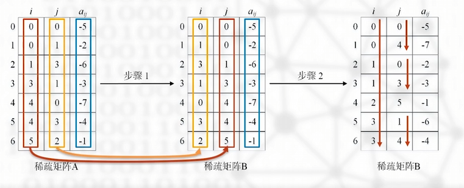

**排序基本概念之内外之分**

如果待排序元素总数相对于内存而言较小，整个排序过程可以在**内存中进行**，则称之为**内部排序**，简称内排序

反之，如果待排序元素总数较多，不能全部放入内存，排序过程中**需访问外存**，则称之为**外部排序**，简称外排序

**排序算法中的数据存储**

```c
typedef struct entry Entry;
typedef struct list List;

struct entry{
    KeyType key;   // 排序关键字，应为可比较类型
    DataType data; // data包含数据元素中的其他数据项
};

struct list{
    int n;              // 待排序元素数量
    Entry D[MaxSize];   // 静态数组存储数据元素
};
```

### 简单选择排序

**算法思想**

每一趟排序，找到待排序序列中**关键字最小**的数据元素，将其与待排序序列中**第一个数据元素交换位置**，并将其从下一趟待排序序列中移出重复该过程，直到某趟排序时待排序序列中仅剩下两个数据元素

**算法过程**

第 $$i$$ 趟排序：在待排序列 $$D[i-1],D[],…, D[n-1]$$ 上找到关键字最小的数据元素将其与 $$D[i-1]$$ 交换位置

**此刻 $$D[i-1]$$ 存储的是全局关键字第 $$i$$ 小的元素，不再进入下趟排序范围**

第 $$n-1$$ 趟排序，在待排序列 $$D[n-2],D[n-1]$$ 上找到关键字最小的数据元素，将其与 $$D[n-2]$$ 交换位置

**此刻 $$D[n-2]$$ 存储的是全局关键字第二大的元素， $$D[n-1]$$ 存储的是全局关键字最大的元素**

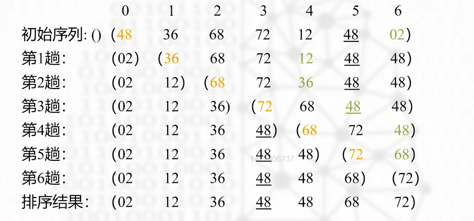

可以发现，排序前后两个48的相对位置发生改变，所以**简单排序算法是不稳定的**

**算法分析**

该算法必须进行 $$n-1$$ 趟，每趟进行 $$n-i-1$$ 次比较，这样总的比较次数为：

$$
\sum_{i=1}^{n-1}(n-i)=\frac{n(n-1)}{2}
$$

时间复杂度按比较次数衡量为 $$O(n^2)$$ （最好、最坏、平均） 

简单选择排序是**不稳定**的排序方法

简单选择排序每趟都能确定至少一个元素的最终有序位置

```c
void Swap(Entry *D, int i, int j){
    Entry temp;
    if(i == j)
        return;
    temp = *(D + i);
    *(D + i) = *(D + j);
    *(D + j) = temp;
}

int FindMin(List *list, int startIndex){
    int minIndex = startIndex;
    for(int i = startIndex + 1; i < list -> n; i++){
        if(list -> D[i].key < list -> D[minIndex].key)
            minIndex = i;
    }
    return minIndex;
}

void SelectSort(List *list){
    int minIndex, startIndex = 0;
    while(startIndex < list -> n - 1){
        minIndex = FindMin(list, startIndex);
        Swap(list -> D, startIndex, minIndex);
        startIndex++;
    }
}
```

### 直接插入排序

**算法思想**

从只包含一个数据元素的有序序列开始，不断地将待排序数据元素**有序地插入**这个有序序列中，直到有序序列包含了所有待排序数据元素为止

**算法过程**

第1趟：将序列中第1个元素作为一个有序序列，将第2个元素按序插入到有序序列中

**此刻前2个元素组成有序区，后n-2个元素组成无序区**

第2趟:将序列中第1-2个元素作为一个有序序列，将第3个元素按序插入到有序序列中

**此刻前3个元素组成有序区，后n-3个元素组成无序区**

第i趟：将序列中第1~i个元素作为有序序列，将第i+1个元素按序插入到有序序列中

**此刻前 i+1个元素组成有序区，后 n-i-1个元素组成无序区**

第n-1趟：将序列中1~n-1个元素作为有序序列，将第n个元素按序插入到有序序列中

**得到排好序的序列**


```c
void InsertSort(List *list){
    int i, j;           // i标识待插入元素下标
    Entry insertItem;   // 每一趟待插入元素
    for(i = 1; i < list -> n; i++){
        insertItem = list -> D[i];
        for(j = i - 1; j >= 0; j--){        
            // 不断将有序序列中元素向后运动，为待插入元素空出位置
            if(insertItem.key < list -> D[j].key)
                list -> D[j + 1] = list -> D[j];
            else
                break;
        }
        list -> D[j + 1] = insertItem; // 待插入元素有序存放至有序序列中
    }
}
```

**为什么最后是D[j+1]？**

因为循环结束后进行了 `j--` 操作

**算法分析**

算法总要执行 $$n-1$$ 趟

第 $$i$$ 趟的最坏情况：待插入元素 $$D[i+1]$$ 插入到有序区 $$(D[0],D[1],….,D[i])$$ 中 $$D[0]$$ 之前，元素比较 $$i$$ 次

最坏情况（逆序）：每一趟待插入元素都插入到有序区的最前面

在最坏情况下比较次数： $$\sum_{i=1}^{n-1}i=\frac{n(n-1)}{2}$$

在最坏情况下时间复杂度: $$O(n^2)$$

### 冒泡排序

跟C语言一样，不作解释

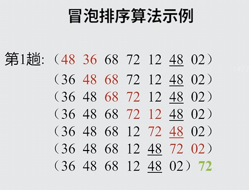

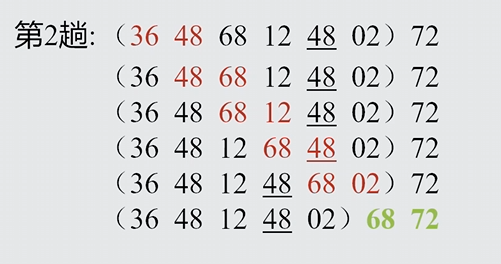

依此类推....不断把最大的排在最后

**算法分析-最好与最坏情况**

最好情况：已有序情况下只需进行一趟排序， $$n-1$$ 次比较最好情况下的时间复杂度是 $$O(n)$$

最坏情况：进行 $$n-1$$ 趟，第 $$i$$ 趟比较 $$(n-i)$$ 次，比较次数为： $$\sum_{i=1}^{n-1}n-1=\frac{n(n-1)}{2}$$

因此最坏情况下的时间复杂度是 $$O(n^2)$$

平均情况：算法在每趟排序停止概率相同，为 $$\frac{1}{(n-1)}$$ ，比较次数为 :

$$
\frac{1}{(n-1)} \times \sum_{j=1}^{n-1}\sum_{i=1}^{j}(n-i)=\frac{n(2n-1)}{6}
$$

因此平均情况下的时间复杂度是 $$O(n^2)$$

```c
void Swap(Entry *D, int i, int j){
    Entry temp;
    if(i == j)
        return;
    temp = *(D + i);
    *(D + i) = *(D + j);
    *(D + j) = temp;
}

void BubbleSort(List *list){
    int i, j;
    for(i = list -> n - 1; i > 0; i--){
        bool isSwap = false;
        for(j = 0; j < i; j++){
            if(list -> D[j].key > list -> D[j + 1].key){
                Swap(list -> D, j, j + 1);
                isSwap = true;
            }
        }
        if(!isSwap)
            break;
    }
}
```

### 快速排序

**算法的递归思想**

**快速排序**(待排序序列)：

1.待排序序列中元素数量小于等于1时，无须排序，直接退出

2.选择**分割元素** $$D_s$$ (关键字为 $$K_s$$ )，将序列划分成左右子序列，满足：

- 左子序列中所有元素的关键字均不大于 $$K$$
- 右子序列中所有元素的关键字均不小于 $$K$$

3.快速排序 (左子序列)：(**48**，36，68，72，12，<u>48</u> ，02)

4.快速排序 (右子序列)：(12，36，02，48) **48** (72，68)

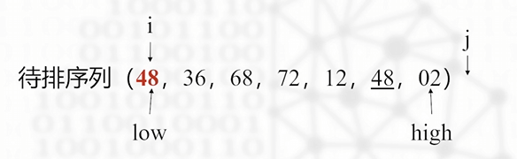

1.**low** 指向待排序列的**最左元素**，**high**指向待排序序列的**最右元素**

2.选择**待排序列**中第一个元素 $$D[low]$$ 为分割元素

3.游动标识 $$i$$ 和 $$j$$ ，初始时 $$i=low$$ ， $$j=high+1$$

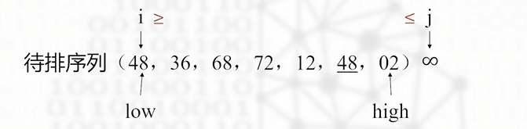

- $$i=i+1$$ ，**从左向右** 扫描序列，找到第一个 $$≥$$ 分割元素的元素后停止
- $$j=j-1$$ ，**从右向左** 扫描序列，找到第一个 $$≤$$ 分割元素的元素后停止
- 如果 $$i<j$$ ，将 $$D[i]$$ 与 $$D[j]$$ 交换，继续步骤1和2
- 如果 $$i≥j$$ ，将 $$D[low]$$ 与 $$D[j]$$ 交换，本趟快速排序结束

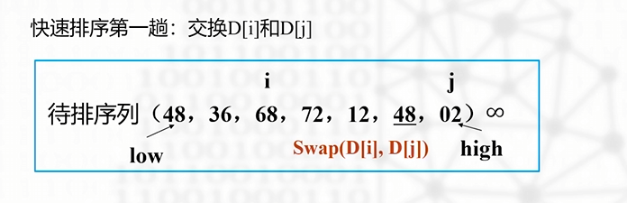

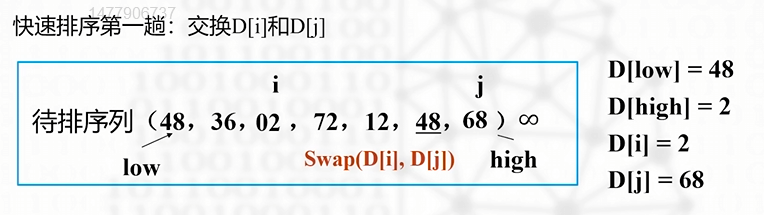

因为此时 $$i<j$$ ，所以本趟排序并没有停止，继续搜索

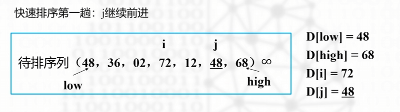

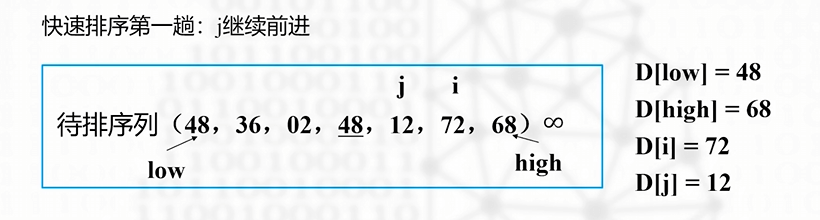

此时发现 $$i>j$$ ， 则交换 $$low$$ 和 $$j$$  ，本趟排序结束

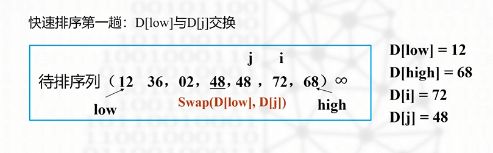

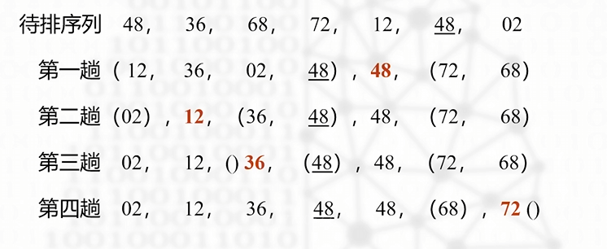

很显然48在排序前后相对位置不一样，所以快速排序算法是不稳定的

**过程分析**：

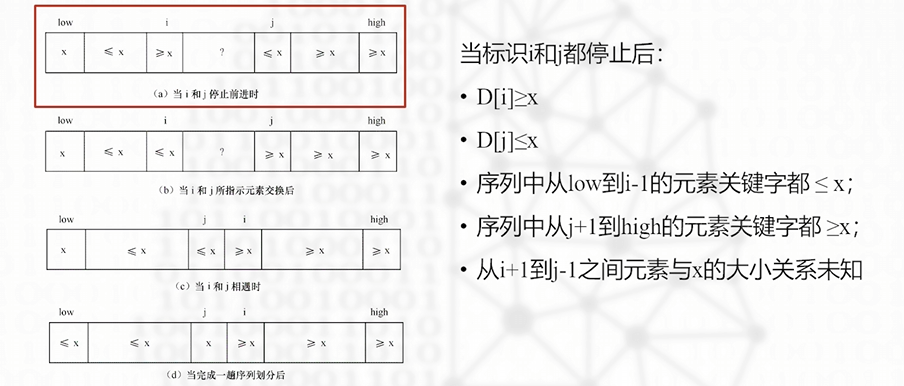

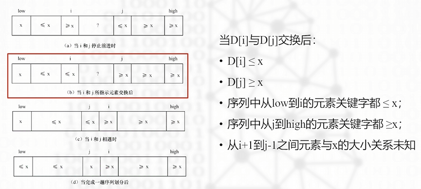

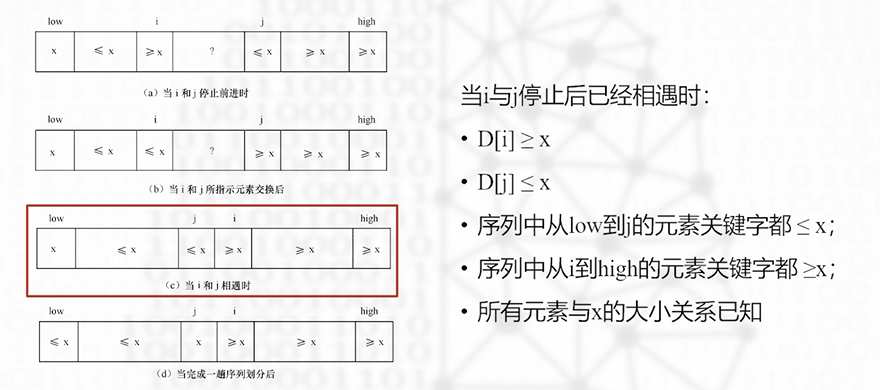

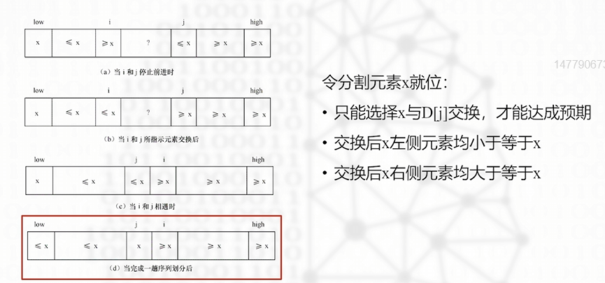

**快速排序算法**：

```c
int Partition(List *list, int low, int high){
    int i = low - 1;
    int j = high + 1;
    Entry pivot = list -> D[low]; // pivot是分割元素
    do{
        do{
            i++;
        }while (i <= high && list->D[i].key < pivot.key); 
        // i前进，直到遇到大于分割
        do{
            j --;
        }while (j >= low && list->D[j].key > pivot.key);  
        // j前进，直到遇到小于分割
        if(i < j)
            Swap(list -> D, i, j);
    }while(i < j);
    Swap(list -> D, low, j);
    return j;   // 此时j是分割元素的下标
}

void QuickSort(List *list, int low, int high){
    if(low < high){
        int p = Partition(list, low, high);
        QuickSort(list, low, p);
        QuickSort(list, p + 1, high);
    }
}
```

**算法分析**：

**最好情况**：经过每一趟排序后，若分割成的两个子序列长度相近快速排序的效率最好，时间复杂度为 $$O(nlog_2n)$$

**平均情况**：时间复杂度为 $$O(nlog_2n)$$

**最坏情况**：若每次分割的两个子序列中有一个为空，即每一趟仅生成一个子序列且长度仅比当前序列少1，则效率最低，时间复杂度为 $$O(n^2)$$

**各趟排序结果**：最多 $$n-1$$趟

$$Q(n)=Q(\lfloor \frac{n-1}{2} \rfloor)+Q(\lceil \frac{n-1}{2} \rceil) + 1$$

### 合并排序

**算法思想**

- 初始时将待排序的 $$n$$ 个数据元素看作 $$n$$ 个待合并有序序列，每个序列中只包含一个数据元素
- 将每 $$m$$ 个待合并序列合并成一个大的有序序列
- **在最后一次合并中，序列个数可能少于 $$m$$**
- 重复合并过程，直到所有数据元素都属于同一个有序序列为止
- 当 $$m=2$$ 时，上述合并排序过程称为**两路合并排序算法**

**算法过程**：

第1趟排序：对 $$n$$ 个有序序列 $$(D[0]),(D[1]),…,(D[n-1])$$ 

合并 $$(D[0])和 (D[1])$$ ，得到有序序列 $$(D[0],D[1])$$

合并 $$(D[2])$$ 和 $$(D[3])$$ ，得到有序序列 $$(D[2],D[3])$$

如果 $$n$$ 是偶数，合并最后两个有序序列，否则，最后一个序列不发生合并

第2趟排序：对 $$\lceil \frac{n}{2} \rceil$$ 个有序序列 $$(D[0],D[1]),(D[2],D[3])$$

合并 $$(D[0], D[1])$$ 和 $$(D[2], D[3])$$ ，得到有序序列 $$(D[0],D[1],D[2],D[3])$$

合并 $$(D[4], D[5])$$ 和 $$(D[6],D[7])$$ ，得到有序序列 $$(D[4],D[5],D[6],D[7])$$

如果 $$\lceil \frac{n}{2} \rceil$$ 是偶数，合并最后两个有序序列，否则，最后一个序列不发生合并

依此类推.....

第 $$N$$ 趟排序： 当 $$\lceil \frac{n}{2^{N-1}} \rceil=2$$ 时，只剩下最后两个有序序列，直接合并即可

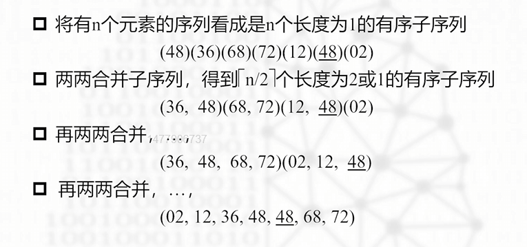


如果两个元素关键字相同，则优先放入 $$D[i]$$ ，所以**两路合并算法是稳定的**

```c
// list是待排序序列，temp是临时创建的空间的首地址，n1和n2是子序列长度，low是子序列首地址
void Merge(List *list, Entry *temp, int low, int n1, int n2){
    int i = low;
    int j = low + n1; // i，j初始分别指向两个序列的第一个元素
    while(i <= low + n1 - 1 && j <= low + n1 + n2 - 1){
        if(list -> D[i].key <= list -> D[j].key)
            *temp++ = list -> D[i++];
        else
            *temp++ = list -> D[j++];
    }
    while(i <= low + n1 - 1)
        *temp++ = list -> D[i++];   // 剩余元素直接拷贝至temp
    while(j <= low + n1 + n2 - 1)
        *temp++ = list -> D[j++];   // 剩余元素直接拷贝至temp
}

void MergeSort(List *list){
    Entry temp[MaxSize];
    int low, n1, n2, i, size = 1;
    while(size < list -> n){
        low = 0;                                    
        // low是一对待合并序列中第一个序列的第一个元素的下标
        while(low + size < list -> n){
            n1 = size;
            if(low + size * 2 < list -> n)
                n2 = size;                          //计算第二个序列长度
            else
                n2 = list -> n - low - size;
            Merge(list, temp + low, low, n1, n2);
            low += n1 + n2;                         
            // 确定下一对待合并序列中第一个序列的第一个元素下标
        }
        for(i = 0; i < low; i++)
            list -> D[i] = temp[i];                 // 复制一趟合并排序结果
        size *= 2;                                  // 子序列长度翻倍
    }
}
```

**算法分析**：

每趟都要扫描 $$n$$ 个元素，因此两路合并排序的时间复杂度 $$O(nlog_2n)$$ 

但是它必须借助一个与原序列等大小的辅助数组 $$(O(n))$$ 方能实现

**两路合并排序是一种稳定的排序方法**

### 堆排序

（最大堆，且是完全二叉树，所以到时候做题可以先画一个完全二叉树，然后存放顺序就是层次遍历的顺序）

**算法思想**

- 借助堆数据结构，不断输出当前堆顶元素
- 每次堆顶离开当前堆后，对剩余元素重新调整成堆，直到堆中只剩下一个元素
- 元素的输出序列可转换成元素的有序序列

**算法过程**

准备：待排序序列构建成**最大堆** $$D[0],D[1],……, D[n-1]$$

第 $$1$$ 趟：交换堆顶元素 $$D[0]$$ 与堆底元素 $$D[n-1]$$调整 $$D[0],D[1],…, D[n-2]$$ 为最大堆

第 $$2$$ 趟：交换堆顶元素 $$D[0]$$与堆底元素 $$D[n-2]$$ 调整 $$D[0],D[1],…., D[n-3]$$ 为最大堆

...

第 $$i$$ 趟：交换堆顶元素 $$D[0]$$ 与堆底元素 $$D[n-i]$$ 调整 $$D[0],D[1],.., D[n-i-1]$$ 为最大堆

...

第 $$n-1$$ 趟：交换堆顶元素 $$D[0]$$ 与堆底元素 $$D[1]$$ 排序完成

**示例**：

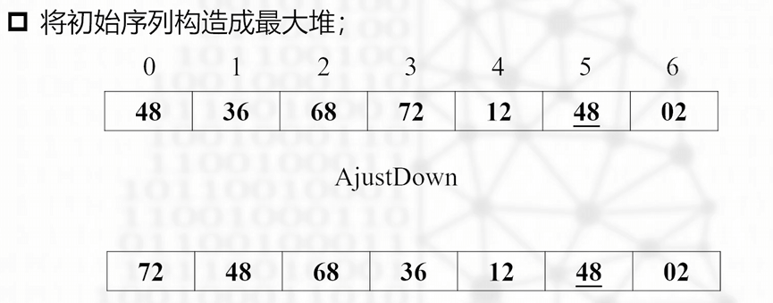

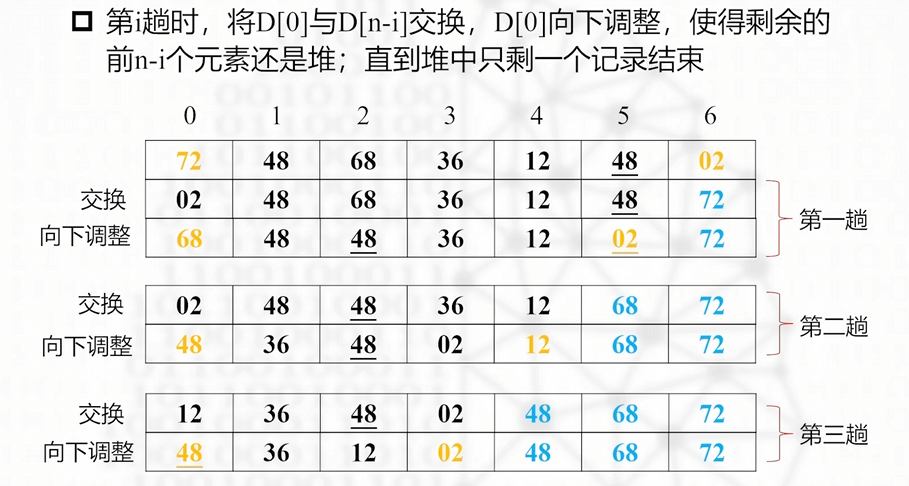

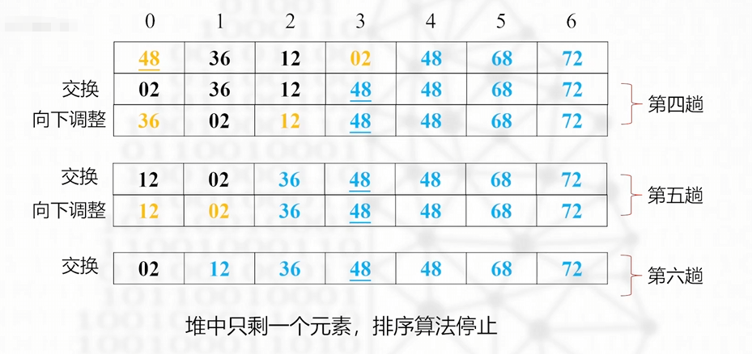

**算法分析**

- 堆排序主要有两步,即 **构造初始堆** 和 **排序**
- 构造初始最大堆的时间复杂度 $$O(n)$$
- AdjustDown() 函数的执行时间不超过 $$O(log_2n)$$
- 在排序部分,除最后一趟的堆顶元素无需再调整外,其余 $$n-1$$ 个元素均要向下调整一次,花费时间 $$O(log_2n)$$ ,故堆排序的时间复杂度为 $$O(nlog_2n)$$
- 最好、最坏与平均情况： $$O(nlog_2n)$$
- 一趟堆排序结束后,可以确定一个元素的最终位置
- 该排序是**不稳定**的排序方法

```c
// 修正后的 AdjustDown 函数（关键修改）
void AdjustDown(Entry heap[], int current, int border) {
    int parent = current;
    Entry temp = heap[parent]; // 保存当前节点（整个结构体）
    
    while (2 * parent + 1 <= border) { // 存在左子节点
        int child = 2 * parent + 1; // 默认左子节点
        
        // 选择较大的子节点（大顶堆）
        if (child + 1 <= border && heap[child].key < heap[child + 1].key) {
            child++; // 选择右子节点
        }
        
        // 如果父节点大于等于子节点，满足堆性质
        if (temp.key >= heap[child].key) {
            break;
        }
        
        // 将较大子节点上移（移动整个结构体）
        heap[parent] = heap[child];
        parent = child; // 继续向下检查
    }
    
    // 将保存的节点放到正确位置
    heap[parent] = temp;
}

void HeapSort(MaxHeap *hp) {
    for (int i = (hp -> n - 2) / 2; i >= 0; i--) {
        AdjustDown(hp -> D, i, hp -> n - 1);
    }
    for (int i = hp -> n - 1; i > 0; i--) {
        Swap(hp -> D, 0, i);
        AdjustDown(hp ->D, 0, i - 1);
    }
}
```

