# DataStructure(C)-Beta版
**南京邮电大学数据结构C语言代码**

每个大章节中我会把文件程序具体是什么放在最前面，然后知识点放在程序后，所以可能顺序会有点不同，可以看下面目录选择你喜欢的进行查看（ **想看程序分别对应是什么的** 可以直接 **点大章节标题**，比如我直接点树就能看到对应程序的内容所指）（Github右边可以展开目录）

## 树

binarytree.c（先序、中序、后序遍历）

binarytree2.c（层次遍历）

binarytree3.c（应用-计算结点数量）

treeclear.c（递归清空二叉树）

### 树转化成二叉树

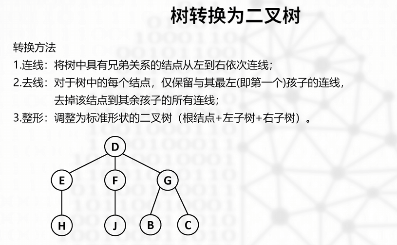


### 二叉树转化成森林

（左孩子，右兄弟）

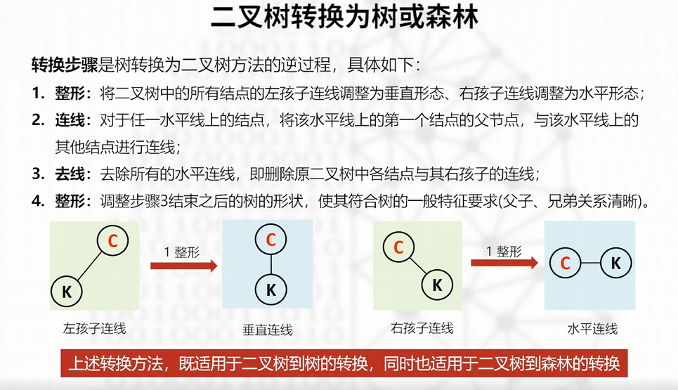

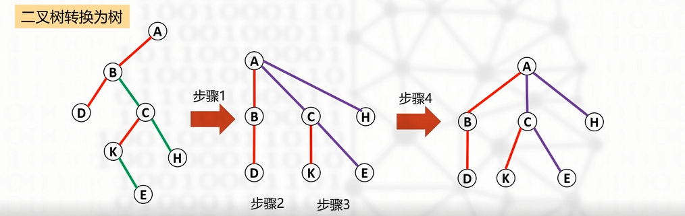

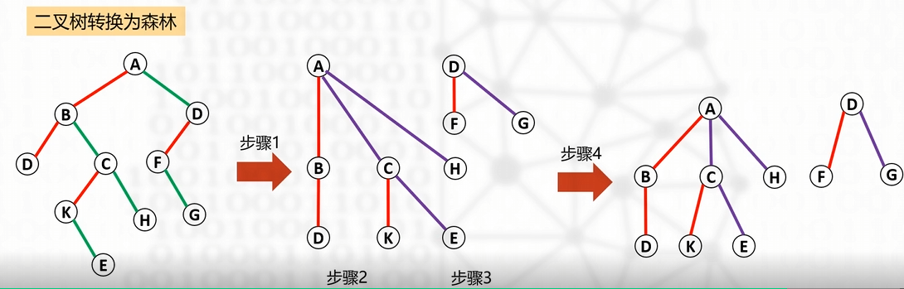

### 树和森林的存储表示

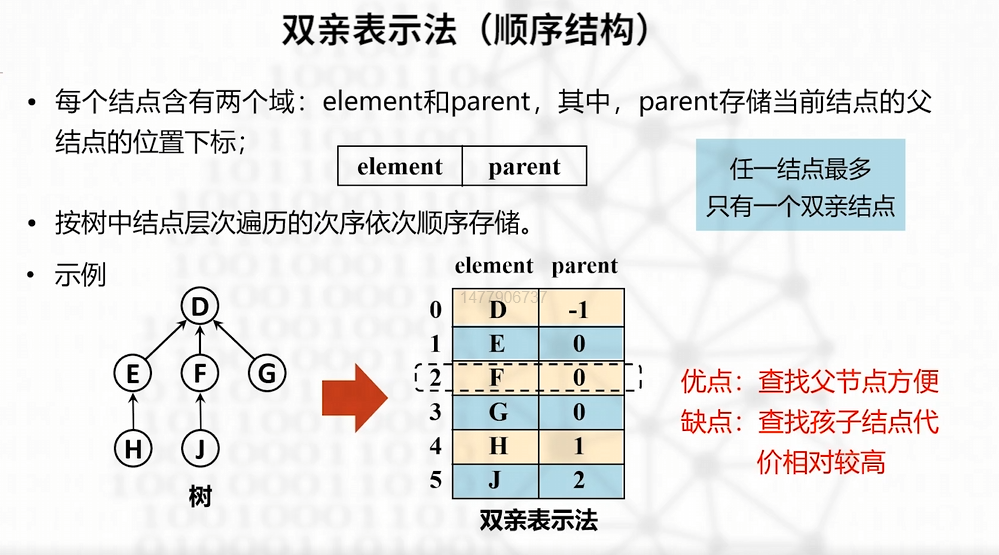

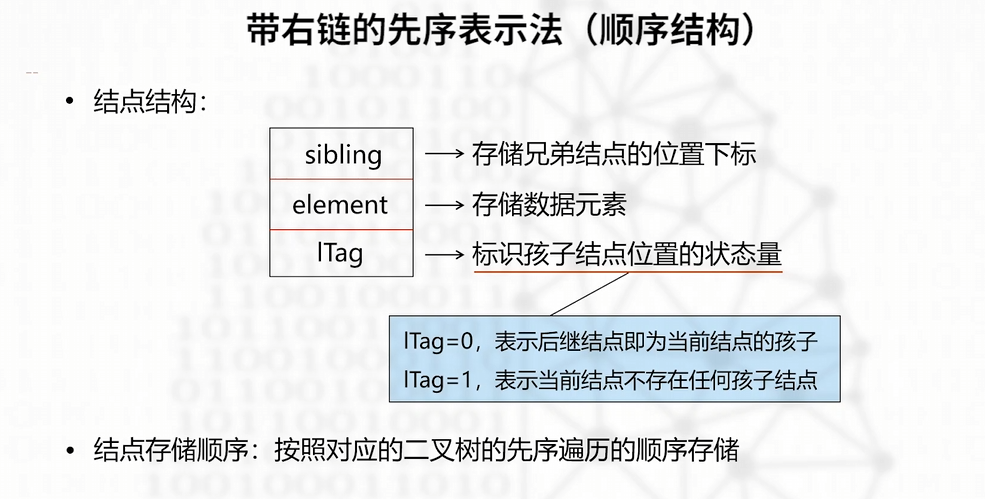

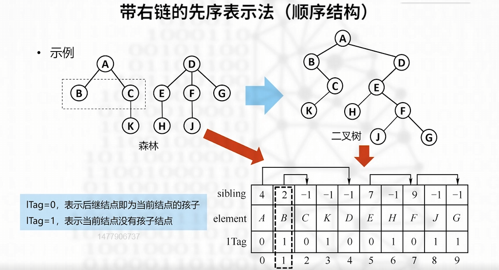

其中这里的 `sibling` 表示原示例中兄弟结点的下标，比如说B和C是兄弟结点，然后A是-1，B是1，C是2，那么BC（B在C的左边）这个兄弟结点的的 `sibling` 的表示则为： `B -> C(2) -> A(-1)`，也就是上面图示的箭头指向，兄弟结点的最后一个（最右边的）的 `sibling` 即为他的父结点的位置下标

### 森林的遍历

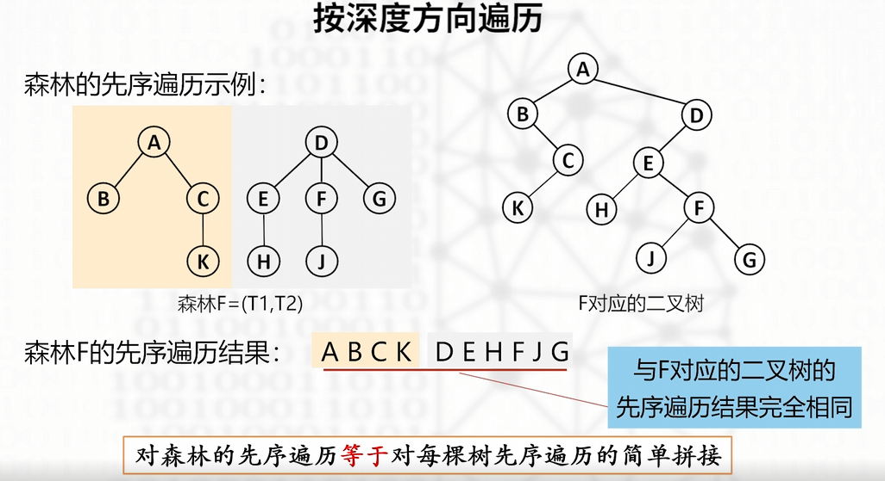

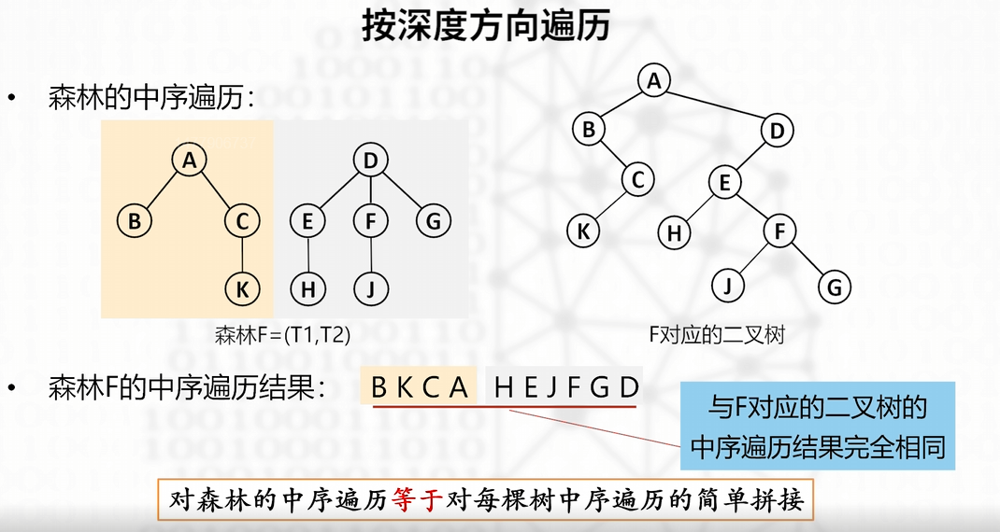

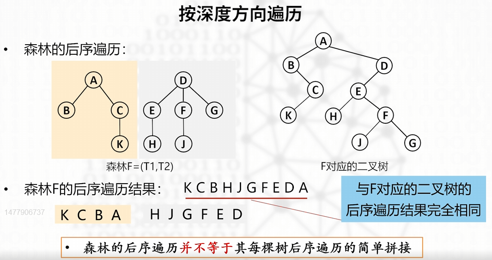

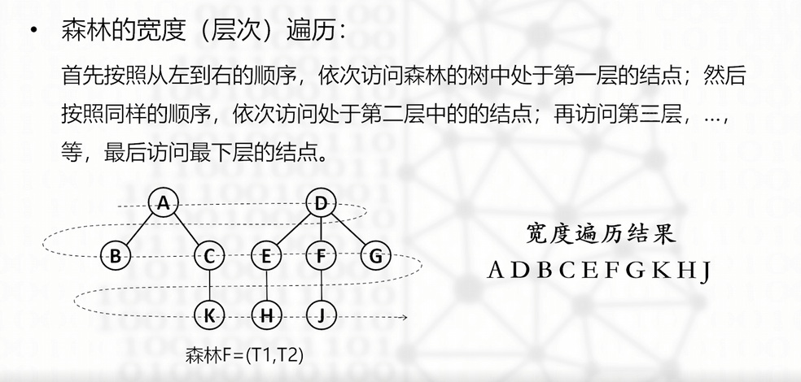

总结就是：

- 森林先序/中序遍历与二叉树的思想基本相同，遍历完相加即可
- 森林后序遍历的头结点是从右往左一次遍历的（D -> A），并不是简单相加
- 层次也差不多


------

## 堆与优先权队列

heap1.c（向下调整算法 && 建堆运算）

### 什么是堆？

定义:从逻辑结构上看，一个大小为n的堆是一棵包含n个结点的 **完全二叉树**，根结点称为堆顶，包含如下两类：

- 最小堆:树中每个结点的数据都 **小于或等于** 其孩子结点，因此，在最小堆中，堆顶存储的数据是整棵树中最小的;
- 最大堆:树中每个结点的数据 **大于或等于** 其孩子结点，因此，在最大堆中，堆顶存储的数据是整棵树中最大的

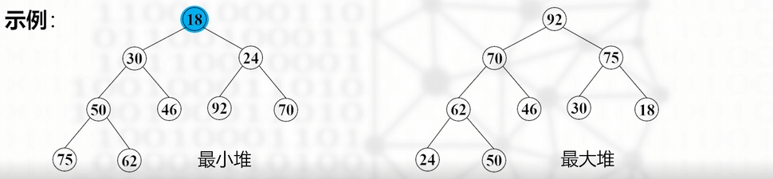

### 堆的存储表示

就拿上面那个最小堆来举例，堆的存储结构应该遵循的是层次遍历，也就是如下：

```
index:  0   1   2   3   4   5  ....
value: [18, 30, 24, 50, 46, 92]....
```

那么如何判断一个堆是最小堆还是最大堆？

你就从0开始按层次遍历排好，然后观察是不是 **每个结点** 都 **大于等于/小于等于** 其子结点就行

### 建堆运算

我们已知最后一个叶结点双亲的位置是 $$\lfloor\frac{(n-2)}{2}\rfloor$$ （$$\lfloor x\rfloor$$表示向下取整）根结点位置为 0

**算法思想（最小堆）：** 从最后一个叶子的双亲（$$K_{\lfloor(n-2)/2\rfloor}$$）**反方向** 直到根结点（$$K_0$$），依次对其中的每个结点($$K_i$$)执行向

下调整（AdjustDown）操作，步骤如下：

①若该结点小于或等于其最小的孩子，则本轮向下调整结束;否则执行步骤②;

②将该结点与最小孩子交换;交换完成后，继续以该结点为考查对象，再次执行步骤①；

关键算法：（完整代码可以见 heap1.c）

```c
void AdjustDown(ElemType heap[], int current, int border){
    int p = current;
    int minChild;
    ElemType temp;
    while(2 * p + 1 <= border){  // 若p不是叶结点，则执行
        if((2 * p + 2 <= border) && (heap[2 * p + 1] > heap[2 * p + 2]))
            minChild = 2 * p + 2;  // 右子树存在，且较小，则minChild指向p的右子树
        else
            minChild = 2 * p + 1;  // 右子树不存在或较大，则指向p的左子树
        if(heap[p] <= heap[minChild]){
            break;                 // 若当前结点不大于自己的最小的子树，则结束
        }
        else{                      // 否则就将p与最小的子树进行交换
            temp = heap[p];
            heap[p] = heap[minChild];
            heap[minChild] = temp;
            p = minChild;          // 设置下轮循环待考察元素的位置（当前下移元素位置）
        }
    }
}

void CreatHeap(ElemType heap[], int n){
    int i;
    for(i = (n-2)/2; i > -1; i--)      // 从最后一个叶结点的双亲方向到根结点
        AdjustDown(heap, i, n - 1);
}
```

### 优先权队列


------

## 集合与搜索

占位

## 搜索树

占位

## 散列表

占位

